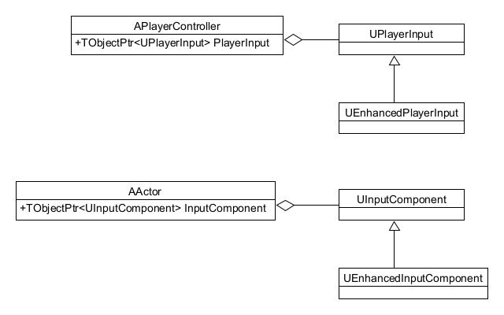
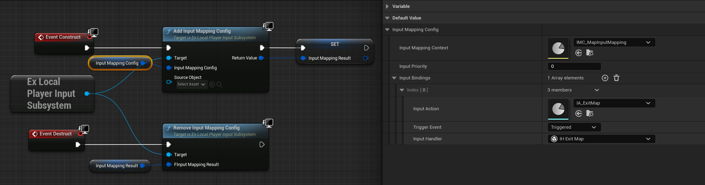

[TOC]

# EnhancedInput原理


## UE模块常用设计模式

在UE开发或阅读UE源码时，了解UE的设计思路会加快我们工作的效率。这里我们先来看一个它常用的一种设置模式，我把它叫做**Context|Action|Delegate**模式，其中：

- **Context**为当前模块提供功能的描述，外部系统可以通过它可以查到某个功能的相关信息。在EnhancedInput就是**InputMappingContext**。

- **Action**为某个功能的抽象，与具体实现无关。在EnhancedInput就是**InputAction**

- **Delegate**则是该功能的具体实现，通常和**Action**通过某种**绑定**联系在一起。

这种方式很好地将功能的**具体实现**和**外部的使用**隔离开，实现起来又比较简单，充分体现了简单粗暴，行之有效的设计思路。

UE不仅在EnhancedInput中采用了这种模式，其他模块例如**编辑器扩展**也基本是这样的实现方式。
      


## 基础类
   

### InputComponent

基础功能类

```cpp
//InputComponent.h
class ENGINE_API UInputComponent: public UActorComponent
{
    //这个类中保存了输入相关数据，例如绑定了那些事件，在Actor生命周期改如何处理之类
}
```

每个Actor都持有一个InputComponent的变量，所以原则上来说，每个Actor都能接收输入：

```cpp
//Actor.h
class ENGINE_API AActor : public UObject
{
    /** Component that handles input for this actor, if input is enabled. */
	UPROPERTY(DuplicateTransient)
	TObjectPtr<class UInputComponent> InputComponent;
}
```

通过**Project Settings -> Engine -> Input -> Default Classes -> Default Input Component Class** 可以设置这些InputComponent的类型。

可以通过`UInputSettings::GetDefaultInputComponentClass()`来获取这个类型。

#### 初始化

对于一个**Actor**, 当它Enable Input时：

```cpp
//Actor.cpp
void AActor::EnableInput(APlayerController* PlayerController)
{
	//如果当前的InputComponent为null，那么根据UInputSettings::GetDefaultInputComponentClass()创建一个
    //将InputComponent保存到Controller中 PlayerController->PushInputComponent(InputComponent);
}
```

对于特殊的Actor，例如**Pawn**, **PlayerController**, **LevelScriptActor**, 会重载`EnableInput`，不走这一套，在特殊的地方初始化。

**Pawn**中的InputComponent在`APawn::PawnClientRestart`中初始化

```cpp
//Pawn.cpp
void APawn::PawnClientRestart()
{
	APlayerController* PC = Cast<APlayerController>(Controller);
	if (PC && PC->IsLocalController()) //只有LocalController才有Input
	{
        //NewObject创建一个InputComponent
        
        //该InputCompnent的类型由UInputSettings::GetDefaultInputComponentClass()指定
		InputComponent = CreatePlayerInputComponent(); 
        if (InputComponent)
        {
            SetupPlayerInputComponent(InputComponent); //这里会交由业务去绑定输入
            //其他初始化
        }
	}
}
```

**PlayerController**的InputComponent在PlayerController创建的时候初始化，堆栈：

```cpp
APlayerController::SetupInputComponent()
-> APlayerController::InitInputSystem()
-> APlayerController::SetPlayer(UPlayer * InPlayer)
-> UWorld::SpawnPlayActor(...)
```

实现：

```cpp
//PlayerController.cpp
void APlayerController::SetupInputComponent()
{
	//也是使用UInputSettings::GetDefaultInputComponentClass()为类型New一个
}
```

**LevelScriptActor**中在`PreInitializeComponents`中初始化：

```cpp
//LevelScriptActor.cpp
void ALevelScriptActor::PreInitializeComponents()
{
	//同样使用UInputSettings::GetDefaultInputComponentClass()为类型New一个
}
```

### EnhancedInputComponent

对InputComponent的升级

```cpp
//EnhancedInputComponent.h
class ENHANCEDINPUT_API UEnhancedInputComponent: public UInputComponent {}
```

### PlayerInput

PlayerInput用来保存一些输入状态以及提供对这些状态的操作，例如：

```cpp
class ENGINE_API UPlayerInput : public UObject
{
    /** The current game view of each key */
	TMap<FKey,FKeyState> KeyStateMap; //保存当前触发的按键信息
    virtual bool InputKey(const FInputKeyParams& Params); //处理按键
}
```

PlayerInput被PlayerController持有：

```cpp
//PlayerController.h
class ENGINE_API APlayerController : public AController
{
	/** Object that manages player input. */
	UPROPERTY(Transient)
	TObjectPtr<UPlayerInput> PlayerInput;   
}
```

通过**Project Settings -> Engine -> Input -> Default Classes -> Default Input Class** 可以设置默认的PlayerInput类型。

可以通过`UInputSettings::GetDefaultPlayerInputClass()`来获取这个类型。

#### 初始化

PlayerInput在PlayerController创建的时候初始化：

```cpp
//PlayerController.cpp
void APlayerController::InitInputSystem()
{
    //根据设置的PlayerInput类型设置
	PlayerInput = NewObject<UPlayerInput>(this, UInputSettings::GetDefaultPlayerInputClass());
	//初始化InputComponent
	SetupInputComponent();
}
```

### EnhancedPlayerInput

这是对PlayerInput的升级

```cpp
//EnhancedPlayerInput.h
class ENHANCEDINPUT_API UEnhancedPlayerInput : public UPlayerInput {}
```


## EnhancedInput的使用 

EnhancedInput在网上有很多资料，但个人比较推荐[大钊的这个视频](https://www.bilibili.com/video/BV14r4y1r7nz)。

本文不会讲Enhanced的具体使用，主要是通过源码来阐述它内部的工作方式。

### InputMappingContext

每个模块通过`InputMappingContext`来告知输入系统自己需要响应哪些输入，开发者可以通过通过`UEnhancedInputLocalPlayerSubsystem`的相关接口来操作：

```cpp
UEnhancedInputLocalPlayerSubsystem* Subsystem = GetEnhancedInputSubsystem();
Subsystem->AddMappingContext(InputMappingContext, InputPriority); //添加
Subsystem->RemoveMappingContext(InputMappingContext);  //移除
```

系统中所有注册的`InputMappingContext`保存在EnhancedPlayerInput中：

```cpp
//EnhancedPlayerInput.h
class ENHANCEDINPUT_API UEnhancedPlayerInput : public UPlayerInput
{
    //通过声明友元类来实现访问私有成员的目的
	friend class IEnhancedInputSubsystemInterface;
private:
    //key是context, value是优先级
    TMap<const class UInputMappingContext*, int32> AppliedInputContexts;
}
```

### InputAction

在EnhancedInputComponent.h中，提供了很多`BindAction`的接口，大致形式如下：

```cpp
//EnhancedInputComponent.h
FEnhancedInputActionEventBinding& BindAction(const UInputAction* Action, ETriggerEvent TriggerEvent, /*Delegate相关*/)
{
    //主要行为就是创建一个绑定结构：FEnhancedInputActionEventDelegateBinding
    //把Action， TriggerEvent, Delegate填充进去
    //将绑定结构加入列表EnhancedActionEventBindings
	//返回该绑定结构
}
```

我们来看看FEnhancedInputActionEventDelegateBinding里面有哪些信息：

```cpp
//EnhancedInputComponent.h

template<typename TSignature>
struct FEnhancedInputActionEventDelegateBinding : FEnhancedInputActionEventBinding
{
	// 执行函数，就是运行Delegate
	virtual void Execute(const FInputActionInstance& ActionData) const override;
	//回调
	TEnhancedInputUnifiedDelegate<TSignature> Delegate;
    
    /*父类FEnhancedInputActionEventBinding中的信息*/
	TWeakObjectPtr<const UInputAction> Action; //保存的Action
	ETriggerEvent TriggerEvent = ETriggerEvent::None;//保存的Trigger
    
    /*祖父类FInputBindingHandle中的信息*/
    uint32 Handle = 0; //身份ID，可以通过它在缓存中索引
};
```

## EnhancedInput数据组织方式

玩家添加/删除MappingContext后，都会调用一个函数：

```cpp
//EnhancedInputSubsystemInterface.cpp
void IEnhancedInputSubsystemInterface::RequestRebuildControlMappings(...)
{
    //设置是否要重建Mapping, 默认值为 EInputMappingRebuildType::Rebuild
	MappingRebuildPending = MappingRebuildType;
    if (Options.bForceImmediately) //如果需要立即重建，则马上构建，否则等下一帧
	{
		RebuildControlMappings();
	}
}
```
重建逻辑：

```cpp
//EnhancedInputSubsystemInterface.cpp
void IEnhancedInputSubsystemInterface::RebuildControlMappings()
{
    //此函数主要功能是： 当增加或删除InputMappingContext是，更新PlayerInput->EnhancedActionMappings的内容
    
    //每帧都会调用，参看FEnhancedInputModule::Tick函数
    //但会根据MappingRebuildPending的值决定进不进入重建逻辑：
    if(MappingRebuildPending == EInputMappingRebuildType::None)
	{
		return;
	}
    
    //重建步骤
    //1. 保存现有的Mappings: OldMappings(MoveTemp(PlayerInput->EnhancedActionMappings))
    //2. 对当前的InputMappingContext按优先级进行排序
    //3. 遍历当前保存的InputMappingContext, 将里面的Mapping加入PlayerInput->EnhancedActionMappings
    //		-- 添加Mapping时有个判断：if (Mapping.Action && !AppliedKeys.Contains(Mapping.Key))
    //		-- 这意味着如果有两个Mapping的Key一样的话，后面的会加不进去
    //		-- 这就提供了一种改写响应的机制，新加模块只要把InputMappingContext的优先级提高，就可以改写以前的输入响应
    //
    //4. 将OldMappings和PlayerInput->EnhancedActionMappings对比，看要删除哪些Mapping数据

    
    //处理结束
    MappingRebuildPending = EInputMappingRebuildType::None
}
```


## 输入响应

按键响应堆栈，已鼠标事件为例：

```cpp
APlayerController::InputKey(const FInputKeyParams & Params)
-> UGameViewportClient::InputKey(const FInputKeyEventArgs & InEventArgs)
-> FSceneViewport::OnMouseButtonDown(const FGeometry & InGeometry, const FPointerEvent & InMouseEvent)
-> SViewport::OnMouseButtonDown(const FGeometry & MyGeometry, const FPointerEvent & MouseEvent)
-> FSlateApplication::RoutePointerDownEvent::__l5::<lambda>(const FArrangedWidget TargetWidget, const FPointerEvent & Event)
-> FEventRouter::Route<FReply,FEventRouter::FBubblePolicy,FPointerEvent,FReply <lambda>(...)>(...)
-> FSlateApplication::RoutePointerDownEvent(const FWidgetPath & WidgetsUnderPointer, const FPointerEvent & PointerEvent)
-> FSlateApplication::ProcessMouseButtonDownEvent(...)
-> FSlateApplication::OnMouseDown(...)
-> FWindowsApplication::ProcessDeferredMessage(const FDeferredWindowsMessage & DeferredMessage)
```

**APlayerController.InputKey**具体具体逻辑如下：

```cpp
//PlayerController.cpp
bool APlayerController::InputKey(const FInputKeyParams& Params)
{
    //响应到PlayerInput, 后面说
	bResult = PlayerInput->InputKey(Params);
	
    //如果需要响应到场景中的物体，例如点击场景中的物体
    if (bEnableClickEvents && ..))
	{
		//通过GetHitResultAtScreenPosition或其他手段获得鼠标所在的物体ClickedPrimitive
		//根据Evnet调用相应的事件分发
        //ClickedPrimitive->DispatchOnClicked(Params.Key);
        //或
        //ClickedPrimitive->DispatchOnReleased(Params.Key);
		bResult = true;
	}
    return bResult;
}
```

**UPlayerInput.InputKey**处理逻辑如下：

```cpp
//PlayerInput.cpp
bool UPlayerInput::InputKey(const FInputKeyParams& Params)
{
    //从KeyStateMap中找到缓存的按键信息
    //从这里看出，KeyStateMap里面保存的是所有发生过的Input
    FKeyState& KeyState = KeyStateMap.FindOrAdd(Params.Key);
    
    //在KeyState中记录响应的Event
    KeyState.EventAccumulator[Params.Event].Add(++EventCount);
}
```

响应结束。在按下某个键时，实际上只记录了相关按键信息，处理要等下一帧。

## 输入处理

在游戏中，每帧都会对输入事件做一遍处理：

```cpp
//PlayerController.cpp
void APlayerController::ProcessPlayerInput(const float DeltaTime, const bool bGamePaused)
{
	//收集当前的InputComponent
	BuildInputStack(InputStack);
	
    //对Input做处理
	PlayerInput->ProcessInputStack(InputStack, DeltaTime, bGamePaused);
	
    //重置InputStack
	InputStack.Reset();
}
```

#### BuildInputStack

BuildInputStack主要是收集当前生效的InputComponent:

```cpp
//PlayerController.cpp
void APlayerController::BuildInputStack(TArray<UInputComponent*>& InputStack)
{
	//1. 如果Pawn Enable了输入，那么将Pawn默认和它身上挂的InputComponent塞到InputStack
    //2. 将world中所有的LevelScriptActor的InputComponent塞入InpuStack
    //3. 如果Controller Enable了输入，将Controller的InputComponent塞入InputStack
	//4. 将其他Actor的InputComponent塞入(CurrentInputStack)
}
```

#### ProcessInputStack

因为UE5提供了EnhancedPlayerInput, 我们以这个类来做分析：


```cpp
//EnhancedPlayerInput.cpp
void UEnhancedPlayerInput::ProcessInputStack(const TArray<UInputComponent*>& InputComponentStack, ...)
{
    //这个函数很长，大致总结一下：
    //1. 根据上一帧收集到的KeyStateMap，确定是哪个Action响应，并生成Action的实例化数据FInputActionInstance
    //		ProcessActionMappingEvent(...)
    //2. 应用Modifiers和Trigger, 并将相关结构保存到Action的实例化数据
    //		ApplyModifiers(...)
    //		EvaluateTriggers(...)
    //3. 遍历InputComponentStack，通过Action实例化数据，在InputComponent上找到要执行的Delegate，并执行
    //4. Reset实例化数据
}
```


### 蓝图绑定的输入

对于一些特殊的节点，例如BindAction，初始化堆栈：

```cpp
UK2Node_EnhancedInputActionEvent::RegisterDynamicBinding(UDynamicBlueprintBinding * BindingObject)
-> FKismetCompilerContext::BuildDynamicBindingObjects(UBlueprintGeneratedClass * Class)
-> FKismetCompilerContext::CompileFunctions(EInternalCompilerFlags InternalFlags)
-> FBlueprintCompilationManagerImpl::FlushCompilationQueueImpl(...)
-> FBlueprintCompilationManager::FlushCompilationQueue(FUObjectSerializeContext * InLoadContext)
-> FScopedClassDependencyGather::~FScopedClassDependencyGather()
-> FLinkerLoad::CreateExport(int Index)
-> FLinkerLoad::IndexToObject(FPackageIndex Index)

```

大致流程是从类中获得绑定列表，然后添加绑定数据：

```cpp
//BlueprintGeneratedClass.h
class ENGINE_API UBlueprintGeneratedClass : public UClass, public IBlueprintPropertyGuidProvider
{
	/** Array of objects containing information for dynamically binding delegates to functions in this blueprint */
	UPROPERTY()
	TArray<TObjectPtr<class UDynamicBlueprintBinding>> DynamicBindingObjects;
}

//KismetCompiler.cpp
void FKismetCompilerContext::BuildDynamicBindingObjects(UBlueprintGeneratedClass* Class)
{
	Class->DynamicBindingObjects.Empty();

	UClass* DynamicBindingClass = Node->GetDynamicBindingClass();

    if (DynamicBindingClass)
    {
        //创建绑定对象
        UDynamicBlueprintBinding* DynamicBindingObject 
            = UBlueprintGeneratedClass::GetDynamicBindingObject(Class, DynamicBindingClass);
        if (DynamicBindingObject == NULL)
        {
            DynamicBindingObject = NewObject<UDynamicBlueprintBinding>(Class, DynamicBindingClass);
            Class->DynamicBindingObjects.Add(DynamicBindingObject);
        }
        //注册绑定信息
        Node->RegisterDynamicBinding(DynamicBindingObject);
    }
}

```

如果在Pawn的蓝图里绑定了一些InputAction, 运行时堆栈：

```cpp
UEnhancedInputActionDelegateBinding::BindToInputComponent(...)
UInputDelegateBinding::BindInputDelegates(...) 
UInputDelegateBinding::BindInputDelegatesWithSubojects(...)
APawn::PawnClientRestart()
APawn::DispatchRestart(bool bCallClientRestart)
APlayerController::ClientRestart_Implementation(APawn * NewPawn)

```

大致逻辑：

```cpp
//InputDelegateBinding.cpp
void UInputDelegateBinding::BindInputDelegates(...)
{
    //ObjectToBindTo是Pawn， InputComponent是Pawn上的InputComponent
    //递归调用父类的绑定
	BindInputDelegates(InClass->GetSuperClass(), InputComponent, ObjectToBindTo);

    for(UClass* BindingClass : InputBindingClasses)
    {
        //拿到蓝图中绑定信息
        UInputDelegateBinding* BindingObject = CastChecked<UInputDelegateBinding>(
            UBlueprintGeneratedClass::GetDynamicBindingObject(InClass, BindingClass)
            , ECastCheckedType::NullAllowed);
        if (BindingObject)
        {
            //绑定
            BindingObject->BindToInputComponent(InputComponent, ObjectToBindTo);
        }
    }
}
```


# 扩展EnhancedInput

目前UMG中使用的还是老式输入接口：

```cpp
void ListenForInputAction( FName ActionName, TEnumAsByte< EInputEvent > EventType, ...);
void StopListeningForInputAction( FName ActionName, TEnumAsByte< EInputEvent > EventType );
```

如果某个界面会弹出二级界面，二级界面中有相同的按键响应的话，相同的响应处理起来会比较麻烦。为了方便改写、覆盖，我们可不可以也使用EnhancedInput的特性呢？我们来简单实现一下。


## 抽象InputAction

目前BindAction只能在C++中用，为了方便配置化使用BindAction, 我们先对它进行一个抽象：

```cpp
//InputBindingAction.h
#pragma once

#include "CoreMinimal.h"
#include "EnhancedInputComponent.h"
#include "InputBindingAction.generated.h"

UCLASS(BlueprintType, Blueprintable, EditInlineNew)
class EXINPUTSYSTEM_API UInputBindingActionHandler : public UObject
{
	GENERATED_BODY()

public:
	virtual void NativeExecute(const FInputActionValue& inputValue)
	{
		Execute(inputValue);
	}

	UFUNCTION(BlueprintImplementableEvent)
	void Execute(const FInputActionValue& inputValue); //蓝图中可重载的方法

	UFUNCTION(BlueprintCallable)
	inline UObject* GetSourceObject()
	{
		return SourceObject;
	}

	UFUNCTION(BlueprintCallable)
	inline void SetSourceObject(UObject* Object)
	{
		SourceObject = Object;
	}

private:
	UPROPERTY()
	UObject* SourceObject;
};
```


## 定义配置数据结构

```cpp
//ExInputTypes.cpp

#pragma once

#include "CoreMinimal.h"
#include "InputAction.h"
#include "InputBindingAction.h"
#include "ExInputTypes.generated.h"


USTRUCT(BlueprintType)
struct EXINPUTSYSTEM_API FInputBindingConfig  //绑定配置，其实就是BindAction函数的几个参数
{
	GENERATED_BODY()

public:
	//需要绑定的Input Action
	UPROPERTY(EditAnywhere, BlueprintReadOnly)
		TObjectPtr<UInputAction> InputAction;

	//如何触发
	UPROPERTY(EditAnywhere, BlueprintReadOnly)
		ETriggerEvent TriggerEvent;

	//响应逻辑
	UPROPERTY(EditAnywhere, BlueprintReadOnly, Instanced)
		UInputBindingActionHandler* InputHandler;
};

USTRUCT(BlueprintType)
struct EXINPUTSYSTEM_API FInputMappingConfig  //一套输入配置
{
	GENERATED_BODY()

public:
	UPROPERTY(EditAnywhere, BlueprintReadOnly)
		UInputMappingContext* InputMappingContext;

	UPROPERTY(EditAnywhere, BlueprintReadOnly)
	int InputPriority = 0;

	UPROPERTY(EditAnywhere, BlueprintReadOnly)
		TArray<FInputBindingConfig> InputBindings;
};

//一个输入绑定后的结果
USTRUCT(BlueprintType)
struct EXINPUTSYSTEM_API FInputMappingResult  
{
	GENERATED_BODY()

public:
	UPROPERTY(BlueprintReadWrite)
		UInputMappingContext* InputMappingContext;

	UPROPERTY(BlueprintReadWrite)
		TArray<int> InputBindHandlers;
};
```

## 定义SubSystem

```cpp
//ExLocalPlayerInputSubsystem.h
#pragma once

#include "CoreMinimal.h"
#include "ExInputTypes.h"
#include "InputMappingContext.h"
#include "EnhancedInputComponent.h"
#include "EnhancedInputSubsystems.h"
#include "ExLocalPlayerInputSubsystem.generated.h"

UCLASS(BlueprintType)
class EXINPUTSYSTEM_API UExLocalPlayerInputSubsystem : public ULocalPlayerSubsystem
{
	GENERATED_BODY()

public:
	UFUNCTION(BlueprintCallable, BlueprintPure, meta = (DefaultToSelf = "WorldContextObject"))
		static UExLocalPlayerInputSubsystem* GetSubsystem(UObject* WorldContextObject);

	UFUNCTION(BlueprintCallable, BlueprintCosmetic)
		FInputMappingResult AddInputMappingConfig(FInputMappingConfig InputMappingConfig, UObject* SourceObject=nullptr);

	UFUNCTION(BlueprintCallable, BlueprintCosmetic)
		void RemoveInputMappingConfig(const FInputMappingResult& FInputMappingResult);

	UFUNCTION(BlueprintCallable)
		UEnhancedInputComponent* GetInputComponent();

public:
	virtual void Initialize(FSubsystemCollectionBase& Collection);
	virtual void Deinitialize();

private:
	void InitializeInputComponent();
	void DeinitializeInputComponent();

	APlayerController* GetPlayerController();
	UEnhancedInputLocalPlayerSubsystem* GetEnhancedInputSubsystem() const;

private:
	UPROPERTY(Transient, DuplicateTransient)
		TObjectPtr<UEnhancedInputComponent> InputComponent;
};


//ExLocalPlayerInputSubsystem.cpp
#include "ExLocalPlayerInputSubsystem.h"
#include "Subsystems/SubsystemBlueprintLibrary.h"
#include "ExInputSystemModule.h"
#include "GameFramework/InputSettings.h"
#include "InputBindingAction.h"

UExLocalPlayerInputSubsystem* UExLocalPlayerInputSubsystem::GetSubsystem( UObject* WorldContextObject)
{
	return Cast<UExLocalPlayerInputSubsystem>(USubsystemBlueprintLibrary::GetLocalPlayerSubsystem(WorldContextObject, UExLocalPlayerInputSubsystem::StaticClass()));
}

void UExLocalPlayerInputSubsystem::Initialize(FSubsystemCollectionBase& Collection)
{
	Super::Initialize(Collection);
	InitializeInputComponent();
}
void UExLocalPlayerInputSubsystem::Deinitialize()
{
	Super::Deinitialize();
	DeinitializeInputComponent();
}

APlayerController* UExLocalPlayerInputSubsystem::GetPlayerController()
{
	ULocalPlayer* LocalPlayer = this->GetLocalPlayer();
	if (LocalPlayer == nullptr)
	{
		EXINPUTSYSTEM_LOG(Error, TEXT("UExLocalPlayerInputSubsystem::GetPlayerController error, Cannot Get LocalPlayer"));
		return nullptr;
	}
	return LocalPlayer->GetPlayerController(LocalPlayer->GetWorld());
}

UEnhancedInputLocalPlayerSubsystem* UExLocalPlayerInputSubsystem::GetEnhancedInputSubsystem() const
{
	ULocalPlayer* LocalPlayer = this->GetLocalPlayer();
	if (LocalPlayer == nullptr)
	{
		EXINPUTSYSTEM_LOG(Error, TEXT("UExLocalPlayerInputSubsystem::GetEnhancedInputSubsystem error, Cannot Get LocalPlayer"));
		return nullptr;
	}

	return LocalPlayer->GetSubsystem<UEnhancedInputLocalPlayerSubsystem>();
}

void UExLocalPlayerInputSubsystem::InitializeInputComponent()
{
	if (InputComponent == nullptr)
	{
		UClass* DefaultClass = UInputSettings::GetDefaultInputComponentClass();
		if (!DefaultClass->ClassDefaultObject->IsA(UEnhancedInputComponent::StaticClass()))
		{
			DefaultClass = UEnhancedInputComponent::StaticClass();
		}

		if (APlayerController* PlayerController = GetPlayerController())
		{
			const FName InputComponentName(TEXT("LocalPlayerInputComponent"));
			InputComponent = Cast<UEnhancedInputComponent>(NewObject<UInputComponent>(this, DefaultClass, InputComponentName));
			PlayerController->PushInputComponent(InputComponent);
		}
		else
		{
			EXINPUTSYSTEM_LOG(Error, TEXT("UExLocalPlayerInputSubsystem::InitializeInputComponent error, Cannot Get PlayerController"));
		}
	}
}

void UExLocalPlayerInputSubsystem::DeinitializeInputComponent()
{
	if (InputComponent)
	{
		if (APlayerController* PlayerController = GetPlayerController())
		{
			PlayerController->PopInputComponent(InputComponent);
		}
		else
		{
			EXINPUTSYSTEM_LOG(Error, TEXT("UExLocalPlayerInputSubsystem::InitializeInputComponent error, Cannot Get PlayerController"));
		}
	}
}

FInputMappingResult UExLocalPlayerInputSubsystem::AddInputMappingConfig(FInputMappingConfig InputMappingConfig, UObject* SouceObject)
{
	InitializeInputComponent();

	FInputMappingResult Result;
	if (InputComponent == nullptr)
	{
		EXINPUTSYSTEM_LOG(Error, TEXT("UExLocalPlayerInputSubsystem::AddInputMappingConfig error, InputComponent is null"));
		return Result;
	}

	UEnhancedInputLocalPlayerSubsystem* Subsystem = GetEnhancedInputSubsystem();
	if (Subsystem == nullptr)
	{
		EXINPUTSYSTEM_LOG(Error, TEXT("UExLocalPlayerInputSubsystem::AddInputMappingConfig error, GetEnhancedInputSubsystem return null"));
		return Result;
	}

	if (!InputMappingConfig.InputMappingContext)
	{
		return Result;
	}

	Subsystem->AddMappingContext(InputMappingConfig.InputMappingContext, InputMappingConfig.InputPriority);
	Result.InputMappingContext = InputMappingConfig.InputMappingContext;

	for (int i = 0; i < InputMappingConfig.InputBindings.Num(); i++)
	{
		FInputBindingConfig& BindingConfig = InputMappingConfig.InputBindings[i];
		if (BindingConfig.InputAction != nullptr && BindingConfig.InputHandler != nullptr)
		{
			BindingConfig.InputHandler->SetSourceObject(SouceObject);

			FEnhancedInputActionEventBinding& Binding = InputComponent->BindAction(
				BindingConfig.InputAction,
				BindingConfig.TriggerEvent,
				BindingConfig.InputHandler,
				&UInputBindingActionHandler::NativeExecute);

			int BindingHandle = Binding.GetHandle();
			Result.InputBindHandlers.AddUnique(BindingHandle);
		}
	}
	return Result;
}


void UExLocalPlayerInputSubsystem::RemoveInputMappingConfig(const FInputMappingResult& FInputMappingResult)
{
	if (InputComponent == nullptr)
	{
		EXINPUTSYSTEM_LOG(Error, TEXT("UExLocalPlayerInputSubsystem::ClearInputMappingConfig error, InputComponent is null"));
		return;
	}

	UEnhancedInputLocalPlayerSubsystem* Subsystem = GetEnhancedInputSubsystem();
	if (Subsystem == nullptr)
	{
		EXINPUTSYSTEM_LOG(Error, TEXT("UExLocalPlayerInputSubsystem::ClearInputMappingConfig error, GetEnhancedInputSubsystem return null"));
		return;
	}

	if (FInputMappingResult.InputMappingContext)
	{
		Subsystem->RemoveMappingContext(FInputMappingResult.InputMappingContext);
	}

	for (int i = 0; i < FInputMappingResult.InputBindHandlers.Num(); i++)
	{
		InputComponent->RemoveBindingByHandle(FInputMappingResult.InputBindHandlers[i]);
	}
}

UEnhancedInputComponent* UExLocalPlayerInputSubsystem::GetInputComponent()
{
	return InputComponent;
}
```

## 使用




# Debug

在开发的过程中，有时候会遇到InputAction都配置好了，但就是不生效的情况。