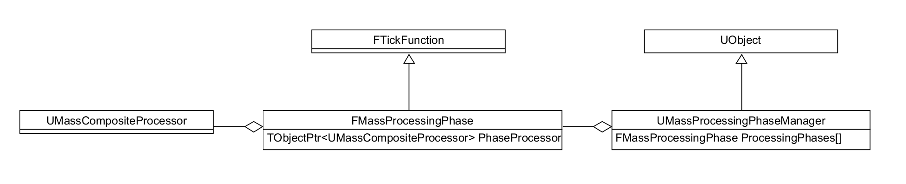

# MassProcessor的执行顺序

[TOC]

MassProcessor的执行顺序由`UMassCompositeProcessor`来控制，在[视频29:52](https://www.bilibili.com/video/BV13D4y1v7xx)有过说明，这里会从源码层面说一下它的流程。


## MassProcessingPhaseManager

Processor在哪个TickGroup执行时`MassProcessingPhaseManager`决定的，来看源码中的注释：

```cpp
//MassProcessingPhaseManager.h

/** MassProcessingPhaseManager owns separate FMassProcessingPhase instances for every ETickingGroup. When activated
 *  via Start function it registers and enables the FMassProcessingPhase instances which themselves are tick functions 
 *  that host UMassCompositeProcessor which they trigger as part of their Tick function. 
 *  MassProcessingPhaseManager serves as an interface to said FMassProcessingPhase instances and allows initialization
 *  with MassSchematics (via InitializePhases function) as well as registering arbitrary functions to be called 
 *  when a particular phase starts of ends (via GetOnPhaseStart and GetOnPhaseEnd functions). */
UCLASS(Transient, HideCategories = (Tick))
class MASSENTITY_API UMassProcessingPhaseManager : public UObject
{
    ...
}
```

大致意思是，`MassProcessingPhaseManager`管理着一堆的`FMassProcessingPhase`,  这些`FMassProcessingPhase`是`FTickFunction`, 可以在不同的TickGroup中执行。每个`FMassProcessingPhase`又持有一个`UMassCompositeProcessor`，从而`UMassCompositeProcessor`也有了在不同TickGroup中执行的能力：



### 初始化

初始化堆栈：

```cpp
UMassProcessingPhaseManager::CreatePhases()
-> UMassProcessingPhaseManager::PostInitProperties()
-> FObjectInitializer::PostConstructInit()
-> UObject::CreateDefaultSubobject(...)
-> UMassSimulationSubsystem::UMassSimulationSubsystem(const FObjectInitializer & ObjectInitializer)
```

它在一个Subsystem中被创建，初始化的主要逻辑为：

```cpp
//MassProcessingPhaseManager.cpp
void UMassProcessingPhaseManager::CreatePhases() 
{
    //预计要改成从Settings里面读取？
	// @todo copy from settings instead of blindly creating from scratch
	for (int i = 0; i < int(EMassProcessingPhase::MAX); ++i)
	{
		ProcessingPhases[i].Phase = EMassProcessingPhase(i);
        
        //指定TickGroup
		ProcessingPhases[i].TickGroup = UE::Mass::Private::PhaseToTickingGroup[i];
        
        //为每个TickGroup创建了一个MassCompositeProcessor， 保存在ProcessingPhases中
		UMassCompositeProcessor* PhaseProcessor = NewObject<UMassCompositeProcessor>(this, 
                       UMassCompositeProcessor::StaticClass(), *FString::Printf(TEXT("ProcessingPhase_%s"), 
                       *UEnum::GetDisplayValueAsText(EMassProcessingPhase(i)).ToString()));
		SetPhaseProcessor(EMassProcessingPhase(i), PhaseProcessor);
	}
}
```

### 注册Tick

注册堆栈：

```cpp
UMassProcessingPhaseManager::EnableTickFunctions(const UWorld & World)
-> UMassProcessingPhaseManager::Start(UWorld & World)
-> UMassSimulationSubsystem::StartSimulation(UWorld & InWorld)
-> UMassSimulationSubsystem::OnWorldBeginPlay(UWorld & InWorld)
-> UWorld::BeginPlay()
```

大致逻辑：

```cpp
//MassProcessingPhaseManager.cpp
void UMassProcessingPhaseManager::EnableTickFunctions(const UWorld& World)
{
	for (FMassProcessingPhase& Phase : ProcessingPhases)
	{
        //就是通用的注册TickFunction的方式
		Phase.RegisterTickFunction(World.PersistentLevel);
		Phase.SetTickFunctionEnable(true);
    }
}
```

### 执行Tick

```cpp
//MassProcessingPhaseManager.cpp
void FMassProcessingPhase::ExecuteTick(float DeltaTime, ELevelTick TickType, ...)
{
	//这里只是设置下状态
	PhaseManager->OnPhaseStart(*this);
	{
		//大部分逻辑这里执行， 通常用如下代码进行注册
        //PhaseManager->GetOnPhaseStart(Phase)->AddUObject(...)
		OnPhaseStart.Broadcast(DeltaTime);
	}

	//如果是并行模式，默认是true
	if (bRunInParallelMode)
	{
		if (PhaseProcessor->IsEmpty() == false)
		{
            //并行运行CompositionProcessor
			const FGraphEventRef PipelineCompletionEvent = UE::Mass::Executor::TriggerParallelTasks(*PhaseProcessor, Context, 
             	[this, DeltaTime]()
				{
                    //这个函数其实是调用OnPhaseEnd.Broadcast(DeltaTime)和PhaseManager->OnPhaseEnd(*this);
					OnParallelExecutionDone(DeltaTime);
				});
		}
	}
	else
	{
        //串行
		UE::Mass::Executor::Run(*PhaseProcessor, Context);
		{
			LLM_SCOPE_BYNAME(TEXT("Mass/PhaseEndDelegate"));
			OnPhaseEnd.Broadcast(DeltaTime);
		}
		PhaseManager->OnPhaseEnd(*this);
		bIsDuringMassProcessing = false;
	}
}
```

## UMassCompositeProcessor

并行运行`UMassCompositeProcessor`时，基本逻辑如下：

```cpp
//MassProcessor.cpp
FGraphEventRef UMassCompositeProcessor::DispatchProcessorTasks(...)
{
    //ProcessingFlatGraph已经是个有依赖顺序的数组了，即后面的元素依赖前面的元素，第一个元素一定不会依赖其他项的
	for (FDependencyNode& ProcessingNode : ProcessingFlatGraph)
	{
		FGraphEventArray Prerequisites;

        //创建出TaskGraph
		for (const int32 DependencyIndex : ProcessingNode.Dependencies)
		{
			Prerequisites.Add(Events[DependencyIndex]);
		}

		// we don't expect any group nodes at this point. If we get any there's a bug in dependencies solving
		if (ensure(ProcessingNode.Processor))
		{
			Events.Add(ProcessingNode.Processor->DispatchProcessorTasks(EntityManager, ExecutionContext, Prerequisites));
		}
	}
    //执行
    FGraphEventRef CompletionEvent = FFunctionGraphTask::CreateAndDispatchWhenReady([this](){}
		, GET_STATID(Mass_GroupCompletedTask), &Events, ENamedThreads::AnyHiPriThreadHiPriTask);
}
```

### 初始化

在`UMassCompositionProcessor`中有这么几个变量：

```cpp
//MassProcessor.h
UCLASS()
class MASSENTITY_API UMassCompositeProcessor : public UMassProcessor
{
protected:
    //就是各TArray<TObjectPtr<UMassProcessor>> Processors
    UPROPERTY(VisibleAnywhere, Category=Mass)
	FMassRuntimePipeline ChildPipeline;

    //子Processor的依赖关系
	TArray<FDependencyNode> ProcessingFlatGraph;
}
```

初始化主要就是针对这两个变量。进入游戏时会重建Processor的执行管线：

```cpp
UMassSimulationSubsystem::RebuildTickPipeline()
-> UMassSimulationSubsystem::OnWorldBeginPlay(UWorld & InWorld)
-> UWorld::BeginPlay()
```

主要是调用了这个函数：

```cpp
void UMassProcessingPhaseManager::InitializePhases(UObject& InProcessorOwner)
{
    //获取当前需要运行的Processor, 主要逻辑在UMassEntitySettings::BuildProcessorList中：
    //1. 反射得到所有MassProcessor的对象，去掉abstract的和CompositeProcessor，存到ProcessorCDOs变量中
    //2. 果这个Processor设置了bAutoRegisterWithProcessingPhases， 意味着要自动运行，再把这些Processor加入到ProcessingPhasesConfig中
    //   返回的也是这个ProcessingPhasesConfig
	const FMassProcessingPhaseConfig* ProcessingPhasesConfig = GET_MASS_CONFIG_VALUE(GetProcessingPhasesConfig());

	for (int i = 0; i < int(EMassProcessingPhase::MAX); ++i)
	{
		const FMassProcessingPhaseConfig& PhaseConfig = ProcessingPhasesConfig[i];
		UMassCompositeProcessor* PhaseProcessor = ProcessingPhases[i].PhaseProcessor;
		FString FileName = ...;
        
        //主要是调用了UMassCompositeProcessor::SetProcessors函数
        //1. 使用FProcessorDependencySolver分析依赖关系，把PhaseProcessor的所有子Processor写入ProcessingFlatGraph变量
        //2. 将所有的子Processor写入ChildPipeline变量
		PhaseProcessor->CopyAndSort(PhaseConfig, FileName);
        
        //初始化所有子Processor
		PhaseProcessor->Initialize(InProcessorOwner);
	}

```

## ProcessorDependencySolver

所有的Processor的依赖关系都是通过ProcessorDependencySolver来解析。每个Processor里都有ExecutionOrder变量：

```cpp
//MassProcessor.h

USTRUCT()
struct FMassProcessorExecutionOrder
{
	GENERATED_BODY()
        
	//Processor所属的组名，有子组概念，可参考FProcessorDependencySolver::CreateSubGroupNames中的注释
	FName ExecuteInGroup = FName(); 

	//在哪个Processor之前执行, 可以是组名，也可以是Processor名
	TArray<FName> ExecuteBefore; 

	//在哪个Processor之前执行, 可以是组名，也可以是Processor名
	TArray<FName> ExecuteAfter; 
};

class MASSENTITY_API UMassProcessor : public UObject
{
    UPROPERTY(EditDefaultsOnly, Category = Processor, config)
	FMassProcessorExecutionOrder ExecutionOrder;
}
```

在中，会对Processor依次调用`FProcessorDependencySolver::CreateNodes`来建立索引关系：

```cpp
//MassProcessorDependencySolver.h

//CreateNode中的Node， 用以辅助建立索引关系，所有的Node保存在AllNodes变量中
struct FProcessorDependencySolver::FNode
{
    FName Name = TEXT("");
	UMassProcessor* Processor = nullptr;
	TArray<int32> OriginalDependencies;
	TArray<int32> TransientDependencies;
	TArray<FName> ExecuteBefore;
	TArray<FName> ExecuteAfter;
	FMassExecutionRequirements Requirements;
	int32 NodeIndex = INDEX_NONE;
	TArray<int32> SubNodeIndices; //所有的子节点, 用以对Processor分组
}

//MassProcessorDependencySolver.cpp

//这一步建立了ProcessorGroup和Processor的关系
void FProcessorDependencySolver::CreateNodes(UMassProcessor& Processor)
{
    //1. 分析出Processor的组名，判断AllNode中是否创建过该组名的节点
    //		1.1 如果有, 意味着某个Node需要加一个叶子节点。
    //			在AllNode中新加一个该Processor的节点，并在该组名节点的SubNodeIndices中引用这个节点
    //		1.2 如果没有，可能遇到了一个全新组
    //			如果组名正确，创建组名节点：AllNodes.Add_GetRef({ GroupFName, nullptr, NewGroupNodeIndex })
    //			创建Processor节点，并在该组名节点的SubNodeIndices中引用这个节点	
}
```

在之后的`BuildDependencies`函数中，去除组的概念，将对组的依赖改为对Processor的依赖：

```cpp
//MassProcessorDependencySolver.cpp
void FProcessorDependencySolver::BuildDependencies()
{
    //1. 改为单向依赖，即把A.ExecuteBefore(B)该为 B.ExecuteAfter(A)
    //2. 处理组和Process的依赖关系, 例如
	// 		2.1 组A[P1, P2] 依赖 P3, 那么P1, P2都依赖P3
    //		2.2 P4依赖组B[P5, P6], 那么P4依赖P5,P6 
}
```

至此，依赖关系建立完毕，调用`Solve`输出。