# UE5 MassVisualizationTrait爬坑记录

[TOC]

MassVisualizationTrait是用来在场景中展示一些Mesh或Actor的特性，使用方式可以参考[视频06:02](https://www.bilibili.com/video/BV1Tt4y1K7Jq)。使用期间遇到了一些坑，特此记录。


## 基本使用方式

在配置中添加VisualizationTraint，并配好LOD等数据：

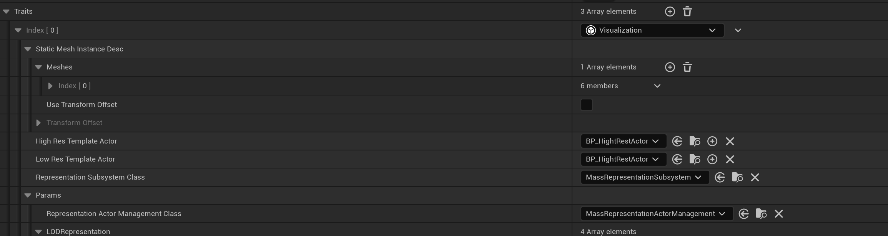

运行，发现报错：

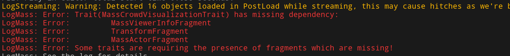

这是缺少依赖的Fragment, 都把它们加上去：

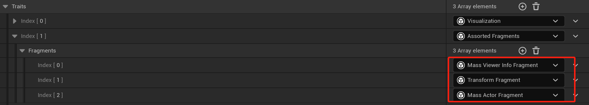

运行，还是没有显示。这是因为处理VisualizationTrait的Processor没有自动运行，我们新添加一个类, 让MassVisualizationProcessor跑起来

```cpp
UCLASS()
class USimpleVisualizationProcessor : public UMassVisualizationProcessor
{
	GENERATED_BODY()

public:
	USimpleVisualizationProcessor();
};

USimpleVisualizationProcessor::USimpleVisualizationProcessor()
{
	bAutoRegisterWithProcessingPhases = true;
}
```

可以正常显示了。

## LOD无效

使用VisualizationTrait的一个很重要的原因就是因为它提供LOD功能，但在上面的配置中，如果我们这样配置了：

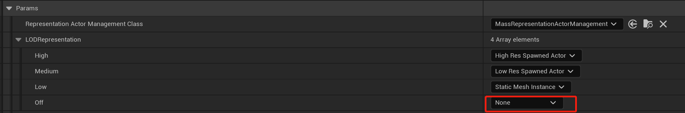

发现又不能正常显示了，这意味着LOD功能并没有开启。断点函数：

```cpp
//MassRepresentationProcessor.cpp
void UMassRepresentationProcessor::UpdateRepresentation(FMassExecutionContext& Context)
{
    //获取LoDFragment
    const TConstArrayView<FMassRepresentationLODFragment> RepresentationLODList = 
        Context.GetFragmentView<FMassRepresentationLODFragment>();
    
    for (int32 EntityIdx = 0; EntityIdx < NumEntities; EntityIdx++)
	{
		const FMassRepresentationLODFragment& RepresentationLOD = RepresentationLODList[EntityIdx];
		
        //获取该Entity需要展示的LOD信息，这时得到的结果是EMassRepresentationType::None
        //查看RepresentationLOD的内容，发现它还是初始化内容，怀疑LOD相关的Processor没有处理。
		EMassRepresentationType WantedRepresentationType = 
            RepresentationParams.LODRepresentation[FMath::Min((int32)RepresentationLOD.LOD, (int32)EMassLOD::Off)];
    }
}
```

查看`UMassVisualizationLODProcessor`, 发现`bAutoRegisterWithProcessingPhases`设为了false。为了让其运行，我们创建一个子类：

```cpp
UCLASS()
class USimpleVisualizationLODProcessor : public UMassVisualizationLODProcessor
{
	GENERATED_BODY()

public:
	USimpleVisualizationLODProcessor();
};

USimpleVisualizationLODProcessor::USimpleVisualizationLODProcessor()
{
	bAutoRegisterWithProcessingPhases = true;
}
```

运行， 可以正确显示物体了。


## Actor不能移动

仿照[视频07:14](https://www.bilibili.com/video/BV1nB4y1y7cX),  添加了一个**USimpleRandomMovementProcessor**， 用于实现Entity的随机移动的功能，这时发现Mesh的可以正常移动，但切换到Actor就不动了。猜想是Entity数据与Actor数据没联动起来， 先来看看Actor是怎么被创建出来的：

### 创建Actor流程

请求创建Actor

```cpp
UMassActorSpawnerSubsystem::RequestActorSpawnInternal(const FConstStructView SpawnRequestView)
-> UMassActorSpawnerSubsystem::RequestActorSpawn<FMassActorSpawnRequest,void>(const FMassActorSpawnRequest & InSpawnRequest)
-> UMassRepresentationSubsystem::GetOrSpawnActorFromTemplate(...) 
-> UMassRepresentationActorManagement::GetOrSpawnActor(...)
-> UMassRepresentationProcessor::UpdateRepresentation(FMassExecutionContext & Context)
```

实际创建Actor：

```cpp
//MassActorSpawnerSubsystem.cpp

AActor* UMassActorSpawnerSubsystem::SpawnActor(FConstStructView SpawnRequestView) const
{
    //获得创建请求
	const FMassActorSpawnRequest& SpawnRequest = SpawnRequestView.Get<FMassActorSpawnRequest>();
    //创建Actor
	if (AActor* SpawnedActor = World->SpawnActorDeferred<AActor>(
        SpawnRequest.Template, SpawnRequest.Transform, nullptr, nullptr, ESpawnActorCollisionHandlingMethod::AlwaysSpawn))
	{
		SpawnedActor->FinishSpawning(SpawnRequest.Transform);
		++NumActorSpawned;

		if (IsValidChecked(SpawnedActor))
		{
            //获取Actor身上的UMassAgentComponent组件，用以联系Actor和Entity
			if (UMassAgentComponent* AgentComp = SpawnedActor->FindComponentByClass<UMassAgentComponent>())
			{
				AgentComp->SetPuppetHandle(SpawnRequest.MassAgent);
			}
			return SpawnedActor;
		}
	}

	return nullptr;
}
```

```cpp
void UMassAgentComponent::SetPuppetHandle(const FMassEntityHandle NewHandle)
{
	SetEntityHandleInternal(NewHandle);

	if (UMassAgentSubsystem* AgentSubsystem = UWorld::GetSubsystem<UMassAgentSubsystem>(GetWorld()))
	{
		AgentSubsystem->MakePuppet(*this);
	}
}
```

根据创建Actor流程来看，需要从Actor上获取一个**UMassAgentComponent**来操作，那么我们先给Actor添加一个AgentComponent组件。运行后报错：

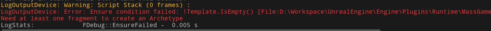

这提示AgentComponent的Entity配置为空。

### 配置AgentComponent

再来查一下AgentComponent需要哪些配置

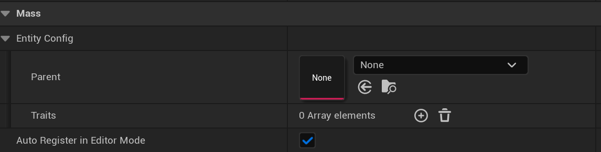

我们通过代码来看下它需要哪些Traits。在MassAgentTraits中，定义了如下几个Trait：

```cpp
//MassAgentTraits.h

//基类，虚类
UMassAgentSyncTrait

//
UMassAgentCapsuleCollisionSyncTrait
UMassAgentMovementSyncTrait
UMassAgentOrientationSyncTrait
UMassAgentFeetLocationSyncTrait
```

在其中的一些类中，使用了如下的代码：

```cpp
//MassAgentTraits.cpp

BuildContext.GetMutableObjectFragmentInitializers().Add([=](...)
{
    //获取某个组件，将该组件加入到ComponentWrapperFragment里面去
}
```

应该就是在这些函数中将Entity和Actor联系起来，因为我们使用的是一个普通的Actor，没有Movement和胶囊体组件，我们选择加上一个**MassAgentFeetLocationSync**到AgentComponent上：

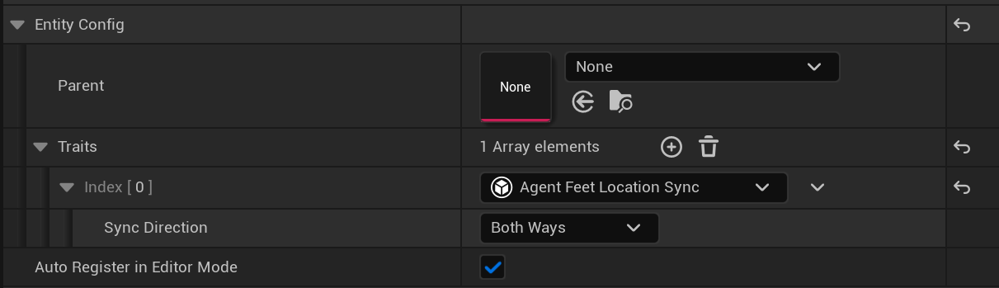

加上之后还是动不了。继续看代码，会发现如下逻辑：

```cpp
//MassAgentTraits.cpp
if (EnumHasAnyFlags(SyncDirection, EMassTranslationDirection::ActorToMass))
{
    //UMassSceneComponentLocationToMassTranslator的功能是将Actor的位置写入Mass
    BuildContext.AddTranslator<UMassSceneComponentLocationToMassTranslator>();
}

if (EnumHasAnyFlags(SyncDirection, EMassTranslationDirection::MassToActor))
{
    //UMassSceneComponentLocationToActorTranslator将Mass的数据设置到Actor
    BuildContext.AddTranslator<UMassSceneComponentLocationToActorTranslator>();
}
```

这两个函数的实际功能是给Translator的EntityQuery加上一个Tag，指定查询某种类型的Entity，以达到类似关闭和开启Processor的效果。

我们再查看Processor的执行顺序：

```cpp
//MassProcessorDependencySolver
void FProcessorDependencySolver::ResolveDependencies(TArray<FProcessorDependencySolver::FOrderInfo>& OutResult)
{
    ...
    Solve(OutResult);

    //可以发现Processor的运行顺序为：
    // SimpleRandomMovementProcessor：将目标位置写入Mass
    // MassSceneComponentLocationToMassTranslator: 将Actor位置写入Mass， 冲掉了以前的数据
    // MassSceneComponentLocationToActorTranslator：
	UE_LOG(LogMass, Verbose, TEXT("Dependency order:"));
	for (const FProcessorDependencySolver::FOrderInfo& Info : OutResult)
	{
		UE_LOG(LogMass, Verbose, TEXT("\t%s"), *Info.Name.ToString());
	}
}
```

以前的数据被冲掉了，所以Actor始终不动。这里就有两种方式解决：

1. 将SyncDirection设置为MassToActor， 不开启将Actor位置写入Mass的功能。

    

2. 将SimpleRandomMovementProcessor的执行顺序放到MassSceneComponentLocationToMassTranslator之后：

    ```cpp
    USimpleRandomMovementProcessor::USimpleRandomMovementProcessor()
    {
		...
    	ExecutionOrder.ExecuteAfter.Add(FName("MassSceneComponentLocationToMassTranslator"));
    }
    ```
    
    

## LOD距离不生效

到这里Actor可以正常移动了，但我们在配置LOD距离时，发现并没有生效：

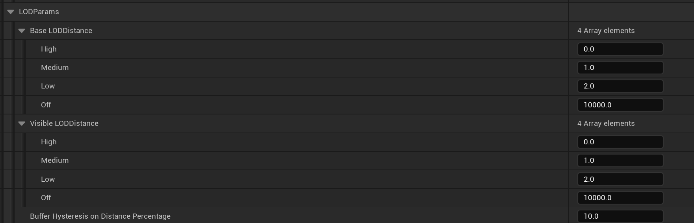

这个配置项是`FMassVisualizationLODParameters`类型，它在`UMassVisualizationLODProcessor`中被用到：

```cpp
//MassVisualizationLODProcessor.cpp
void UMassVisualizationLODProcessor::ConfigureQueries()
{
	BaseQuery.AddConstSharedRequirement<FMassVisualizationLODParameters>();
}
```

可以猜想这个Processor就是处理LOD的Processor， 在它的Execute函数中，有一段计算LOD的逻辑：

```cpp
//MassVisualizationLODProcessor.cpp

void UMassVisualizationLODProcessor::Execute(FMassEntityManager& EntityManager, FMassExecutionContext& Context)
{
    auto CalculateLOD = [this](FMassExecutionContext& Context)
    {
        FMassVisualizationLODSharedFragment& LODSharedFragment = 
            Context.GetMutableSharedFragment<FMassVisualizationLODSharedFragment>();
        TArrayView<FMassRepresentationLODFragment> RepresentationLODList = 
            Context.GetMutableFragmentView<FMassRepresentationLODFragment>();
        
        //这里的ViewerInfoList很奇怪，里面的数据都是0，怀疑没被处理到
        TConstArrayView<FMassViewerInfoFragment> ViewerInfoList = Context.GetFragmentView<FMassViewerInfoFragment>();
        //根据ViewerInfoFragment计算LOD
        LODSharedFragment.LODCalculator.CalculateLOD(Context, ViewerInfoList, RepresentationLODList);
    };
    CloseEntityQuery.ForEachEntityChunk(EntityManager, Context, CalculateLOD);
    FarEntityQuery.ForEachEntityChunk(EntityManager, Context, CalculateLOD);
}
```

搜索后发现`FMassViewerInfoFragment`在`MassLODCollectorProcessor`中会被修改，但`MassLODCollectorProcessor`又没自动运行，所以我们加一个子类，让它运行起来：

```cpp
UCLASS()
class USimpleLODCollectorProcessor : public UMassLODCollectorProcessor
{
	GENERATED_BODY()

public:
	USimpleLODCollectorProcessor();
};

USimpleLODCollectorProcessor::USimpleLODCollectorProcessor()
{
	bAutoRegisterWithProcessingPhases = true;
}
```

加上之后发现相关计算LOD的逻辑也没有跑到：

```cpp
//MassLODCollectorProcessor.cpp

template <bool bLocalViewersOnly>
void UMassLODCollectorProcessor::CollectLODForChunk(FMassExecutionContext& Context)
{
}
```

这个函数没跑进来， 它在`UMassLODCollectorProcessor::ExecuteInternal`中被几个EntityQuery使用，查看这几个Query，发现他们需要这么几个Tag：

- FMassCollectLODViewerInfoTag, 在**UMassLODCollectorTrait**中被添加
- FMassOffLODTag, 在**UMassSimulationLODTrait**中被添加
- FMassVisibilityCulledByDistanceTag, 在**UMassVisualizationTrait**中被添加

VisualizationTrait已经又了，再在EntityConfig加上加上**MassLODCollectorTrait**和**MassSimulationLODTrait**, 加上后存在重复定义的情况：

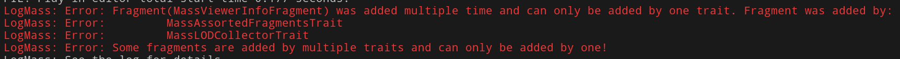

去掉重复定义的MassViewerInfoFragment:

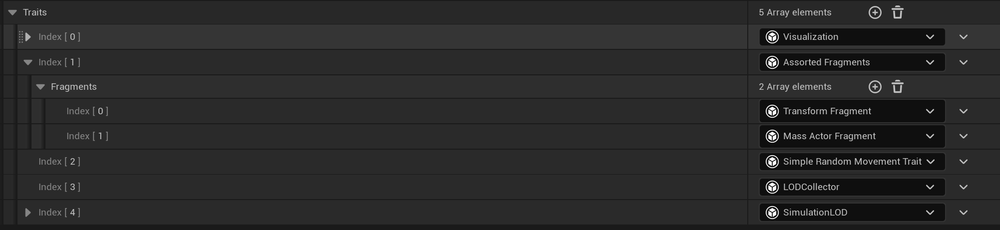

在注意设置好LOD count：

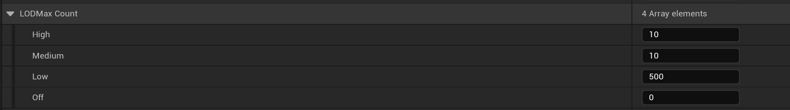

保证创建的Entity数量大于High+Medium。运行，生效了，但会出现一个奇怪的现象，从Hight切换到Low是，High Res Actor并不会被析构。

再看`UMassRepresentationProcessor::UpdateRepresentation`的逻辑：

```cpp
void UMassRepresentationProcessor::UpdateRepresentation(FMassExecutionContext& Context)
{
    const bool bDoKeepActorExtraFrame = UE::MassRepresentation::bAllowKeepActorExtraFrame ?
        								RepresentationParams.bKeepLowResActors : false;

    //只有这些条件满足才删掉Actor， 
    if (!bDoKeepActorExtraFrame || 
        (Representation.PrevRepresentation != EMassRepresentationType::HighResSpawnedActor
         	&& Representation.PrevRepresentation != EMassRepresentationType::LowResSpawnedActor))
    {
        DisableActorForISM(Actor);
    }
}
```

所以`bKeepLowResActors`置为false就可以了：

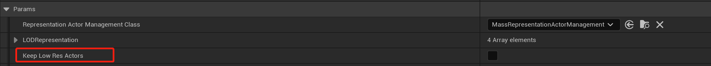

运行成功！！！


## 总结

Mass这一套框架对数据和逻辑做了进一步的解耦，Processor系统也很强大，就连Subsystem都可以整合到Processor中。但过于解耦就导致使用和问题定位的难度加大，特别是现在还没有详细文档，使用起来跟炼丹差不多。从最近阅读的代码方面看，Mass框架写得还是比较有野心的，搞不好ECS会成为UE下的主要开发模式。

