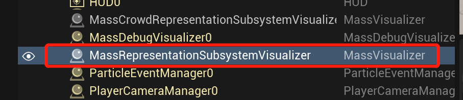
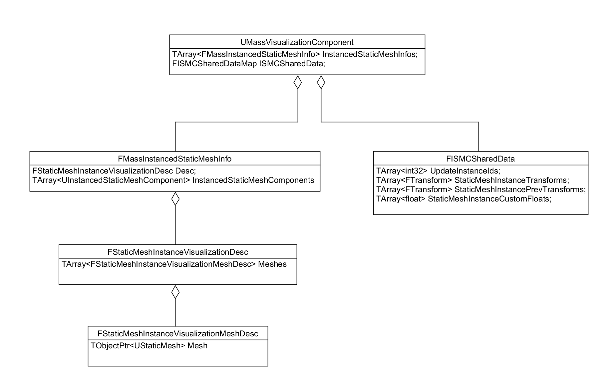

# UE5 Mass对ISM的处理

[TOC]

无论是`MassDebugVisualizationTrait`中还是`MassVisualizationTrait`中，都可以用**Instaiced Static Mesh**来展示一个Entity，这里分析`MassVisualizationTrait`处理ISM的流程。

## MassVisualier

Mass使用一个**AMassVisualier**的Actor来管理ISM， 它被动态创建再场景中：



创建堆栈：

```cpp
UWorld::SpawnActor<AMassVisualizer>(const FActorSpawnParameters & SpawnParameters)
-> UMassRepresentationSubsystem::Initialize(FSubsystemCollectionBase & Collection)
-> FSubsystemCollectionBase::AddAndInitializeSubsystem(UClass * SubsystemClass)
-> FSubsystemCollectionBase::Initialize(UObject * NewOuter)
-> UWorld::InitializeSubsystems()
```

MassVisualizer持有一个`MassVisualizationComponent`, 正是这个组件实现了管理ISM的功能、

```cpp
//MassVisualizer.h
class MASSREPRESENTATION_API AMassVisualizer : public AActor
{
	GENERATED_BODY()
public:
	AMassVisualizer();

	/** Visualization component is garantee to exist if this class is created */
	class UMassVisualizationComponent& GetVisualizationComponent() const { return *VisComponent; }

protected:
	UPROPERTY()
	TObjectPtr<class UMassVisualizationComponent> VisComponent;
};
```

### MassVisualizationComponent

MassVisualizationComponent持有了这些信息：



主要是两个内容：

```cpp
//MassVisualizationComponent.h
class MASSREPRESENTATION_API UMassVisualizationComponent : public UActorComponent
{
 protected:
    //mesh和ISMC信息的列表
    TArray<FMassInstancedStaticMeshInfo> InstancedStaticMeshInfos;
    
    //Mesh和ISM对应的Map, 表示根据这个mesh创建出了多少ISM。
    //key: FStaticMeshInstanceVisualizationMeshDesc的hash， value:FISMCSharedData
    FISMCSharedDataMap ISMCSharedData;
}
```
#### FISMCSharedData

主要用来保存一个ISMC上的Instances数据。

```cpp
//MassRepresentationTypes.h
struct MASSREPRESENTATION_API FISMCSharedData
{
	//Instance对应的EntityID
	TArray<int32> UpdateInstanceIds;
    
    //位置信息
	TArray<FTransform> StaticMeshInstanceTransforms;
	TArray<FTransform> StaticMeshInstancePrevTransforms;

	//CustomData
	TArray<float> StaticMeshInstanceCustomFloats;
};
```

FISMCSharedData在每次Tick都会清掉一遍：

```cpp
//MassVisualizationComponent.cpp

void UMassVisualizationComponent::BeginVisualChanges()
{
	// Reset instance transform scratch buffers
	for (auto It = ISMCSharedData.CreateIterator(); It; ++It)
	{
		//重置FISMCSharedData
	}
}
```

然后在创建`UMassUpdateISMProcessor`中创建:

```cpp
FMassLODSignificanceRange::AddBatchedTransform(...) //又会把每个Entity的信息创建出来
-> UMassUpdateISMProcessor::UpdateISMTransform(...)
-> UMassUpdateISMProcessor::Execute
```
#### MassInstancedStaticMeshInfo
主要用来保存动态创建的ISMC， 以及配置的Mesh信息

```cpp
//MassRepresentationTypes.h
struct MASSREPRESENTATION_API FMassInstancedStaticMeshInfo
{
protected:
	//MassVisualizationTrait中配置的Mesh信息, 持有一个FStaticMeshInstanceVisualizationMeshDesc的列表，可配多个mesh
	FStaticMeshInstanceVisualizationDesc Desc;
    
	//显示Mesh所需要的ISMC，因为Desc中可以配多个Mesh信息，所以ISMC也需要有多个
	TArray<TObjectPtr<UInstancedStaticMeshComponent>> InstancedStaticMeshComponents;
    
    //Mesh的LOD信息，可以根据LOD的配置获取到FISMCSharedData
    TArray<FMassLODSignificanceRange> LODSignificanceRanges;
}
```

#### MassLODSignificanceRange

```cpp
//MassRepresentationTypes.h

struct MASSREPRESENTATION_API FMassLODSignificanceRange
{
    //这个LOD涉及到的ISMC的Hash，用来在FISMCSharedDataMap索引数据
    TArray<uint32> StaticMeshRefs;
    
    //指向的是UMassVisualizationComponent中的数据
    //全局的Instances数据
	FISMCSharedDataMap* ISMCSharedDataPtr = nullptr; 
}
```

#### 一个简单示例

我们对ISM进行的操作实际上都是对`ISMCSharedData`数据的更改。参照`UMassUpdateISMProcessor::Execute`:

```cpp
EntityQuery.ForEachEntityChunk(EntityManager, Context, [](FMassExecutionContext& Context)
{
    UMassRepresentationSubsystem* RepresentationSubsystem = 
        Context.GetSharedFragment<FMassRepresentationSubsystemSharedFragment>().RepresentationSubsystem;

    //涉及到的Fragments
	FMassInstancedStaticMeshInfoArrayView ISMInfo = RepresentationSubsystem->GetMutableInstancedStaticMeshInfos();
    const TArrayView<FMassRepresentationFragment> RepresentationList = 
        	Context.GetMutableFragmentView<FMassRepresentationFragment>();
	const TConstArrayView<FMassRepresentationLODFragment> RepresentationLODList = 
            Context.GetFragmentView<FMassRepresentationLODFragment>();
    
    for (int32 EntityIdx = 0; EntityIdx < NumEntities; EntityIdx++)
	{
		const FMassRepresentationLODFragment& RepresentationLOD = RepresentationLODList[EntityIdx];
		FMassRepresentationFragment& Representation = RepresentationList[EntityIdx];
        
        //获取StaticMeshInfo
        FMassInstancedStaticMeshInfo& MeshInfo = ISMInfo[Representation.StaticMeshDescIndex];
        //EntityID
		int32 EntityId = GetTypeHash(Context.GetEntity(i));
		
        //获取LODRange
        if (FMassLODSignificanceRange* Range = ISMInfo.GetLODSignificanceRange(RepresentationLOD.LODSignificance))
		{
			for (int i = 0; i < Range->StaticMeshRefs.Num(); i++)
			{
				//获得FISMCSharedData			
				FISMCSharedData& SharedData = (*Range->ISMCSharedDataPtr)[Range->StaticMeshRefs[i]];
				
                //TODO: 操作ISMCSharedData
			}
		}
    }
}
```

因为`FISMCSharedData`是在``UMassUpdateISMProcessor::UpdateISMTransform`初始化的，所以如果我们想做一些其他操作，例如设置CustomData之类的，需要**把我们的Processor放到`UMassUpdateISMProcessor`之后**。


## 创建ISMC

当每初始化一个`MassVisualizationTrait`时，会将配置中的StaticMesh信息写到`UMassVisualizationComponent`组件中， 堆栈：

```cpp
UMassVisualizationComponent::FindOrAddVisualDesc(const FStaticMeshInstanceVisualizationDesc & Desc)
-> UMassRepresentationSubsystem::FindOrAddStaticMeshDesc(const FStaticMeshInstanceVisualizationDesc & Desc)
-> UMassVisualizationTrait::BuildTemplate(FMassEntityTemplateBuildContext & BuildContext, const UWorld & World)
```

逻辑：

```cpp
//MassVisualizationComponent.cpp

int16 UMassVisualizationComponent::FindOrAddVisualDesc(const FStaticMeshInstanceVisualizationDesc& Desc)
{
	int32 VisualIndex = //找找看是否有一样的StaticMesh配置
	if (VisualIndex == INDEX_NONE)
	{
        //添加一个
		VisualIndex = InstancedStaticMeshInfos.Emplace(Desc);
        //设置状态：需要创建ISMC了
		bNeedStaticMeshComponentConstruction = true;
	}
}
```

之后在每帧都会运行的函数`BeginVisualChanges`中：

```cpp
//MassVisualizationComponent.cpp

void UMassVisualizationComponent::BeginVisualChanges()
{
	// Conditionally construct static mesh components
	if (bNeedStaticMeshComponentConstruction)
	{
        //根据InstancedStaticMeshInfos创建并保存ISMC，然后把ISMC挂到Owner的RootComponent下面。
		ConstructStaticMeshComponents();
        //Reset状态
		bNeedStaticMeshComponentConstruction = false;
	}
}
```

## 创建ISM

有了ISMC，就可以创建ISM了。在`UMassUpdateISMProcessor`中：

```cpp
//MassUpdateISMProcessor.cpp
void UMassUpdateISMProcessor::Execute(FMassEntityManager& EntityManager, FMassExecutionContext& Context)
{
    if (Representation.CurrentRepresentation == EMassRepresentationType::StaticMeshInstance)
	{
        //如果这个Entity需要使用ISM展示，调用一下UpdateISMTransform
        //最终会调到FMassLODSignificanceRange::AddBatchedTransform中，
        //
		UpdateISMTransform(...);
	}
}
```


## ISM位置的更新

在`UMassUpdateISMProcessor::Execute`中会把**FTransformFragment**的数据同步到**FISMCSharedData**里，之后调用ISMC的`UpdateInstances`接口：

```cpp
UInstancedStaticMeshComponent::UpdateInstances(...)
-> UMassVisualizationComponent::EndVisualChanges()
-> UMassRepresentationSubsystem::OnProcessingPhaseStarted(const float DeltaSeconds, const EMassProcessingPhase Phase)
```

大体流程如下：

**PrePhysics**阶段

- 按需创建ISMC
- 清除FISMCSharedData
- 各种Processor更新FISMCSharedData

**PostPhysics**阶段

- 将FISMCSharedData设置进ISMC