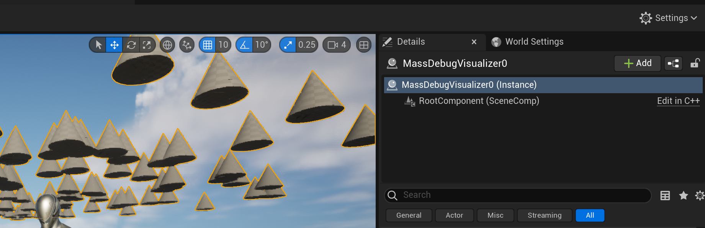

## MassSpawner

[TOC]

基本概念及用法：https://www.bilibili.com/video/BV1nB4y1y7cX


## Eintity的创建

依照示例程序，我们创建了一堆的锥体，这些锥体是什么呢？



可以看到是类似与InstancedStateMesh一样的东西。


### DoSpawning

```cpp
//MassSpawner.cpp
void AMassSpawner::BeginPlay()
{
    //只有设置了bAutoSpawnOnBeginPlay, 而且不能是Client端才能Spawn
    if (bAutoSpawnOnBeginPlay && NetMode != NM_Client)
	{
		DoSpawning();
    }
}
```

在`AMassSpawner::DoSpawning`函数中，真正生成的逻辑是在lambda表达式`GenerateSpawningPoints`中，用来获取spawn的位置：

```cpp
//MassSpawner.cpp, AMassSpawner::DoSpawning()

auto GenerateSpawningPoints = [this, TotalSpawnCount, TotalProportion]()
{
	...
	FFinishedGeneratingSpawnDataSignature Delegate = FFinishedGeneratingSpawnDataSignature::CreateUObject(
        this, &AMassSpawner::OnSpawnDataGenerationFinished, &Generator);
	Generator.GeneratorInstance->Generate(*this, EntityTypes, SpawnCount, Delegate);
	...
};
```

生成位置完毕后，调用回调：

```cpp
void AMassSpawner::OnSpawnDataGenerationFinished(...)
{

	AllGeneratedResults.Append(Results.GetData(), Results.Num());
	if (bAllSpawnPointsGenerated)
	{
		SpawnGeneratedEntities(AllGeneratedResults);
		AllGeneratedResults.Reset();
	}
}
```

在SpawnGeneratedEntities中

```cpp

```


```cpp
//MassEntityEQSSpawnPointsGenerator.cpp
void UMassEntityEQSSpawnPointsGenerator::Generate(...) const
{
}
```

