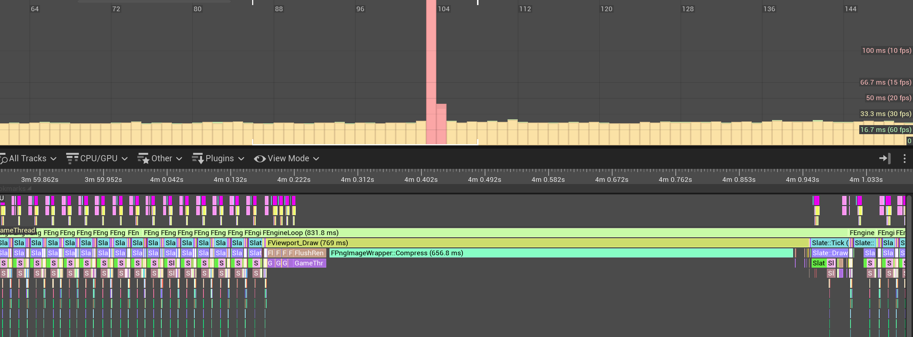
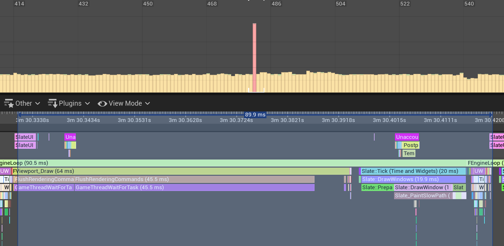

# UE5中截屏功能分析及扩展

[TOC]

## Command

```sh
HighResShot 1920x1080 ScreenShot.png
```

执行命令堆栈

```cpp
UGameViewportClient::HandleHighresScreenshotCommand(const wchar_t * Cmd, FOutputDevice & Ar)
UGameViewportClient::Exec(UWorld * InWorld, const wchar_t * Cmd, FOutputDevice & Ar)
```

这一步主要设置了个标志位，等下一次画Viewport时才处理。所以**一帧内连续执行两次命令的话，只有后一次命令生效**。

```cpp
//GameViewportClient.cpp
bool UGameViewportClient::HandleHighresScreenshotCommand( const TCHAR* Cmd, FOutputDevice& Ar )
{
    //解析命令参数，保存到HighResScreenshotConfig中
	if (GetHighResScreenshotConfig().ParseConsoleCommand(Cmd, Ar))
	{
        //在Viewport中置标志位，其实就是bTakeHighResScreenShot
		Viewport->TakeHighResScreenShot();
	}
}
```


## 截图逻辑

堆栈：

```cpp
GetViewportScreenShot(...)  //UnrealClient.cpp
-> UGameViewportClient::ProcessScreenShots(FViewport * InViewport)
-> FViewport::HighResScreenshot()
-> FViewport::Draw(bool bShouldPresent)
```

相关逻辑：

```cpp
//UnrealClient.cpp
ENGINE_API bool GetViewportScreenShot(FViewport* Viewport, TArray<FColor>& Bitmap, const FIntRect& ViewRect /*= FIntRect()*/)
{
	//把Viewport中的数据读到bitmap中
    //这个Viewport并不是当前真正的viewport， 是经过分辨率调整的
    //调整过程大致如下：  
    // FViewport::HighResScreenshot()
    // 		FDummyViewport* DummyViewport = new FDummyViewport(ViewportClient);
	//		DummyViewport->SizeX = (GScreenshotResolutionX > 0) ? GScreenshotResolutionX : SizeX;
	//		DummyViewport->SizeY = (GScreenshotResolutionY > 0) ? GScreenshotResolutionY : SizeY;
	if (Viewport->ReadPixels(Bitmap, FReadSurfaceDataFlags(), ViewRect))
	{
		check(Bitmap.Num() == ViewRect.Area() || (Bitmap.Num() == Viewport->GetSizeXY().X * Viewport->GetSizeXY().Y));
		return true;
	}
	return false;
}
```

其中生成截图的viewport逻辑：

```cpp
//UnrealClient.cpp
void FViewport::HighResScreenshot()
{
    //按截图指定的大小初始化viewport的大小
    FDummyViewport* DummyViewport = new FDummyViewport(ViewportClient);
	DummyViewport->SizeX = (GScreenshotResolutionX > 0) ? GScreenshotResolutionX : SizeX;
	DummyViewport->SizeY = (GScreenshotResolutionY > 0) ? GScreenshotResolutionY : SizeY;

    //往里面写几次数据，默认是4，个人觉得一次就好，可以减少截屏卡顿。可以通过r.HighResScreenshotDelay来指定
    while (FrameDelay)
	{
        //往DummyViewport中写数据
		FCanvas Canvas(DummyViewport, NULL, ViewportClient->GetWorld(), ViewportClient->GetWorld()->FeatureLevel);
		{
			ViewportClient->Draw(DummyViewport, &Canvas);
		}
    }
    
    //生成截图
    ViewportClient->ProcessScreenShots(DummyViewport);
}
```


从bitmap写入到图像文件是在UGameViewportClient::ProcessScreenShots中完成的

```cpp
//GameViewportClient.cpp
bool UGameViewportClient::ProcessScreenShots(FViewport* InViewport)
{
    bScreenshotSuccessful = GetViewportScreenShot(InViewport, Bitmap);
    if (bScreenshotSuccessful)
    {
        //如果注册了外部回调，从bitmap到图像就交由外部回调完成
        if (ScreenshotCapturedDelegate.IsBound() && CVarScreenshotDelegate.GetValueOnGameThread())
        {
            //截图肯定不会得到透明的图像
            for (auto& Color : Bitmap)
            {
                Color.A = 255;
            }

            // If delegate subscribed, fire it instead of writing out a file to disk
            ScreenshotCapturedDelegate.Broadcast(Size.X, Size.Y, Bitmap);
        }
        //系统处理
        else
        {
            //生成png图像数据
            TArray64<uint8> CompressedBitmap;
			FImageUtils::PNGCompressImageArray(Size.X, Size.Y, Bitmap, CompressedBitmap);
            
            //把png保存到文件
			bIsScreenshotSaved = FFileHelper::SaveArrayToFile(CompressedBitmap, *ScreenShotName);
        }
    }
}
```

## 性能优化

虽然功能达成，但在实际应用中截图那一刻消耗非常高：



800多ms的卡顿还是能明显感觉出来的。一个解决的方式就是把Compress这一过程改成多线程的。

## 多线程的截屏

粗略实现了一般多线程的截屏，大致是这个意思，可能存在线程安全问题。

头文件：

```cpp
#pragma once

#include "CoreMinimal.h"
#include "AsyncScreenshotSubsystem.generated.h"

USTRUCT()
struct FScreenshotData
{
	GENERATED_BODY()

	int32 Width;
	int32 Height;

	TArray<FColor> BitMap;

	FString FileName;
};

UCLASS(BlueprintType)
class UAsyncScreenshotSubsystem : public UGameInstanceSubsystem
{
	GENERATED_BODY()

public:

	virtual void Initialize(FSubsystemCollectionBase& Collection) override;
	virtual void Deinitialize() override;

	UFUNCTION(BlueprintCallable)
		void TakeScreenshot(int32 Width, int32 Height, const FString& FileName);

	void OnScreenshotCompleteToPng(int32 InWidth, int32 InHeight, const TArray<FColor>& InColors);

	void ProcessScreenshotData();

private:
	FDelegateHandle DelegateHandle;
	FString CurrentShotFileName;

	TArray<FScreenshotData> ScreenshotDatas;
	FCriticalSection ScreenshotDataCritical;

	bool Working;
};
```

代码文件：

```cpp
#include "Utils/AsyncScreenshotSubsystem.h"
#include "ImageUtils.h"
#include "ExGameplayLibrary.h"

void UAsyncScreenshotSubsystem::Initialize(FSubsystemCollectionBase& Collection)
{
	Super::Initialize(Collection);

    //降低写入次数，进一步降低开销
	UExGameplayLibrary::ExecCommand("r.HighResScreenshotDelay 1");

	Working = true;
	Async(EAsyncExecution::Thread, [&]()
	{
		ProcessScreenshotData();
	});
}

void UAsyncScreenshotSubsystem::Deinitialize()
{
	Super::Deinitialize();
	Working = false;
}

void UAsyncScreenshotSubsystem::TakeScreenshot(int32 Width, int32 Height, const FString& FileName)
{
	CurrentShotFileName = FileName;
	DelegateHandle = UGameViewportClient::OnScreenshotCaptured().AddUObject(this, &UAsyncScreenshotSubsystem::OnScreenshotCompleteToPng);

	FString Command = FString::Printf(TEXT("HighResShot %dx%d filename=\"%s\""), Width, Height, *FileName);
	UExGameplayLibrary::ExecCommand(Command);
}

void UAsyncScreenshotSubsystem::OnScreenshotCompleteToPng(int32 InWidth, int32 InHeight, const TArray<FColor>& InColors)
{
	UGameViewportClient::OnScreenshotCaptured().Remove(DelegateHandle);

	if (!CurrentShotFileName.IsEmpty())
	{
		FScopeLock SetLock(&ScreenshotDataCritical);

		FScreenshotData* Data = new (ScreenshotDatas)FScreenshotData();
		Data->Width = InWidth;
		Data->Height = InHeight;
		Data->FileName = CurrentShotFileName;
		Data->BitMap = InColors;
	}
	CurrentShotFileName.Reset();
}

void UAsyncScreenshotSubsystem::ProcessScreenshotData()
{
	while (Working)
	{
		if (ScreenshotDatas.Num() == 0)
		{
			FPlatformProcess::Sleep(0.1);
			continue;
		}

		FScopeLock SetLock(&ScreenshotDataCritical);
		TArray<FScreenshotData> Datas = MoveTemp(ScreenshotDatas);
		for (FScreenshotData& Data : Datas)
		{
			TArray64<uint8> CompressBitmap;
			FImageUtils::PNGCompressImageArray(Data.Width, Data.Height, Data.BitMap, CompressBitmap);
			FFileHelper::SaveArrayToFile(CompressBitmap, *Data.FileName);
		}
	}
}
```

之后的性能开销：



