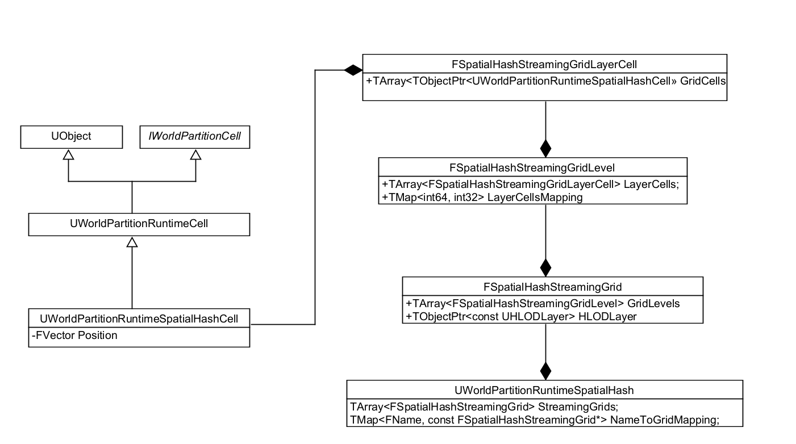
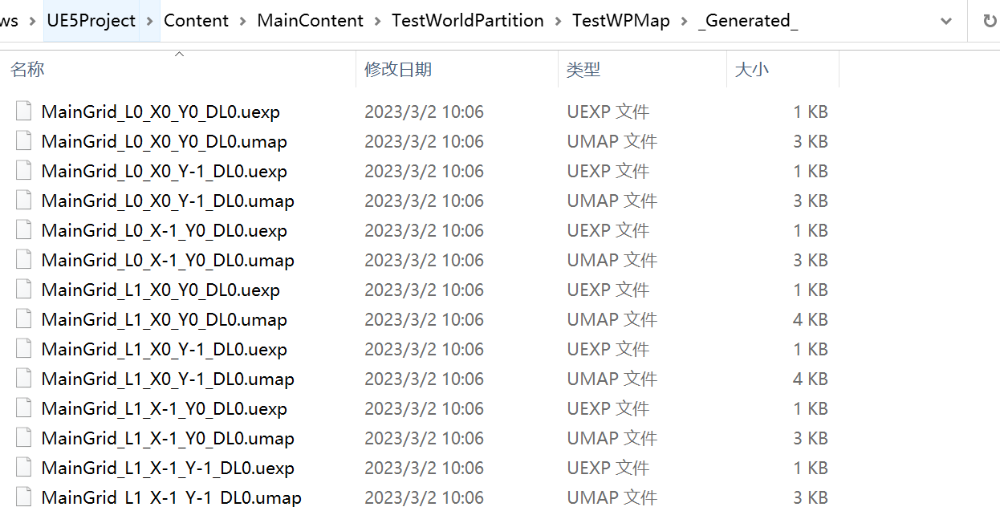
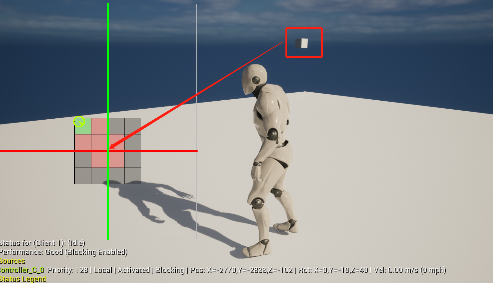

# WorldPartition中Actor的划分

[TOC]

## 入口概览

在Editor模式下，需要将Actor以Sublevel的方式组织起来，以便Cook或是运行，堆栈如下：

```cpp
UWorldPartitionRuntimeSpatialHash::GenerateStreaming(...)
UWorldPartition::GenerateContainerStreaming(...)
UWorldPartition::GenerateStreaming(...)
UWorldPartition::OnBeginPlay()
UWorldPartition::OnPreBeginPIE(bool bStartSimulate)
```

主要逻辑

```cpp
//WorldPartitionRuntimeSpatialHash.cpp
bool UWorldPartitionRuntimeSpatialHash::GenerateStreaming(...)
{
    ...
    //获取当前生效的Grid配置  AllGrids
    
    //将所有Actor按Grid分类  GridActorSetInstances
        
    //开始创建相关数据结构
    for (int32 GridIndex=0; GridIndex < AllGrids.Num(); GridIndex++)
	{
        //对Actor进行划分到相应的cell中
		const FSquare2DGridHelper PartionedActors = GetPartitionedActors(WorldBounds, Grid, GridActorSetInstances[GridIndex]);
        //创建sublevel
		CreateStreamingGrid(Grid, PartionedActors, StreamingPolicy, OutPackagesToGenerate))
	}
    ...
}
```

## Grid, Level和Cell

在FSquare2DGridHelper的构造函数中会生成三者的逻辑关系：

```cpp
//RuntimeSpatialHashGridHelper.cpp
FSquare2DGridHelper::FSquare2DGridHelper(const FBox& InWorldBounds, const FVector& InOrigin, int64 InCellSize)
{
    //根据worldsize和cellsize划分cell
    //1. 以InOrigin为中心点，将world根据InCellSize划分为2的n次方个cell， 
    //2. 初始化n+1个Level
    
    //例如有正方形世界大小为[-2000, 2000], cell大小为1600
    //第一步将世界划分为4x4的cell， 每个cell大小为1600
    //第二步初始化3个FGridLevel：
    //	level[0]:  CellSize[1600], GridSize[4]
    //	level[1]:  CellSize[3200], GridSize[2]
    //	level[2]:  CellSize[6400], GridSize[1]
}
```

对于一个最后Level，它被认为是**AwaysLoad**的：

```cpp
//RuntimeSpatialHashGridHelper.h
inline const FGridLevel::FGridCell& GetAlwaysLoadedCell() const 
{
    return Levels.Last().GetCell(FGridCellCoord2(0,0)); 
}
```

对于AwaysLoad的Cell， 有这么一个说明：

```cpp
//WorldPartitionRuntimeHash.cpp

// In PIE, Always loaded cell is not generated. Instead, always loaded actors will be added to AlwaysLoadedActorsForPIE.
// This will trigger loading/registration of these actors in the PersistentLevel (if not already loaded).
// Then, duplication of world for PIE will duplicate only these actors. 
// When stopping PIE, WorldPartition will release these FWorldPartitionReferences which 
// will unload actors that were not already loaded in the non PIE world.
bool UWorldPartitionRuntimeHash::ConditionalRegisterAlwaysLoadedActorsForPIE(...)
{
    if (bIsMainWorldPartition && bIsMainContainer && bIsCellAlwaysLoaded && !IsRunningCookCommandlet())
	{
        return true;
    }
    return false;
}
```

大致意思就是说AlwaysLoad的Cell， 相当于于PersistentLevel里面的东西。

### Runtime下的层级

将Actor划分到cell之后，会将所有数据处理后存入`UWorldPartitionRuntimeSpatialHash`。大致结构如下：




可以看到层级关系为：Grids -> GridLevel -> LayerCells -> GridCells -> Cell

## Cell的坐标

FGridLevel使用散列存储:

```cpp
//FGridCell
struct FGridLevel : public FGrid2D
{
    //FGrid2D中的变量
    int64 CellSize;
	int64 GridSize;
    //FGrid2D end
    
    int32 Level;  //网格等级
	TArray<FGridCell> Cells; //散列存储Cell， 如果一个cell中没有数据(Actor,LOD等), 可以不存
	TMap<int64, int64> CellsMapping; //key: Cell在Grid中的二维坐标的映射，value：Cells散列中的下标
}
```

二维下标映射到一个值的方式：

```cpp
//RuntimeSpatialHashGridHelper.h	
inline bool GetCellIndex(const FGridCellCoord2& InCoords, uint64& OutIndex) const
{
    //Y为行数，X为列数， X[2] Y[1] GridSize[4] => 6
	OutIndex = (InCoords.Y * GridSize) + InCoords.X;
}
```

FGridCell的结构：

```cpp
//FGridCell
struct FGridCell
{
    FGridCellCoord Coords; //是一个vector3，初始化时，xy为其在grid中的二维下标，z为所处level下标
	TSet<FGridCellDataChunk> DataChunks; //格子中的数据
}
```

FGridCell保存了一个Grid里面的坐标Coords，但为了定位方便，数据处理时，会把它转为全局坐标：

```cpp
//RuntimeSpatialHashGridHelper.h
inline bool GetCellGlobalCoords(const FGridCellCoord& InCoords, FGridCellCoord& OutGlobalCoords) const
{
    //其实就是将原点放到了中心位置
	int64 CoordOffset = Levels[InCoords.Z].GridSize >> 1;
	OutGlobalCoords = InCoords;
	OutGlobalCoords.X -= CoordOffset;
	OutGlobalCoords.Y -= CoordOffset;
}
```


## Cell名字

在使用NewObject创建UWorldPartitionRuntimeSpatialHashCell时，会给它分配一个名字：

```cpp
//RuntimeSpatialHashGridHelper.cpp
NewObject<UWorldPartitionRuntimeSpatialHashCell>(this, StreamingPolicy->GetRuntimeCellClass(), FName(CellName))
```

名字的生成方式：

```cpp
//RuntimeSpatialHashGridHelper.cpp
FString UWorldPartitionRuntimeSpatialHash::GetCellNameString(...)
{
	//其实就是Grid名_level_全局坐标_datalayer
}
```

打包后，可以看到序列化后的Cell：




## 划分逻辑

```cpp
//RuntimeSpatialHashGridHelper.cpp

//这个函数主要将WorldPartition中的Actor分配到FGridCell里面去
FSquare2DGridHelper GetPartitionedActors(...)
{
    //定义了一个lambda函数ShouldActorUseLocationPlacement
    auto ShouldActorUseLocationPlacement = ...
    
   	//遍历某个Grid中的所有Actor
    for (const IStreamingGenerationContext::FActorSetInstance* ActorSetInstance : ActorSetInstances)
	{
        //如果设置了动态加载， 找到某个能放下Actor的Cell， 将Actor放入Cell中
        //否则将Actor放入AlwaysLoad的Cell
    }
}
```

这里有个问题，因为cell是按2的幂来划分，所以应该存在一些处于公共边界的Actor, 这些Actor只能放到AlwaysLoad的Cell中了：



例如在一个4x4的cell中，把一个cube放到原点，会发现它始终是加载的。

