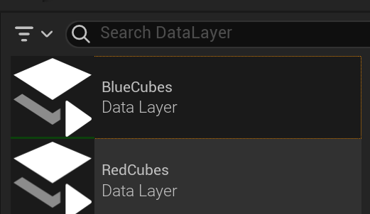
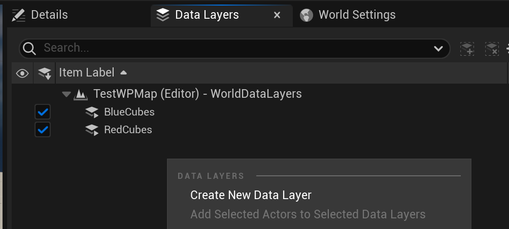
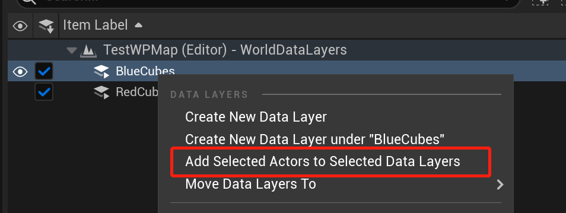
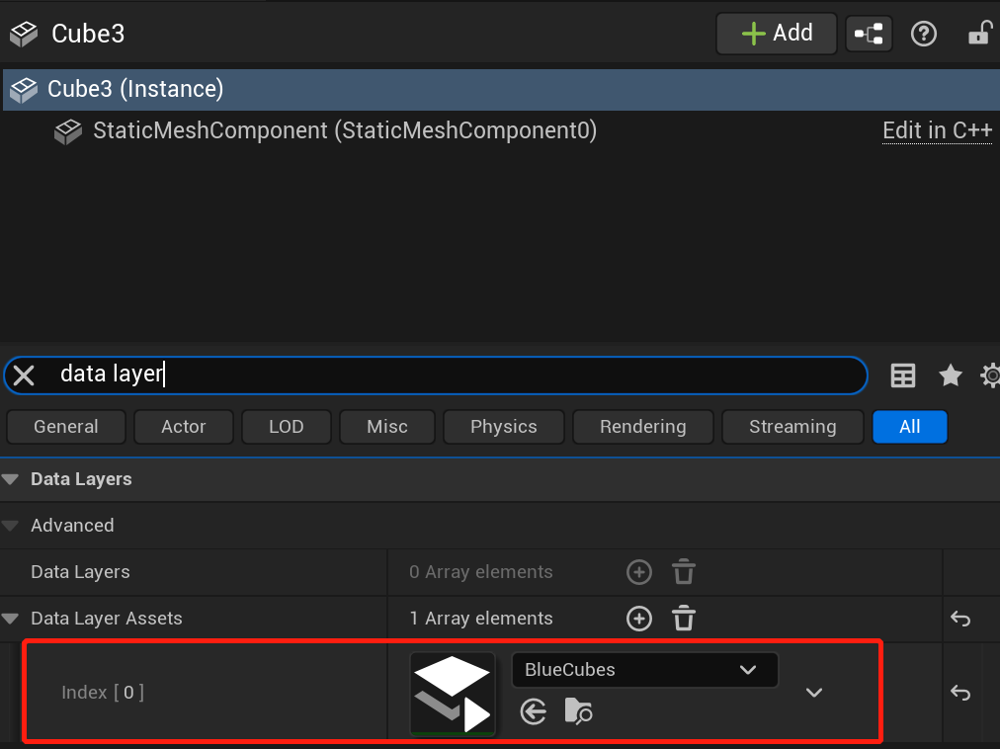
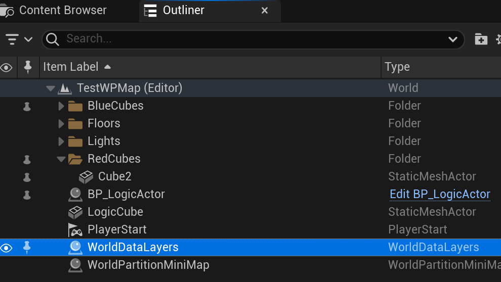
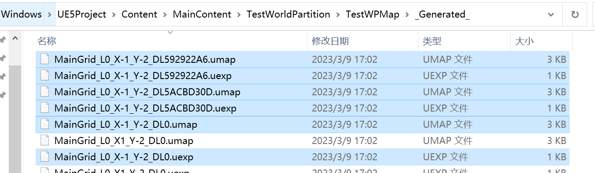
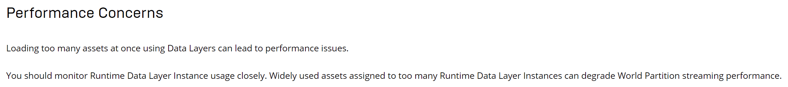

# WorldPartition中的DataLayer

[TOC]

## 基本概念

[**DataLayer**](https://docs.unrealengine.com/5.1/en-US/world-partition---data-layers-in-unreal-engine/)是WorldPartition中Actor的一种组织方式。它可以指定Actor实在在Editor还是Runtime加载，初始加载哪些Actor以及动态加载Actor。

**DataLayerAsset**可以看作是一个DataLayer的类别声明，与具体场景无关。

**DataLayerInstance**是场景中DataLayer的实例化。

## 基本用法

### 创建DataLayer

1. 创建DataLayerAsset。右键ContentBrowser -> Miscellaneous -> DataLayer。例如我创建了两个DataLayer用于放红色立方体和蓝色立方体：

    
    
2. 创建DataLayerInstance。打开场景，点击菜单栏Windows -> World Partition -> Data Layers Outline。右击空白处创建并指定对应的DataLayerAsset：

    

3. 为Actor分配DataLayerInstance。有两种方法：

    一是选中场景中的Actor， 右击Data Layers Outline中的Data Layer Instance

    

    二是在Actor的Detail面板中：

    

### 相关接口

相关的接口主要放在DataLayerSubsystem中：

```cpp
//DataLayerSubsystem.h
class ENGINE_API UDataLayerSubsystem : public UWorldSubsystem
{
	//获取某个DataLayer的状态
	UFUNCTION(BlueprintCallable, Category = DataLayers)
	UDataLayerInstance* GetDataLayerInstanceFromAsset(const UDataLayerAsset* InDataLayerAsset) const;

	UFUNCTION(BlueprintCallable, Category = DataLayers)
	EDataLayerRuntimeState GetDataLayerInstanceRuntimeState(const UDataLayerAsset* InDataLayerAsset) const;

    //设置某个DataLayer的状态
	UFUNCTION(BlueprintCallable, Category = DataLayers)
	EDataLayerRuntimeState GetDataLayerInstanceEffectiveRuntimeState(const UDataLayerAsset* InDataLayerAsset) const;
}
```

### 相关配置说明

DataLayerAsset:

```cpp
//DataLayerAsset.h
class ENGINE_API UDataLayerAsset : public UObject
{
    //类型，有两类
    //Editor: 在Editor下生效，但看DataLayerSubsystem只提供了Runtime接口， 感觉这个类型就没多大用了。
    //Runtime: 在Editor和Runtime下生效
	EDataLayerType DataLayerType;
}
```

DataLayerInstance:

```cpp
//DataLayerInstance.cpp
class ENGINE_API UDataLayerInstance : public UObject
{
    //Runtime时，DataLayer的初始状态
    EDataLayerRuntimeState InitialRuntimeState;
}
```


## 代码解析

###初始化

当我们创建一个WorldPartition场景的时候，自带了一个WorldDataLayers的Actor：



它用来存储当前DataLayerInstance的状态：

```cpp
//WorldDataLayers.h

class ENGINE_API AWorldDataLayers : public AInfo
{
    //保存着当前需要Load或Activate的DataLayerInstance名， 可以通过相关复制接口复制到客户端
	UPROPERTY(Transient, Replicated, ReplicatedUsing=OnRep_ActiveDataLayerNames)
	TArray<FName> RepActiveDataLayerNames;	
	UPROPERTY(Transient, Replicated, ReplicatedUsing=OnRep_LoadedDataLayerNames)
	TArray<FName> RepLoadedDataLayerNames;
}
```
Editor中创建的DataLayerInstance也会保存起来，方便之后序列化。创建相关函数：
```cpp
DataLayerInstanceType* AWorldDataLayers::CreateDataLayer(CreationsArgs... InCreationArgs)
{
	DataLayerInstanceType* NewDataLayer = NewObject<DataLayerInstanceType>(...);
	DataLayerInstances.Add(NewDataLayer);
	return NewDataLayer;
}
```

在DataLayerSubsystem初始化时：

```cpp
void UDataLayerSubsystem::RegisterWorldDataLayer(AWorldDataLayers* WorldDataLayers)
{
	if (GetWorld()->IsGameWorld() && WorldDataLayers && !WorldDataLayers->IsRuntimeRelevant())
	{
		return;
	}

    //将WorldLayerActor保存到WorldDataLayerCollection中
	if (WorldDataLayerCollection.RegisterWorldDataLayer(WorldDataLayers))
	{
	}
}
```

### DataLayer的本质

现在我们回过头来看StreamingGrid的创建流程。 在将Actor划分到Cell上时，会将Actor塞到FGridCell的DataChunck里面。

堆栈：

```cpp
FSquare2DGridHelper::FGridLevel::FGridCell::AddActorSetInstance(...)
GetPartitionedActors(...)
UWorldPartitionRuntimeSpatialHash::GenerateStreaming(..)
```

逻辑：

```cpp
//RuntimeSpatialHashGridHelper.h
void AddActorSetInstance(const IStreamingGenerationContext::FActorSetInstance* ActorSetInstance)
{
    //将Actor的所有DataLayer根据名字做一个Hash
	const FDataLayersID DataLayersID = FDataLayersID(ActorSetInstance->DataLayers);
    //查找或创建有相同DataLayer的DataChunk
	FGridCellDataChunk& ActorDataChunk = DataChunks.FindOrAddByHash(DataLayersID.GetHash(), FGridCellDataChunk(...));
    //将Actor加入到DataChunk中
	ActorDataChunk.AddActorSetInstance(ActorSetInstance);
}
```

假如一个Cell上的Actor存在n中不同的DataLayer分配，那么这个Cell有n个DataChunk。再看创建StreamingGrid:

```cpp
//WorldPartitionRuntimeSpatialHash.cpp
bool UWorldPartitionRuntimeSpatialHash::CreateStreamingGrid(...)
{
    //对于Grid的每个层级
    for (const FSquare2DGridHelper::FGridLevel& TempLevel : PartionedActors.Levels)
	{
        //根据Cell中的DataChunk来创建StreamCell。
        const FSquare2DGridHelper::FGridLevel::FGridCell& TempCell = TempLevel.Cells[TempCellMapping.Value];
		for (const FSquare2DGridHelper::FGridLevel::FGridCellDataChunk& GridCellDataChunk : TempCell.GetDataChunks())
		{
            FString CellName = GetCellNameString(...);
			UWorldPartitionRuntimeSpatialHashCell* StreamingCell = NewObject<UWorldPartitionRuntimeSpatialHashCell>(...);
        }
    }
}
```

我们知道StreamCell关卡流送的基本单位，也会Cook成单独的场景：



这表示（-1， -2）的Cell上的Actor存在两种不同的DataLayer。

由此可见**DataLayer本质还是LevelStreaming**， 这就会引发一个性能问题，如果DataLayer太多，就会导致同时加载或卸载多个Level，[官方文档](https://docs.unrealengine.com/5.1/en-US/world-partition---data-layers-in-unreal-engine/)上说的性能问题可能就是基于这个原因：



### 触发流程

当前guan

当我们使用DataLayerSubsystem中的接口设置DataLayer的状态时, 基本流程如下：

```cpp
//WorldDataLayers.cpp
void AWorldDataLayers::SetDataLayerRuntimeState(...)
{
    //1. 确保只能服务端调用： GetLocalRole() == ROLE_Authority
    //2. 更新保存的DataLayerInstance状态
    //3. 处理递归的DataLayer
}
```

之后在每帧的获取当前可见Cell中：

```cpp
//WorldPartitionRuntimeSpatialHash.cpp
void FSpatialHashStreamingGrid::GetCells(...) const
{
    //对于某个Cell坐标得到所有的Cell， 即
	for (const UWorldPartitionRuntimeCell* Cell : LayerCell->GridCells)
	{
        //如果该Cell不是DataLayer的Cell，或者该Cell的DataLayer可见
		if (!Cell->HasDataLayers() || (DataLayerSubsystem && DataLayerSubsystem->IsAnyDataLayerInEffectiveRuntimeState(Cell->GetDataLayers(), EDataLayerRuntimeState::Activated)))
		{
            //添加到加载或是可见列表
        }
    }
}
```

剩下就和WorldPartition的LevelStreaming方式一致了。