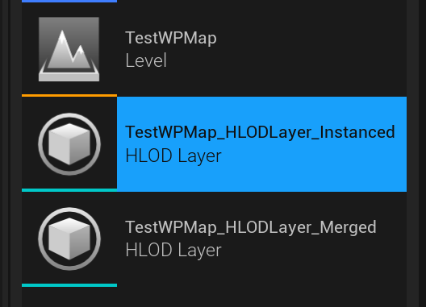
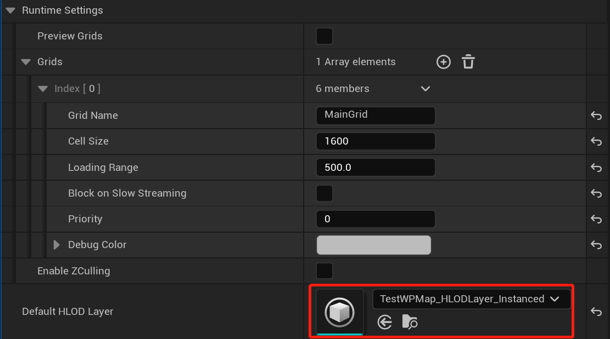
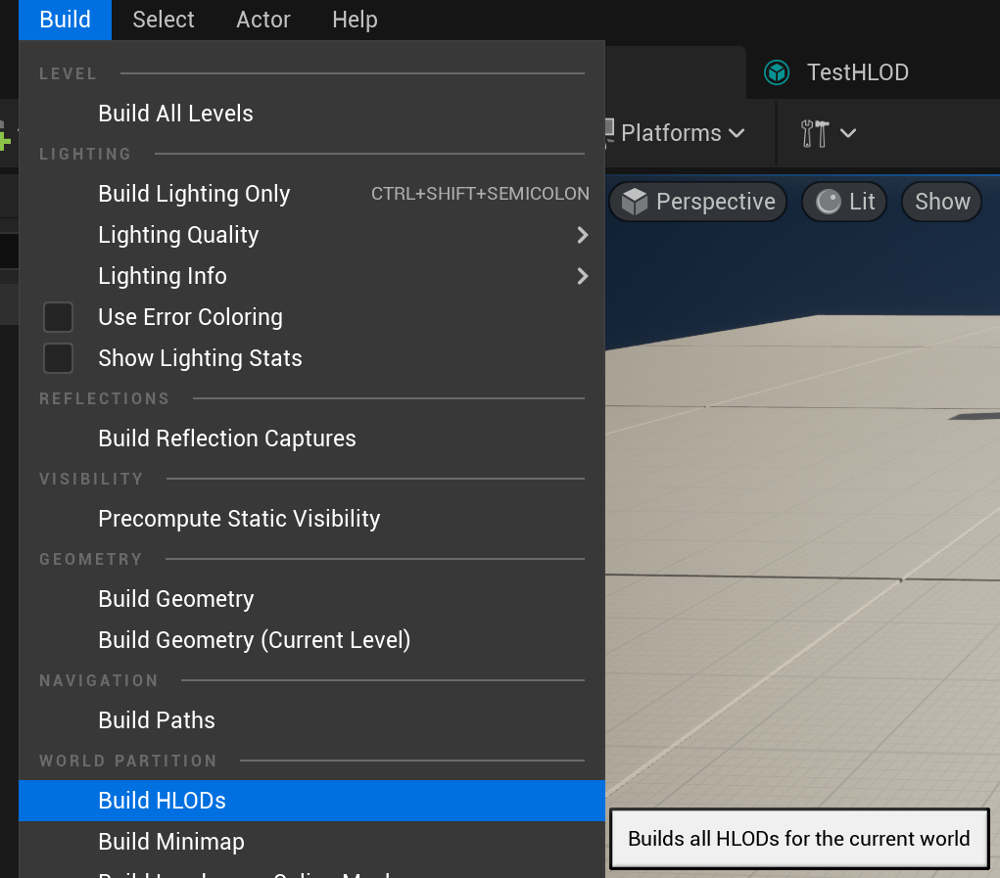
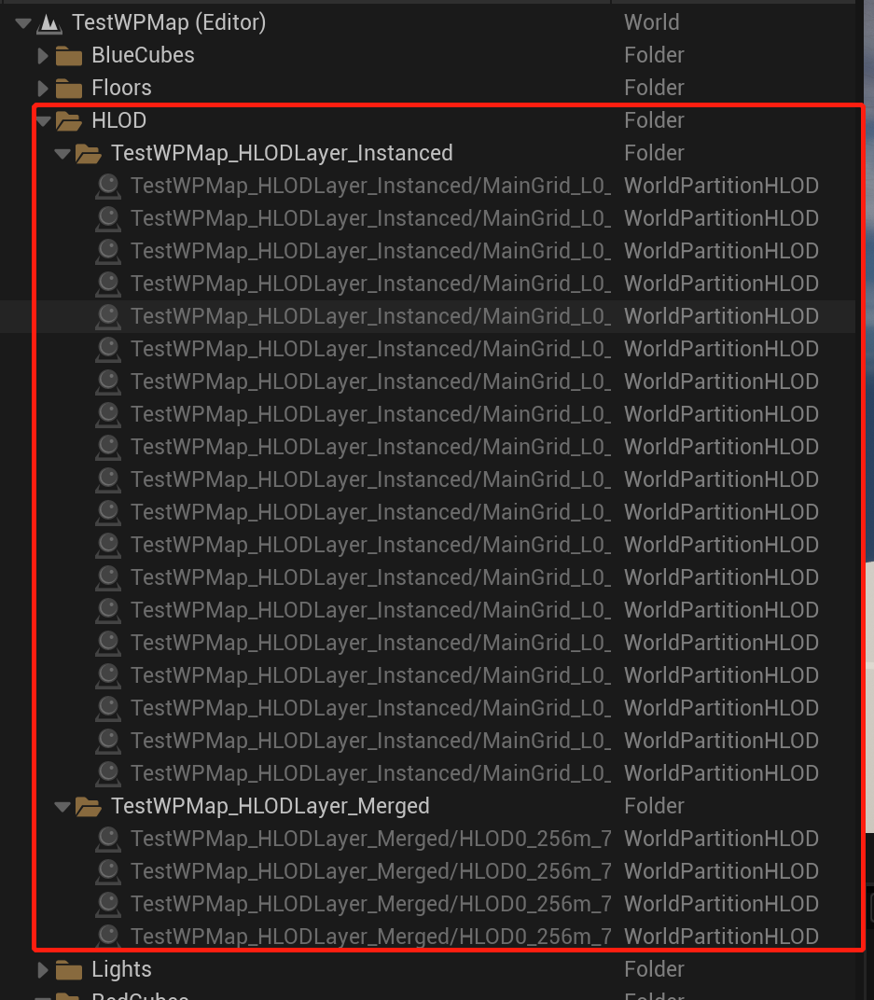
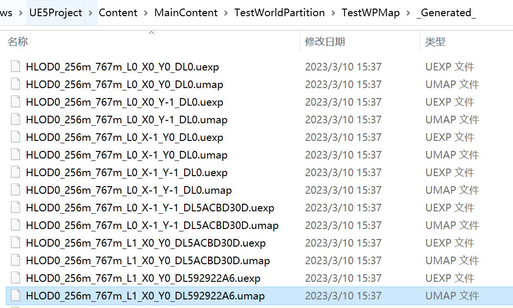
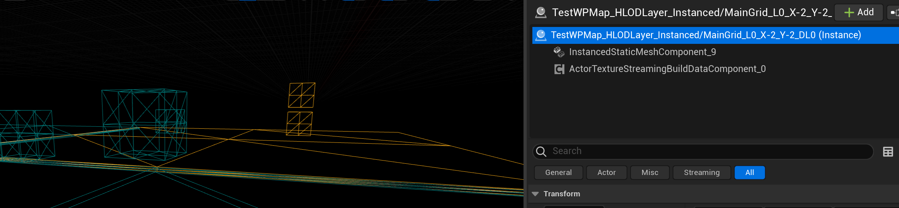

# WorldPartition中的HLOD

[TOC]

## 用法简介

[WorldPartition HLOD](https://docs.unrealengine.com/5.1/en-US/world-partition---hierarchical-level-of-detail-in-unreal-engine/)是针对Cell层的LOD， 在创建WorldPartition场景时，已经默认有一个HLOD的配置文件了：



配在这里：



但默认是没有生成HLOD相关资源的， 需要手动Build一下：



Build完后，可以发现场景中多了这么些东西：



Cook之后也多了这么多的子关卡文件：



之后再运行游戏，就没有加载Cell时出现的忽然显示的问题了。

## 相关源码

从上面说的多出来的Actor和场景文件可以推测出，HLOD使用的也是LevelStreaming那套。我们从创建StreamingCell的流程开始看起：

```cpp
bool UWorldPartitionRuntimeSpatialHash::GenerateStreaming(...)
{
    //Build HLOD之后，场景中会多一个ASpatialHashRuntimeGridInfo类型的Actor， 但Editor中看不到， external package是有的
    //它持有一个FSpatialHashRuntimeGrid结构，内容是HLOD Asset中配置的CellSize LoadingRange等
    TArray<const FWorldPartitionActorDescView*> SpatialHashRuntimeGridInfos = StreamingGenerationContext->GetMainWorldContainer()->ActorDescViewMap->FindByExactNativeClass<ASpatialHashRuntimeGridInfo>();
	for (const FWorldPartitionActorDescView* SpatialHashRuntimeGridInfo : SpatialHashRuntimeGridInfos)
	{
		FWorldPartitionReference Ref(WorldPartition, SpatialHashRuntimeGridInfo->GetGuid());
		ASpatialHashRuntimeGridInfo* RuntimeGridActor = CastChecked<ASpatialHashRuntimeGridInfo>(SpatialHashRuntimeGridInfo->GetActor());
        //加到当前Grid配置中
		AllGrids.Add(RuntimeGridActor->GridSettings);
	}
}
```

断点后可以看到它把LODLayer_Instance下面的Actor都放到了RuntimeGrid里面。这些Actor都是`AWorldPartitionHLOD`类型，Bound和和Cell大小一致。WorldPartitionHLOD可以看作是一个Cell的LOD， 它将Cell上的所有Mesh合并成了一个Mesh：



在每帧获取要显示的Cell时：

```cpp

//WorldPartitionRuntimeSpatialHash.cpp
void UWorldPartitionRuntimeSpatialHash::ForEachStreamingCellsSources(...) const
{
    //对于每个Grid，都要获取一遍需要显示的Cell
    ForEachStreamingGrid([&](const FSpatialHashStreamingGrid& StreamingGrid)
    {
        if (IsCellRelevantFor(StreamingGrid.bClientOnlyVisible))
    	{
			StreamingGrid.GetCells(...);
		}
    });
}
```

接下来流程就和普通Cell一致了。

