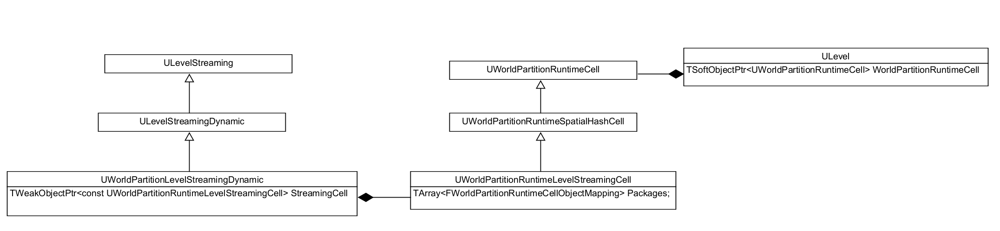
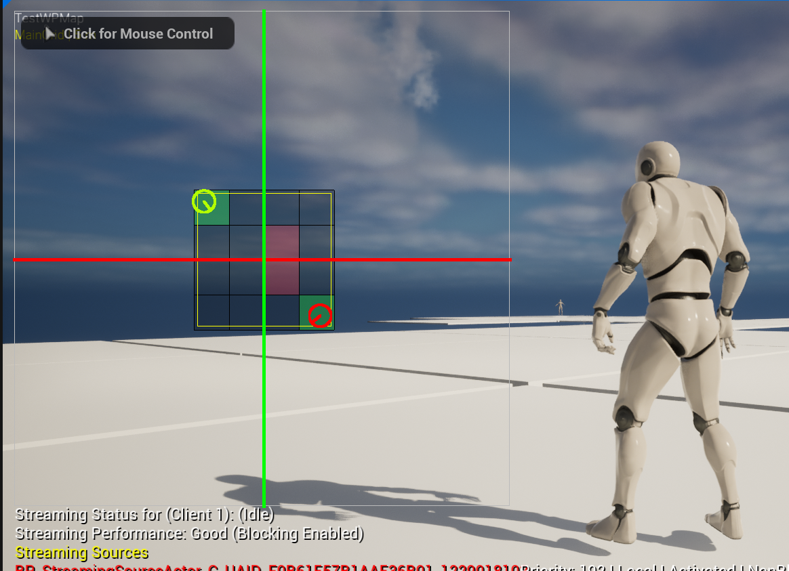

# WorldPartition中的LevelStreaming

[TOC]

## 简述

无论在Editor还是Game模式，WorldPartition都是以StreamingLevel的方式加载Cell。不过`FStreamingLevelsToConsider`中持有的是`UWorldPartitionLevelStreamingDynamic`类型的的StreamingLevel。




## WorldPartitionStreamingSource

StreamingSource可以理解为一个视角数据，指定要加载哪个位置的Cell，例如我可以在远处放一个带StreamingSourceProvider的[Actor](https://github.com/shazi129/UE5Project/blob/main/Source/UE5Project/Test/StreamingSource/StreamingSourceActor.h), 然后将这个Actor设成Aways Load:



左上角绿色是玩家所在位置，右下角是放置的StreamingSource, 可以看到它周围的Cell也被加载了。

```cpp
//WorldPartitionStreamingSource.h
struct ENGINE_API FWorldPartitionStreamingSource
{
    FVector Location;
	FRotator Rotation;
	EStreamingSourceTargetState TargetState;
    float Velocity;
    
    //可认为是视线的形状，默认是个球
    TArray<FStreamingSourceShape> Shapes;
}
```

它由一个Provider来提供：

```cpp
//WorldPartitionStreamingSource.h
struct ENGINE_API IWorldPartitionStreamingSourceProvider
{
	virtual bool GetStreamingSource(FWorldPartitionStreamingSource& StreamingSource) const = 0;
};
```

例如一个PlayerController就可以提供一个StreamingSource:

```cpp
//PlayerController.h
class ENGINE_API APlayerController : public AController, public IWorldPartitionStreamingSourceProvider
{
}

//PlayerController.cpp
bool APlayerController::GetStreamingSource(FWorldPartitionStreamingSource& OutStreamingSource) const
{
    //用PlayerViewPoint的数据来填充StreamingSource的数据，代表玩家视角。
}
```

每个Provider需要注册到WorldPartitionSubsystem中才能使用：

```cpp
//WorldPartitionSubsystem.h
class ENGINE_API UWorldPartitionSubsystem : public UTickableWorldSubsystem
{
	void RegisterStreamingSourceProvider(IWorldPartitionStreamingSourceProvider* StreamingSource);
	bool UnregisterStreamingSourceProvider(IWorldPartitionStreamingSourceProvider* StreamingSource);
}
```

在每帧的`UWorldPartitionStreamingPolicy::UpdateStreamingState`中，会更新当前系统中的StreamingSource, 大致逻辑如下：

```cpp
//WorldPartitionStreamingPolicy.cpp
void UWorldPartitionStreamingPolicy::UpdateStreamingSources()
{
    ...
    for (IWorldPartitionStreamingSourceProvider* StreamingSourceProvider : WorldPartitionSubsystem->GetStreamingSourceProviders())
	{
		FWorldPartitionStreamingSource StreamingSource;
		if (StreamingSourceProvider->GetStreamingSource(StreamingSource))
		{
			// Transform to Local
			StreamingSource.Location = WorldToLocal.TransformPosition(StreamingSource.Location);
			StreamingSource.Rotation = WorldToLocal.TransformRotation(StreamingSource.Rotation.Quaternion()).Rotator();
			StreamingSources.Add(StreamingSource);
		}
	}
}
```
## WorldPartitionStreamingPolicy

哪些Cell需要加载，哪些需要卸载也是每帧需要检测的：

```cpp
UWorldPartitionStreamingPolicy::UpdateStreamingState()
UWorldPartition::UpdateStreamingState()
UWorldPartitionSubsystem::UpdateStreamingState()
UWorld::InternalUpdateStreamingState()
UWorld::Tick(ELevelTick TickType, float DeltaSeconds)
```

可以看到，最终逻辑是由`UWorldPartitionStreamingPolicy`来实现的。UE中Policy的一个常用用法就是把**Policy的Class写入配置，用户自定义Policy**。但WoldPartition中貌似没有实现这个功能。这个Policy创建堆栈：

```cpp
NewObject<UWorldPartitionStreamingPolicy>(...)
UWorldPartition::GenerateStreaming(TArray<FString,TSizedDefaultAllocator<32>> * OutPackagesToGenerate)
UWorldPartition::OnBeginPlay()
UWorldPartition::OnPreBeginPIE(bool bStartSimulate)
```

相关逻辑：

```cpp
//WorldPartitionStreamingGeneration.cpp
bool UWorldPartition::GenerateStreaming(TArray<FString>* OutPackagesToGenerate)
{
    ...
    StreamingPolicy = NewObject<UWorldPartitionStreamingPolicy>(
        const_cast<UWorldPartition*>(this), 
        WorldPartitionStreamingPolicyClass.Get(), //这个Class在构造函数中写死了。
        NAME_None, bIsPIE ? RF_Transient : RF_NoFlags);
   ...
}
```

## 获取当前可见的Cell

```cpp
//WorldPartitionRuntimeSpatialHash.cpp

void UWorldPartitionRuntimeSpatialHash::ForEachStreamingCellsSources(StreamingSource, Func) const
{
	//如果没有source，获取aways load的cell
    //如果有source，获取souce能看到的cell: FSpatialHashStreamingGrid::GetCells
}
```
获取可见Cell的函数是：

```cpp
//WorldPartitionRuntimeSpatialHash.cpp
void FSpatialHashStreamingGrid::GetCells(...)
{
    //根据loadingRand和Source的Shape计算出一个可见区域
    const float GridLoadingRange = GetLoadingRange();
	for (const FWorldPartitionStreamingSource& Source : Sources)
	{
		Source.ForEachShape(GridLoadingRange, GridName, HLODLayer, /*bProjectIn2D*/ true, [&](const FSphericalSector& Shape){
			//针对每个可见区域和Cell做交集
            //将算出来的结果放到OutActivateCells和OutLoadCells中
        });
     }
    
    //加载AlwaysLoad Cell
    GetAlwaysLoadedCells(...);
    
    
}
```

其实就是拿可见区域跟Grid的每个层级中的Cell做交集：

```cpp
//RuntimeSpatialHashGridHelper.cpp
int32 FSquare2DGridHelper::ForEachIntersectingCells(const FBox& InBox, ...) const
{
    //遍历Grid的各个层级
	for (int32 Level = InStartLevel; Level < Levels.Num(); Level++)
	{
		//找可见Cell
	}
    
    //这里对于每一个Level，都会返回一个Cell, 但如果这个Cell没有任何Actor，是不用做处理的
}
```

求交逻辑：

```cpp
//RuntimeSpatialHashGridHelper.h

//InBox代表StreamingSource
int32 ForEachIntersectingCellsBreakable(const FBox& InBox, TFunctionRef<bool(const FGridCellCoord2&)> InOperation) const
{
	//将StreamSource压扁到2D
	const FBox2D Bounds2D(FVector2D(InBox.Min), FVector2D(InBox.Max));

    //获取min点和max点所在的Cell坐标
	if (GetCellCoords(Bounds2D, MinCellCoords, MaxCellCoords))
	{
        //遍历min点和max点所有的Cell， 回调
	}
}
```

找到当前帧可见的Cell之后，跟上一帧的Cell信息对比，得到需要改变状态的Cell：

```cpp
//WorldPartitionStreamingPolicy.cpp
void UWorldPartitionStreamingPolicy::UpdateStreamingState()
{
    ...
    //diff出需要变为Activate的Cell
	TArray<const UWorldPartitionRuntimeCell*> ToActivateCells;
	{
		TSet<const UWorldPartitionRuntimeCell*> ToActivateCellsUnsorted = FrameActivateCells.Difference(ActivatedCells);
		ProcessCellsToActivate(ToActivateCellsUnsorted);
		SortStreamingCells(StreamingSources, ToActivateCellsUnsorted, ToActivateCells);
	}
    ...
	//diff出需要unload的的Cell
	TArray<const UWorldPartitionRuntimeCell*> ToUnloadCells;
	{
		TSet<const UWorldPartitionRuntimeCell*> ToUnloadCellsUnsorted = ActivatedCells.Union(LoadedCells).Difference(FrameActivateCells.Union(FrameLoadCells));
		ProcessCellsToUnload(ToUnloadCellsUnsorted);
		ToUnloadCells = ToUnloadCellsUnsorted.Array();
	}
    ...
}
```

然后通过设置状态的方式把他们加入到World的StreamingLevelsToConsider中：

```cpp
//WorldPartitionLevelStreamingDynamic.cpp
void UWorldPartitionLevelStreamingDynamic::Unload()
{
	...
	SetShouldBeLoaded(false);
}

void UWorldPartitionLevelStreamingDynamic::Activate()
{
    ...
	PlayWorld->AddUniqueStreamingLevel(this);
}
```

## 关联Level

### Editor模式下

跟WorldComposition一样, 加载Cell也是调用RequestLevel, 但在Editor模式下，并没有真正的关卡文件，所有Actor都是通过OFPA加载的。所以就需要创建一个在内存中UPackage以及ULevel来达到操作的统一：

```cpp
CreatePackage(const wchar_t * PackageName) //UObjectGlobals.cpp
FWorldPartitionLevelHelper::CreateEmptyLevelForRuntimeCell(...)
UWorldPartitionLevelStreamingDynamic::CreateRuntimeLevel()
UWorldPartitionLevelStreamingDynamic::RequestLevel(...)
ULevelStreaming::UpdateStreamingState(bool & bOutUpdateAgain, bool & bOutRedetermineTarget)
UWorld::UpdateLevelStreaming()
```

具体逻辑：

```cpp
//WorldPartitionLevelHelper.cpp
ULevel* FWorldPartitionLevelHelper::CreateEmptyLevelForRuntimeCell(...)
{
    // 包名格式为： /Memory/UEDPIE_0_MainGrid_L1_X0_Y-1_DL0
    CellPackage = CreatePackage(*PackageName);
    
    //依据包名创建Level
    UWorld* NewWorld = UWorld::CreateWorld(InWorld->WorldType, false, WorldName, CellPackage,...);
    ULevel* NewLevel = NewWorld->PersistentLevel
        
    //关联Level和Cell
    NewLevel->WorldPartitionRuntimeCell = Cell;
}
```

创建Level之后，需要将WorldPartition中保存的Actor加载到Level中来：

```cpp
//WorldPartitionLevelHelper.cpp

//InActorPackages就是Actor对应的External Package
bool FWorldPartitionLevelHelper::LoadActors(InOwningWorld, InDestLevel, InActorPackages, ...)
{
    //加载ExternalPackage, LoadPackageAsync 或 LoadPackage
    //获取里面的Actor信息，然后加入的InDestLevel->Actors中
}
```

### Runtime模式下

对于类`UWorldPartitionLevelStreamingDynamic`, 它其实是`ULevelStreaming`：

```cpp
//WorldPartitionLevelStreamingDynamic.h
class ENGINE_API UWorldPartitionLevelStreamingDynamic : public ULevelStreamingDynamic
{
    #if WITH_EDITOR
	// Override ULevelStreaming
	virtual bool RequestLevel(UWorld* PersistentWorld, bool bAllowLevelLoadRequests, EReqLevelBlock BlockPolicy) override;
    #endif
}
```

它在Editor模式下重载了RequestLevel， 但在Runtime模式下，实际调用的是：

```cpp
//LevelStreaming.cpp
bool ULevelStreaming::RequestLevel(UWorld* PersistentWorld, bool bAllowLevelLoadRequests, EReqLevelBlock BlockPolicy)
{
    ...
}
```

这就和WorldComposition一样了。

