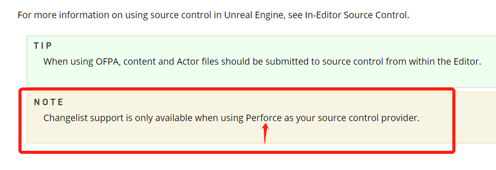
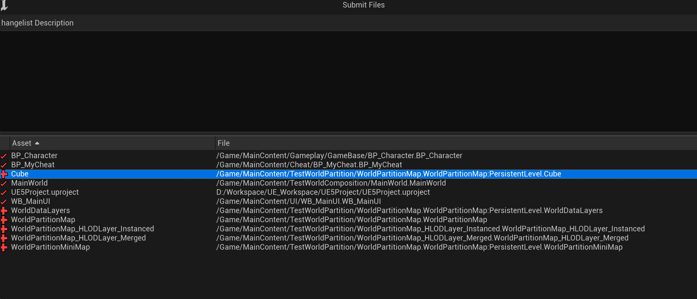
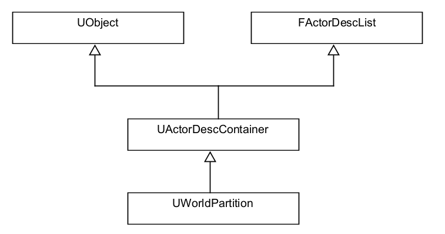

# OFPA原理简介

[TOC]

在WorldPartition中，场景中的Actor默认保存在单独的Package中，这就是所谓的OFPA(One File Per Actor)。这对版本管理带来了极大的遍历。虽然当前UE的文档上写着只有P4支持changelist：



但实际使用下来，5.1也支持了Git：




## 相关标志位

在创建Actor时，会有一个`FActorSpawnParameters`参数：

`UWorld::SpawnActor(..., const FActorSpawnParameters & SpawnParameters)`

我们来看下它的构造函数：

```cpp
//World.cpp
FActorSpawnParameters::FActorSpawnParameters()
: Name(NAME_None)
...
#if WITH_EDITOR
, bCreateActorPackage(true) //默认是需要使用ExternalPackage的
#endif
...
{
}
```

在Level的定义中也定义了一个标志位：

```cpp
//Level.h
UCLASS(MinimalAPI)
class ULevel : public UObject, public IInterface_AssetUserData, public ITextureStreamingContainer
{
	...
	/** Use external actors, new actor spawned in this level will be external
      * and existing external actors will be loaded on load. 
    */
	UPROPERTY(EditInstanceOnly, Category=World)
	bool bUseExternalActors;
};

//Level.cpp
bool ULevel::ShouldCreateNewExternalActors() const
{
    //如果上面的标志位有效，且在Editor模式下，ExternalActor生效
	return IsUsingExternalActors() && !GetPackage()->HasAnyPackageFlags(PKG_PlayInEditor);
}
```

而对于一个Actor:

```cpp
//Actor.cpp
bool AActor::SupportsExternalPackaging() const
{
	//一堆的判断，其实就是正常情况都返回true
	return true;
}
```

所以在UE5中，ExternalActor应该被当作默认开启的。


## 创建

ExternalPackage随着Actor的创建而创建，引擎使用SpawnActor来创建一个Actor，堆栈：

```cpp
UWorld::SpawnActor(..., const FActorSpawnParameters & SpawnParameters)
UActorFactory::SpawnActor(..., const FActorSpawnParameters & InSpawnParams)
UActorFactory::CreateActor(..., const FActorSpawnParameters & InSpawnParams) 
UActorFactory::PlaceAsset(...) 
UPlacementSubsystem::PlaceAssets(...) 
```

基本逻辑：

```cpp
//LevelActor.cpp
AActor* UWorld::SpawnActor( UClass* Class, FTransform const* UserTransformPtr, const FActorSpawnParameters& SpawnParameters )
{
    ...
    //在External Actor模式下，需要保证Actor不同名
    else if (LevelToSpawnIn->ShouldCreateNewExternalActors() && SpawnParameters.bCreateActorPackage && ...)
	{
		bNeedGloballyUniqueName = CastChecked<AActor>(Class->GetDefaultObject())->SupportsExternalPackaging();
	}
    
    //生成Actor名，它会使用GUIDGenerator根据类名来生成一个GUID， 然后拼接起来，例如：
    //StaticMeshActor_UAID_1C697AF5F40E036901_1206997571
    NewActorName = FActorSpawnUtils::MakeUniqueActorName(...);
    
    //创建ExternalActor的包
    //其中这个ActorPath的格式为：PackageName.WorldName.PersistentLevel.NewActorName
    //例如：/Game/Test_WordPartition/WPMain.WPMain:PersistentLevel.StaticMeshActor_UAID_1C697AF5F40E036901_1206997571
    //要创建的包名是由函数ULevel::GetActorPackageName生成，主要是对ActorPath做各种Hash
    //之后调用CreatePackage(实际就是NewObject<UPackage>(nullptr, NewPackageName, RF_Public)) 创建
    ExternalPackage = ULevel::CreateActorPackage(LevelToSpawnIn->GetPackage(), LevelToSpawnIn->GetActorPackagingScheme(), *ActorPath)
        
    //MarkDirty, 预备保存
    if (ExternalPackage)
	{
		ExternalPackage->MarkPackageDirty();
	}
}
```

## 建立对应关系

在创建了ExternalPackage之后，还需要保存Actor和ExternalPackage之间的联系，来看这个结构：

```cpp
//UObjectHash.cpp
class FUObjectHashTables
{
    ...
    /** Map of object to their external package. */
	TMap<UObjectBase*, UPackage*> ObjectToPackageMap;
    ...
}
```
当创建一个Actor时，会有如下堆栈：

```cpp
AssignExternalPackageToObject(...)  //UObjectHash.cpp
HashObjectExternalPackage(UObjectBase * Object, UPackage * Package)  //UObjectHash.cpp
UObjectBase::SetExternalPackage(UPackage * InPackage)
StaticAllocateObject(...)
StaticConstructObject_Internal(const FStaticConstructObjectParameters & Params)
NewObject<AActor>(...)
UWorld::SpawnActor(...)
```

而析构Actor时， 则是在BeginDestroy中调用了`SetExternalPackage(nullptr)`

## 保存

当我们保存一个Level时，会调用到这个逻辑：

```cpp
//FileHelpers.cpp
bool FEditorFileUtils::SaveCurrentLevel()
{
    ...
    //获取Level上所有的ExternalPackage
    //获取方式：
    //1. 获取Level所在的Package中的Object
    //2. 获取以这个Object为Outer的所有Object的ExternalPackage
    TArray<UPackage*> PackagesToSave = Level->GetLoadedExternalObjectPackages();
    
    //移除PackagesToSave中没有dirty的Package
    
    //调用InternalSavePackages保存package
}
```

保存package的时候，会获取到这个package对应的Actor，然后将Actor序列化到package里。

## 加载

打开地图时，有如下堆栈：

```cpp
UActorDescContainer::Initialize(UWorld * InWorld, FName InPackageName)
UWorldPartition::Initialize(UWorld * InWorld, const UE::Math::TTransform<double> & InTransform)
UWorldPartitionSubsystem::PostInitialize()
UWorld::PostInitializeSubsystems()
UWorld::InitWorld(const UWorld::InitializationValues IVS)
UEditorEngine::Map_Load(const wchar_t * Str, FOutputDevice & Ar) 
```

基本逻辑：

```cpp
//ActorDescContainer.cpp
void UActorDescContainer::Initialize(UWorld* InWorld, FName InPackageName)
{
	ContainerPackageName = InPackageName;
	TArray<FAssetData> Assets;
	
	if (!ContainerPackageName.IsNone())
	{
        //根据World的PackageName找到该World的ExternalActor路径
		const FString LevelPathStr = ContainerPackageName.ToString();
		const FString LevelExternalActorsPath = ULevel::GetExternalActorsPath(LevelPathStr);

		//使用AssetRegistry遍历ExternalActor路径，获取所有资源
		IAssetRegistry& AssetRegistry = FModuleManager::LoadModuleChecked<FAssetRegistryModule>(TEXT("AssetRegistry")).Get();
		AssetRegistry.ScanPathsSynchronous({ LevelExternalActorsPath }, /*bForceRescan*/false, false);
		AssetRegistry.GetAssets(Filter, Assets);
	}
    
    //整理出资源的对应关系，即使用FActorDescList::AddActorDescriptor填充FActorDescList中的ActorsByGuid和Actor
}
```

FActorDescList与WorldPartition的关系：



此时ExternalActor就加载到了WorldPartion中。

