# 量化投研入门手册（Quantitative Primer）· 中英对照版 02

# 2-7页是目录，忽略

# 第 8 页 · 致读者信

## Dear Reader,
## 亲爱的读者：

Each year since 2010 we have published an annual primer on techniques in quantitative analysis, as well as exposition on the hundreds of proprietary tools that we regularly update and publish.

自 2010 年起，我们每年都会发布这份关于量化分析方法的年度入门手册，同时系统介绍我们长期维护、持续更新的数百种自有分析工具。

- **Trends and hot topics in quantitative finance**: We provide insight from our survey of institutional investors about what factors are popular or unpopular, how alternative data and AI are changing industry dynamics, how to weave signals together to determine an outlook for US equities.

  **量化金融中的趋势与热点话题**：基于我们对机构投资者的年度问卷调查，洞察哪些因子正受热捧、哪些正被冷落，探讨另类数据与 AI 如何重塑行业格局，以及如何把多种信号编织在一起，形成对美股的整体观点。

- **Factor performance**: We highlight the performance of various stock screens, spanning valuation to growth to technical to miscellaneous factors, to determine both long-term efficacy and cyclicality of different investment styles.

  **因子表现**：我们系统呈现各类选股筛选策略的表现——从估值、成长、技术，到杂项因子——以此评估不同投资风格的**长期有效性**与**周期性**。

- **Risk/reward characteristics**: We highlight the reward and risk characteristics of each screen versus market benchmarks to indicate how well and how consistently metrics have driven returns. We measure risk by both volatility of returns and by probability of loss. For top vs. bottom ranked screens, we also assess consistency of top decile versus bottom decile spreads.

  **风险/收益特征**：每个筛选策略都会对照市场基准，给出其收益和风险指标，用以评估"因子驱动收益"的力度与稳定性。风险从两个维度度量：**回报波动率**与**亏损概率**。对于排序靠前与靠后的筛选策略，我们还会评估**首十分位与末十分位**利差的稳定性。

- **Sector composition**: We highlight changes in sector composition of style screens based on an unconstrained approach to running factor models. There is useful information in assessing changes in sector exposures both to determine (1) whether particular sectors are driving returns; and (2) how sectors have changed characteristics.

  **行业构成**：我们采用**不加行业约束**的方式运行因子模型，并跟踪各风格筛选策略的行业构成如何变化。观察行业敞口的变化，有助于回答两个问题：（1）某一特定行业是否在驱动整体收益？（2）行业本身的特征随时间如何演变？

- **Long-short signals can be asymmetric**: Long-only and long-short investors may benefit from knowing not just how the top-ranked stocks have behaved, but also how the bottom-ranked stocks have behaved over time. This is useful in determining which screens to use as overweight or "buy" signals, and which screens to use as underweight or "sell" signals.

  **多空信号可能并不对称**：不论是纯多头还是多空投资者，都不应只关心"头部股票"表现如何——"尾部股票"的历史表现同样重要。这有助于判断：**哪些筛选策略更适合作为超配/买入信号，哪些更适合作为低配/卖出信号**。

- **How to pick stocks within sectors**: Given that certain screens may be more effective in some sectors than in others, we believe that determining drivers of returns within specific industry groups can add significant value to a screening process.

  **行业内部如何选股**：由于某些筛选策略在特定行业中的有效性远高于在其他行业，**识别每个行业内部真正驱动收益的因子**，能为筛选流程带来显著增益。

We hope this annual report proves to be helpful, and readily welcome suggestions on how to improve next year's edition.

希望这份年度报告对你有所帮助，也欢迎任何改进建议，以便我们把明年的版本做得更好。

**Savita Subramanian**
**Savita Subramanian**
*Head of US Equity and Quantitative Strategy*
*美国股票与量化策略主管*

# 第 9 页 · 美国股票与量化策略团队简介-忽略

# 第 10 页 · 愈发复杂，愈发拥挤

## More complicated, more crowded
## 愈发复杂，愈发拥挤

Our quantitatively oriented clients use 3x the number of factors today than they did 25 years ago (Exhibit 1). Popularity of quantitative investing has increased sharply, potentially at the expense of fundamental investing. One of today's greatest market inefficiencies may stem from the shift in capital toward shorter-term strategies relying on shorter term data like prices, news and flows, and the scarcity of capital devoted toward long-term, fundamental investing.

和 25 年前相比，我们量化客户如今所使用的因子数量已是当时的 3 倍（图表 1）。量化投资的热度大幅上升，而这背后的代价可能是**基本面投资的式微**。当下最大的一类市场无效定价，或许正来自这个结构性变化：资金愈发向**短线策略**集中——依赖短周期数据（如价格、新闻、资金流），与此同时，愿意投入**长期、基本面投资**的资金却愈发稀缺。

We have seen a seismic shift in assets and resources toward data-driven, systematic strategies and shorter-term investment strategies, which tend to rely on access to better, faster and larger stores of data. Jobs advertised for data scientists and quantitative analysts outnumber those for fundamental analysts by a factor of eight, and the number of fundamental analysts covering $1B of market cap has shrunk from 14 in 1986 to less than two people today (Exhibit 2). Quants are increasingly focused on real-time data feeds, AI (artificial intelligence), big data and machine learning. The advent of new tools has created a more interesting, but more competitive, landscape. Alternative data and new tools reveal interesting opportunities. But like most of our other work, the "bad back-test graveyard" for alternative data is vast relative to the analyses that make it into print.

我们正经历一场规模空前的资源大迁徙——资金与人才正加速涌入**数据驱动的系统化策略**和短线投资策略，这些策略天然依赖更优质、更及时、更庞大的数据源。现在招聘市场上，数据科学家和量化分析师的岗位数量是传统基本面分析师的 **8 倍**；而覆盖每 10 亿美元市值的基本面分析师数量，从 1986 年的 14 人萎缩到如今的不足 2 人（图表 2）。量化从业者越来越聚焦于：实时数据流、人工智能（AI）、大数据、机器学习。新工具的涌现让这个战场更有趣，也更拥挤。另类数据和新工具确实揭示出一些有吸引力的机会，但——就像我们其他研究一样——真正能够被发表出来的分析，相较那些沉睡在**"失败回测的坟场"**里的另类数据尝试，只是冰山一角。

> **📊 图表 1**：*BofA Institutional Factor Survey: average number of factors used by investors over time*
> **美银机构因子问卷调查：投资者使用因子的平均数量随时间的变化**
>
> 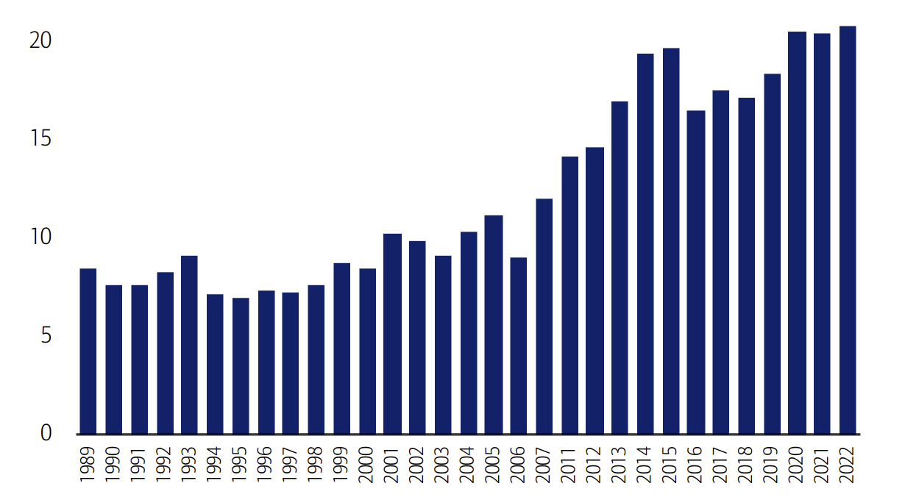
>
> 结论：近年来投资者使用的因子数量持续增加。（注：2008–2010 年因回复样本不足被剔除。数据来源：BofA US Equity & Quant Strategy）

---

# 第 11 页 · 短期主义的抬头

> **📊 图表 2**：*Average number of analysts per \$1 billion market cap of S&P 500 (adjusted for inflation)*
> **标普 500 每 10 亿美元市值对应的平均分析师数量（经通胀调整）**
>
> 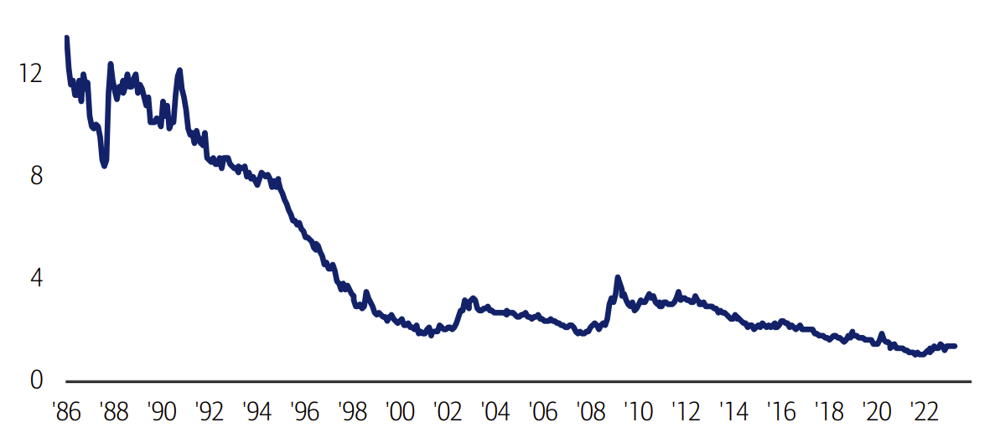
>
> 结论：覆盖 10 亿美元市值的基本面分析师数量，已从 1986 年的 14 人锐减至如今的不足 2 人。

> **📊 图表 3**：*Google searches for "factor investing" and for "fundamental investing"*
> **Google 搜索趋势："因子投资" vs. "基本面投资"**
>
> 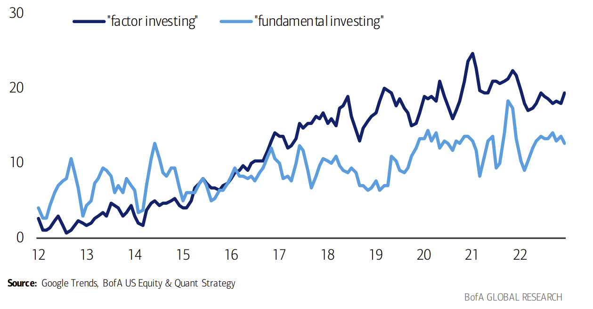
>
> 结论："因子投资"的搜索热度自 2012 年 6 月至 2023 年 5 月期间持续上升（3 个月移动平均）。（来源：Google Trends, BofA US Equity & Quant Strategy）

## Rise of short-termism
## 短期主义的抬头

Zero-day-to-expiry options, or "0DTEs" have surged over the past few years and now account for 40-45% of total SPX option volume (see 0DTEs note). In our latest Annual Institutional Factor Survey, 41% of respondents cited the investment community's short-term focus as the biggest threat to their investment processes, the most of any choice. We have found that the best recipe for loss avoidance is time – the probability of loss drops from 46% to 6% if the time horizon is extended from one day to ten years. SPX 0DTE options have grown from ~10% of total SPX options volume pre-Covid, to ~20% in 2021, to 40-45% in 2022-23.

**当日到期期权（0DTE）** 在过去几年间爆发式增长，目前已占标普 500（SPX）期权总成交量的 **40%–45%**（详见 0DTE 专题报告）。在我们最新的年度机构因子调查中，有 **41%** 的受访者将"投资界过度聚焦短期"列为自身投资流程面临的最大威胁——这是所有选项中得票最多的一项。而我们的研究也反复显示：**规避亏损最可靠的秘诀是"时间"**——把投资期限从 1 天拉长到 10 年，出现亏损的概率会从 **46% 骤降至 6%**。SPX 的 0DTE 期权在新冠疫情前仅占 SPX 期权总成交量的约 10%，2021 年升至约 20%，到 2022–2023 年已达 40%–45%。

---

# 第 12 页 · 0DTE 期权爆发与"时间能降低亏损概率"

> **📊 图表 4**：*SPX zero-day-to-expiry (0DTE) options volume took off in mid-2022, coinciding with the listing of Tue/Thu expiry weekly options*
> **SPX 0DTE 期权成交量在 2022 年年中起飞，恰好对应周二/周四到期的周期权上市**
>
> 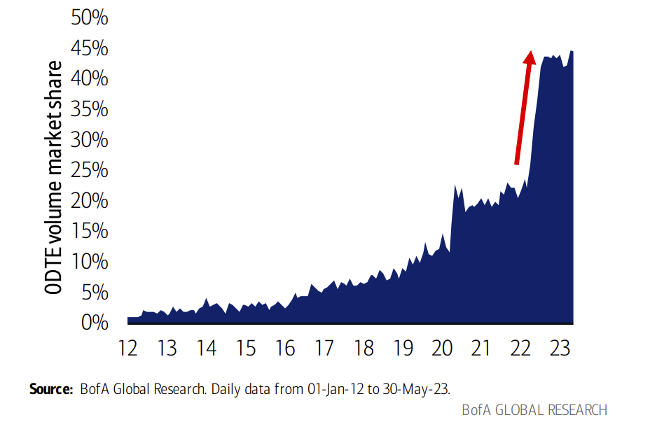
>
> （统计口径：0DTE 合约占 SPX 期权总合约的比例。数据：2012-01-01 至 2023-05-30）

> **📊 图表 5**：*Surprisingly to many, 0DTEs have been additive to SPX option volumes, rather than cannibalizing traditional expiries*
> **出乎多数人意料：0DTE 是"新增"了 SPX 期权成交量，并未蚕食传统到期合约**
>
> 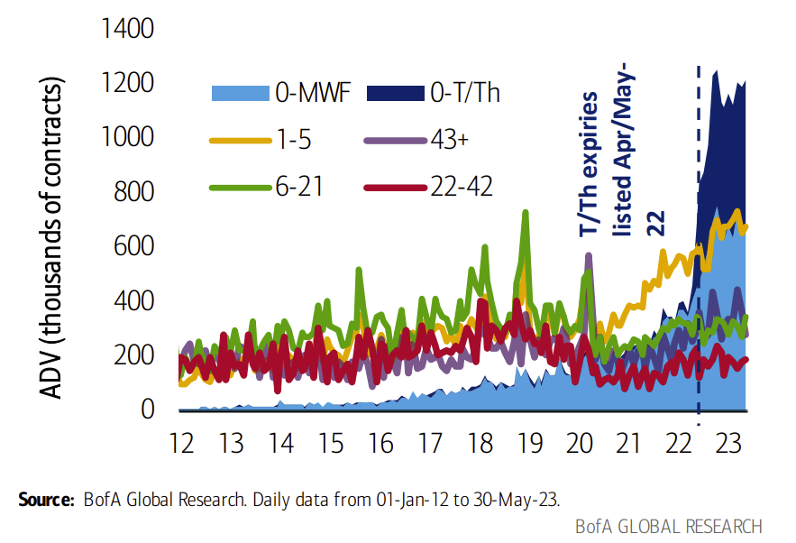
>
> （按到期日前交易日数拆分的 SPX 期权平均日合约量，其中 0DTE 按 周一/三/五 与 周二/四 分开统计）

**The probability of losing money in the S&P 500 over one day is a little worse than a coin-flip but declines to just 6% over a 10-year time horizon (data since 1929).**

**在标普 500 上持有 1 天出现亏损的概率略高于"掷硬币"（46%），但把投资期限拉长到 10 年，亏损概率就会降至仅 6%**（数据自 1929 年起）。

> **📊 图表 6**：*As time horizons increase, equity losses drop*
> **持股时间越长，亏损概率越低**（基于 1929–2023/5/31 标普 500 总回报）
>
> 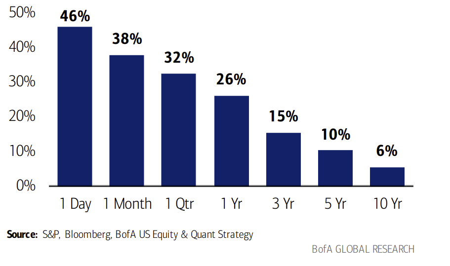

> **📊 图表 7**：*Time is not as compelling for other asset classes (like oil)*
> **对其他资产类别（如原油）而言，时间的"复利优势"并不那么明显**
>
> 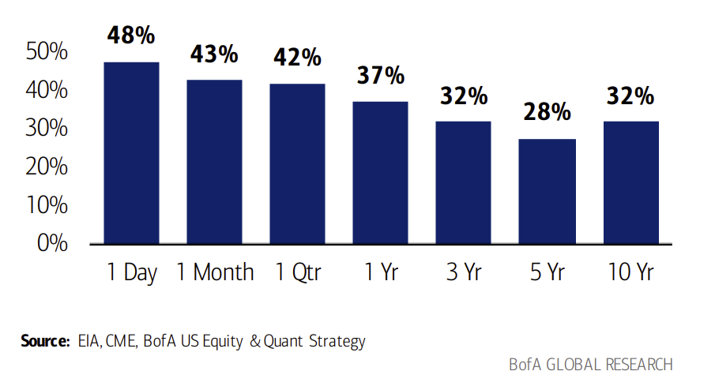

## BofA data-driven research
## 美银数据驱动的研究

It pays to be different. To this end, BofA Global Research publishes a robust suite of data-driven products. From proprietary surveys of financial advisors, US consumers, Millennials, IT spenders, construction dealers etc., to spending barometers like BofA client flows and aggregated BAC credit and debit card data, to sector-specific indicators like Flight Signals and the Industrial Momentum Indicator, to name a few. We showcase the most recent research below.

**差异化，才有超额收益**。为此，美银全球研究部门推出了一整套数据驱动产品，包括：针对金融顾问、美国消费者、千禧一代、IT 支出负责人、建材经销商等群体的自有问卷调查；**美银客户资金流向**、**美国银行汇总的信用卡与借记卡消费数据**等消费量度指标；以及针对特定行业的专属指标，如**航空信号（Flight Signals）** 和 **工业动量指标（Industrial Momentum Indicator）** 等。下方展示的是近期发布的相关研究。

---

# 第 13 页 · 美银近期数据驱动研究一览

> **📊 图表 8**：*BofA Global Research Reports — The most recent BofA data-driven research*
> **美银全球研究部门报告清单 —— 近期数据驱动研究一览**
>
> 下表为报告标题、作者、发表日期。为便于查阅，标题保留英文原题、作者/机构一并附中文简述，日期统一为 YYYY/MM/DD 格式。

| Publish Date 发布日期 | Subtitle 副标题 | Analyst 作者 |
|---|---|---|
| 2023/5/31 | How big is 0DTE gamma really? — *0DTE 的 Gamma 规模究竟有多大？* | Global Equity Derivatives Research 全球股票衍生品研究 |
| 2023/5/30 | EV tracker Apr-23: EU loses significant share; special analysis on premium EVs — *电动车追踪 23 年 4 月：欧洲份额明显下滑；豪华电动车专题* | Schneider, Horst |
| 2023/5/29 | Subdued indicator on weak demand during traditional peak seasons — *传统旺季需求低迷指标* | Zhao, Matty |
| 2023/5/29 | April China ACT reading jumped higher against a low base — *4 月中国 ACT 读数在低基数上明显跳升* | Qiao, Helen |
| 2023/5/29 | Understanding the US market — *读懂美国市场* | Wallace, Ashley |
| 2023/5/26 | Got yield? — *拿到收益率了吗？* | Seliger, Yuri |
| 2023/5/25 | Survey: Brazilians are thirsty for beer — *调查：巴西人对啤酒的需求强劲* | Simonato, Isabella |
| 2023/5/25 | Bonds & Bubbles — *债券与泡沫* | Hartnett, Michael |
| 2023/5/25 | BofA Industrial Momentum Indicator ticks down – are we about to retest the bottom? — *美银工业动量指标回落——是否即将再测底部？* | Global Industrials |
| 2023/5/25 | Spending update through May 20 — *截至 5 月 20 日的消费更新* | US Economics |
| 2023/5/24 | EM Fundamentals have peaked. What comes next? — *新兴市场基本面见顶，接下来呢？* | Milne, Anne |
| 2023/5/24 | Neither panic, nor euphoria — *既不恐慌，也不狂热* | Samadhiya, Ritesh |
| 2023/5/23 | Negative result, but outlook remains soft — *结果负面，但展望仍偏弱* | Beker, David |
| 2023/5/23 | BofA Commercial Aerospace Tracker: WoW North America cycles decline — *美银商用航空追踪：北美周度循环下降* | Heelan, Benjamin |
| 2023/5/23 | US ortho dataset says… cases down -13% M/M in April — *美国骨科数据：4 月案例环比 -13%* | Ryskin, Michael |
| 2023/5/23 | Private client capitulation — *私人客户投降式抛售* | Hall, Jill |
| 2023/5/22 | Bearish JPY vs rest of G10 FX — *看空日元（对其他 G10 货币）* | Iaralov, Vadim |
| 2023/5/22 | Golf Industry Tracker: MODG Club sales -12% in April, but see some green shoots — *高尔夫行业追踪：4 月 MODG 球杆销量 -12%，但已出现一些复苏迹象* | Perry, Alexander |
| 2023/5/22 | China pessimism & US debt limit hopes and fears — *对华悲观情绪与美国债务上限的希望与恐惧* | Vamvakidis, Athanasios |
| 2023/5/19 | Trend Tracker: April slows, Q2 trend est 5.2%; still below trended baseline — *趋势追踪：4 月放缓，Q2 趋势估 5.2%，仍低于趋势基线* | Fischbeck, Kevin |
| 2023/5/19 | The W&W Indicator is marginally bullish in May — *W&W 指标 5 月小幅偏多* | Wu, Winnie |
| 2023/5/19 | Survey Says: Demand (44.3) stays sub-50; Inventory moves further below peak — *调查：需求 44.3 仍在荣枯线下；库存进一步低于峰值* | Hoexter, Ken |
| 2023/5/17 | RENO Barometer shows April showers (and 2H flowers) — *翻新景气指标：4 月风雨，下半年花开* | Suzuki, Elizabeth L |
| 2023/5/16 | BofA Flight Signals shows unit revenues could decelerate into 2H23 — *美银航空信号：单位营收可能在下半年放缓* | Didora, Andrew |
| 2023/5/16 | Watching and waiting — *观望中* | Tupper, Nigel |
| 2023/5/16 | BofA Japan FA Indicator improves again — *美银日本金融顾问指标再次改善* | Hotta, Kenjin |
| 2023/5/16 | Monthly restaurant spending: spend continues slowdown across segments — *餐饮月度消费：各细分持续放缓* | Senatore, Sara |
| 2023/5/16 | Turned bullish cash — *转为看多现金* | Morris, John |
| 2023/5/16 | Small sentiment uptick — *情绪小幅回升* | Beker, David |
| 2023/5/16 | FMS: sell the news? — *基金经理调查：利好兑现即卖出？* | Virgo, Alexander |
| 2023/5/16 | State of Play: Assessing the China rebound — *形势评估：中国反弹还能走多远？* | Roux, David |
| 2023/5/16 | Hoping for a soft landing — *期待软着陆* | Raedler, Sebastian |
| 2023/5/15 | Default and loss pressures in the current default cycle — *当前违约周期中的违约与损失压力* | Khoda, Neha |
| 2023/5/15 | April card spending: soft but not slumping — *4 月刷卡消费：偏弱但未崩塌* | Thornton, Thomas (T.J.) |
| 2023/5/15 | Real-time Grocery Spending Update: See trade down to value grocery channel — *实时杂货消费更新：消费降级至平价渠道* | Ohmes, Robert |
| 2023/5/15 | Survey: Home health vols tracking above Q1, labor costs remain a headwind — *调查：居家医疗量高于 Q1，人工成本仍是逆风* | Gajuk, Joanna |
| 2023/5/12 | April pool spending and composite decking search trend update — *4 月泳池消费与复合地板搜索趋势更新* | Jadrosich, Rafe |
| 2023/5/12 | BofA's assessment of US Mall REITs, 9th edition — *美银美国购物中心 REIT 评估（第 9 版）* | REITs Team |
| 2023/5/12 | Duration extremes — *久期极值* | Preusser, Ralf |
| 2023/5/12 | Broad based spending slowdown in April — *4 月消费全面放缓* | Hutchinson, Lorraine |
| 2023/5/10 | The BofA Alts EXAMINER: Forecast soft fundamentals in 2Q/3Q but still LT bullish — *美银另类投资观察：预计 Q2/Q3 基本面偏弱，但长期仍乐观* | Siegenthaler, Craig |
| 2023/5/10 | Unambiguous trend — *趋势明朗* | Nair, Girish |
| 2023/5/9 | Japan Consumer Survey (Apr 23): Continued recovery — *日本消费者调查（23 年 4 月）：复苏持续* | Devalier, Izumi |
| 2023/5/5 | Chemical conditions tool: April makes a fool of recovery hopes — *化工景气工具：4 月让复苏希望落空* | Yates, Matthew |
| 2023/5/4 | From "lucky to have me" to "thanks for having me," labor markets loosen — *从"能雇到我是你们的福气"到"谢谢你们肯雇我"——劳动力市场正在松动* | Thornton, Thomas (T.J.) |
| 2023/5/4 | Apr-23: Street catching up on earnings cuts; further cuts likely — *23 年 4 月：卖方盈利下调正在追赶现实，后续还会下调* | Shah, Amish |
| 2023/5/2 | May 2023 update: Stay positive — *23 年 5 月更新：保持乐观* | Gee, Nathan |
| 2023/5/2 | Light at the end of the tunnel — *隧道尽头的曙光* | Luo, Chen |
| 2023/5/1 | April app data: Mixed trends continue, travel growth slowing on tougher comps — *4 月 App 数据：趋势分化延续，高基数下旅游增速放缓* | Post, Justin |
| 2023/5/1 | CB investors brace for a recession — *可转债投资者为衰退做准备* | Youngworth, Michael |
| 2023/5/1 | 1Q23 Pharma Survey: New modules, same old macro — *23 年 Q1 医药调查：新模块，同样的宏观老问题* | Lutz, Allen |
| 2023/5/1 | Bulls are becoming an endangered species — *多头正在成为濒危物种* | Subramanian, Savita |
## Myth-busters
## 流言终结者

### Market narratives abound
### 市场流言层出不穷

Amid a period of "Macro discord" (see Quantitative Profiles) and a year marked by a multitude of economic/market crosscurrents, we have heard a number of myths related to market behavior that we have attempted to address or debunk in our work.

在当下这段**"宏观失调"**时期（详见《量化策略画像》报告），以及这个经济与市场多重暗流交织的年份里，我们听到了形形色色关于市场行为的"流言"。本章试图逐一正面回应并戳破其中的一部分。

---

# 第 14 页 · 流言 ①—② 戳破

## False: buybacks drive performance
## 流言①：股票回购能推动股价表现 —— **错**

Given we expect a shift from buybacks to dividends, does this spell doom for the S&P 500? Actually, the relationship between S&P 500 buybacks and index performance since 1986 is a minimal 0.08 R-squared (Exhibit 9). Furthermore, our weekly BofA corporate client buyback data have a similarly low relationship with future index performance (0.01 R-squared) (Exhibit 10). What we can validate is that companies that repurchase shares at inexpensive valuations tend to outperform (Exhibit 11). In fact, over the past 12 months (as of 4/30/23) cheap buybacks outperformed expensive buybacks by 7.6ppt.

我们预计企业现金回报重心将从**回购**逐步转向**派息**——这是否意味着标普 500 要遭殃？实际并不是。自 1986 年以来，标普 500 的回购规模与指数表现之间的相关性 **R² 仅为 0.08**（图表 9），几乎不相关。我们自己每周跟踪的美银公司客户回购数据，对未来指数表现的解释力同样极低（R² = 0.01，图表 10）。真正能被验证的规律是：**在低估值时做回购的公司往往跑赢**（图表 11）。事实上，截至 2023 年 4 月 30 日的过去 12 个月里，"便宜时回购"的一组公司比"贵时回购"的一组公司**跑赢 7.6 个百分点**。

> **📊 图表 9**：*Little evidence of share buybacks helping performance*
> **几乎看不到回购带动指数表现的证据** —— 标普 500 过去 12 个月回购金额（占市值%）对比指数同期回报，R² = 0.08
>
> 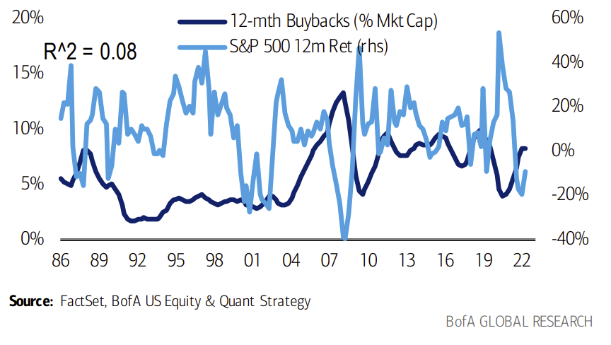

> **📊 图表 10**：*BofA corporate client buybacks also appear to have little effect on index performance*
> **美银公司客户的回购数据对指数表现同样几乎无效** —— 周度回购量（占当年回购总额%）对比指数周度回报（2009/6 至今），R² = 0.0141
>
> 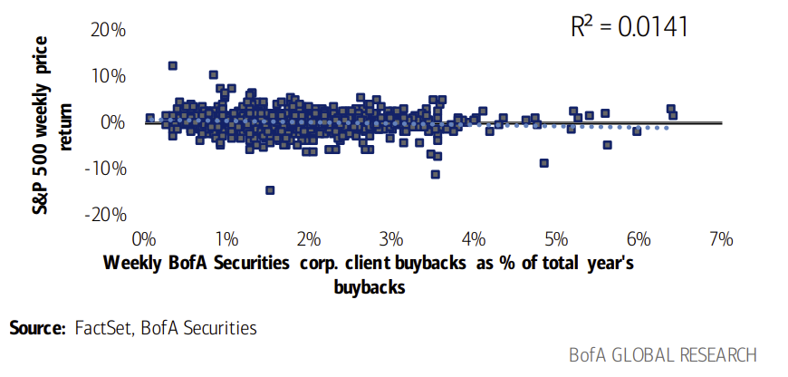

> **📊 图表 11**：*Companies that reduce shares at low valuations tend to outperform*
> **低估值时回购的公司倾向于跑赢**（年化回报，1986/1–2023/4）：单纯回购 ≈ 14%；回购+高 FCF/EV ≈ 14.5%
>
> 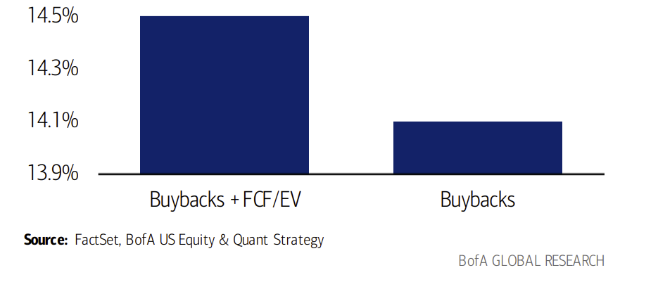

## False: retail investors are a contrary indicator
## 流言②：散户是反向指标 —— **错**

Some claim that institutional investors are the "smart" money and retail investors are better contrary indicators – when retail is buying, it's time to sell, and vice versa. But our BofA Securities Equity Client Flows suggest the opposite (Exhibit 12). Returns following periods of retail inflows have been above average and returns post-retail selling have been below average, with a similar spread to hedge funds (suggesting the latter was not a better signal). Relatedly, our Low Institutional Ownership factor – which includes high retail ownership stocks – has more consistently outperformed during market drops; during months since 1986 with the index falling 3%+, the screen produced an average alpha of 1ppt.

常有一种说法：机构是"聪明钱"，散户是"反向指标"——散户买则应卖、散户卖则应买。但我们的美银证券股票客户资金流数据给出了**相反**的结论（图表 12）：散户**净流入后**的市场回报**高于平均**，净流出后的回报**低于平均**，其信号价差甚至接近对冲基金（也就是说，**对冲基金也并非更优信号**）。相关地，我们的 **"低机构持股"因子**（该组合里高散户持股的股票比例较高）在市场下跌时反而更稳定地跑赢：自 1986 年以来，每逢指数单月跌幅超 3% 时，该策略平均产生 **1 个百分点的阿尔法**。

> **📊 图表 12**：*Retail investors have been similar positive indicators to hedge funds*
> **散户其实是类似于对冲基金的"正向"指标**（2008 年至今标普 500 后 4 周回报，按前 4 周资金流正/负划分）
>
> | 资金类型 | 净流入后 4 周回报 | 净流出后 4 周回报 | 价差 |
> |---|---|---|---|
> | 对冲基金 Hedge Funds | 1.0% | 0.5% | **0.4%** |
> | 机构 Institutional | 1.5% | 0.3% | **1.2%** |
> | 散户 Retail | 0.9% | 0.6% | **0.3%** |

---

# 第 15 页 · 流言 ③—④ 戳破

## False: valuation doesn't matter, price is the best predictor of price
## 流言③：估值不重要，"以价测价"才准 —— **错**

The unwavering faith in price momentum investing is likely attributable to a liquidity-fueled decade that saw tremendous serial correlation across price returns. The average portfolio manager (~45 y.o.) has seen a financial crisis during which statistically cheap stocks were traps, followed by a decade during which value factors destroyed alpha almost every year while investing based on past price return turned in hefty alpha. The few value investors left see post-COVID shifts as a sort of come-uppance: Value (proxied by long-short EV/EBITDA) returned 30ppt from 2021-2022, whereas price return produced no alpha. Prior to the GFC, valuation was a far better signal than basing future forecasts on past price returns. And while Growth has outperformed Value YTD, part of this outperformance was driven by a mini bout of QE this year post-SVB (Silicon Valley Bank failure).

投资者对**价格动量**的信仰之所以根深蒂固，很可能要归因于过去那十年由流动性驱动、价格回报之间出现极强序列相关性的特殊行情。**今天的基金经理平均年龄约 45 岁**，他们的职业生涯大致经历了两个阶段：先是 2008 年那场金融危机——那期间"统计意义上便宜"的股票几乎都是陷阱；紧接着就是长达十年的"价值每年都在毁阿尔法，而动量年年奏效"的岁月。硕果仅存的价值投资者，把新冠后的市场变化视作某种"风水轮流转"：以 EV/EBITDA 多空组合代表的**价值**在 2021–2022 年累计回报 **30 个百分点**，同期**价格动量几乎没有阿尔法**。而在 2008 年全球金融危机（GFC）之前，**估值作为预测信号的有效性远胜于"以过去价格预测未来价格"**。虽然今年年初至今成长跑赢价值，但其中一部分超额收益是由硅谷银行（SVB）倒闭后今年上半年那波**小规模量化宽松（QE）**行情推动的。

> **📊 图表 13**：*Valuation matters, it just hasn't for the last 10 years*
> **估值其实一直重要，只是过去 10 年失效**（EBITDA/EV 与 3 个月价格回报的阶段表现）
>
> 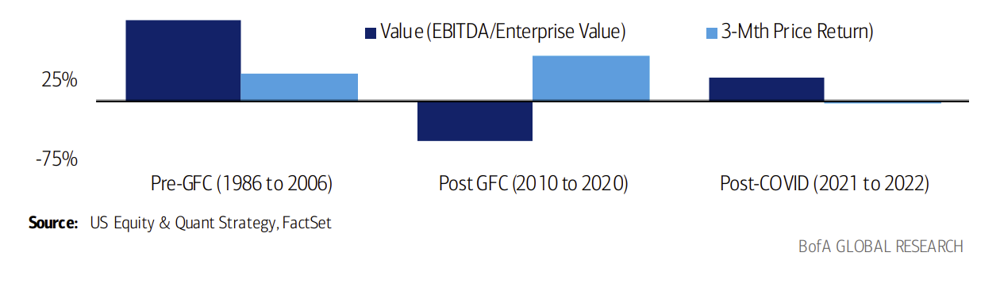
>
> - GFC 前（1986–2006）：价值（EBITDA/EV）显著正向，动量偏弱
> - GFC 后（2010–2020）：价值大幅失效，动量主导
> - 新冠后（2021–2022）：价值卷土重来，动量归零

## False: valuation doesn't matter for Tech
## 流言④：估值对科技股不重要 —— **错**

While the Tech sector has earned aD:\GitHub\py_workspace\manim\fraction_ratio\fraction_ratio.md reputation as a valuation-defying high flier, we have found that valuations have mattered for Tech investors selecting stocks within the sector. Over the past 38 years, companies with low Price to Free Cash Flow and low EV to EBITDA have generated annualized alpha of 6.4ppt and 5.2ppt vs. the sector.

科技板块给人的印象是"估值无效、一路高飞"。但我们的研究显示：**对在科技板块内部选股的投资者来说，估值同样重要**。过去 38 年里，在科技行业中使用**低 P/FCF（股价/自由现金流）** 和 **低 EV/EBITDA** 筛选出的公司，相对行业基准分别带来 **6.4 ppt** 和 **5.2 ppt** 的年化阿尔法。

> **📊 图表 14**：*Price to Free Cash Flow outperformed the index most*
> **在信息技术行业中，P/FCF 是最好的估值类因子**
>
> 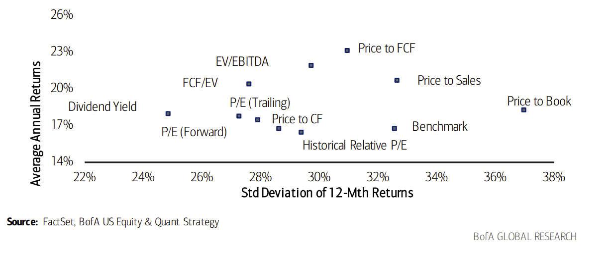
>
> （1985/1 至 2023/4 首五分位年化表现；横轴 = 12 个月回报的标准差，纵轴 = 年化平均回报）

---

# 第 16 页 · 流言 ⑤—⑦ 戳破

## False: duration only matters for bonds
## 流言⑤：久期只对债券有用 —— **错**

In 2022, as markets repriced assets amid rising real rates (10-yr real yield + 235bp) and an aggressive Fed tightening cycle (fed funds rate + 425bp), the Russell 1000 Growth index (-29.1%) underperformed the Russell 1000 Value (-7.5%). Our Long Equity Duration factor, back-end loaded growth stocks that are more vulnerable to rising cost of capital, suffered a 25.5% loss and ranked among the worst three factors for the year.

2022 年，随着 **10 年期实际利率上行 235 个基点**、美联储激进加息（联邦基金利率上调 **425 个基点**），全市场资产被重新定价：罗素 1000 成长指数暴跌 **-29.1%**，而罗素 1000 价值指数仅 -7.5%。我们的**长久期权益（Long Equity Duration）** 因子——刻画"收益高度集中于遥远未来、因此对资本成本上行最敏感"的成长股——当年亏损 **25.5%**，跻身全年**表现最差的三个因子**之一。（由此可见，**股票也有"久期"**，且并不是债券独有的概念。）

## False: bad breadth is bearish
## 流言⑥：市场广度差 = 熊市 —— **错**

Only 23% of stocks outperformed the S&P 500 in May, the lowest of any month in our data history since 1986. Five stocks added 2.4ppt to the index. The other 495 stocks detracted 2.0ppt from the index. But history suggests weak breadth itself isn't a precursor of market weakness: in years of mega-cap leadership since 1986, the market was up the subsequent year nearly 75% of the time (see US Performance Monitor).

2023 年 5 月，**仅 23% 的个股跑赢标普 500**——这是自 1986 年有数据以来任意月份中的**最低值**。当月，5 只股票为指数贡献了 **+2.4 ppt**，其余 495 只合计**拉低指数 2.0 ppt**。但历史经验表明，**广度走弱本身并不是市场走弱的前兆**：自 1986 年以来，凡是**大盘股（Mega-cap）领涨**的年份，**次年市场上涨的概率接近 75%**（详见《美国表现监视器》报告）。

> **📊 图表 15**：*Bad breadth usually mean reverts*
> **差广度通常会均值回归** —— 过去 3 个月跑赢标普 500 的股票占比（1986 至 2023/5/31）
>
> 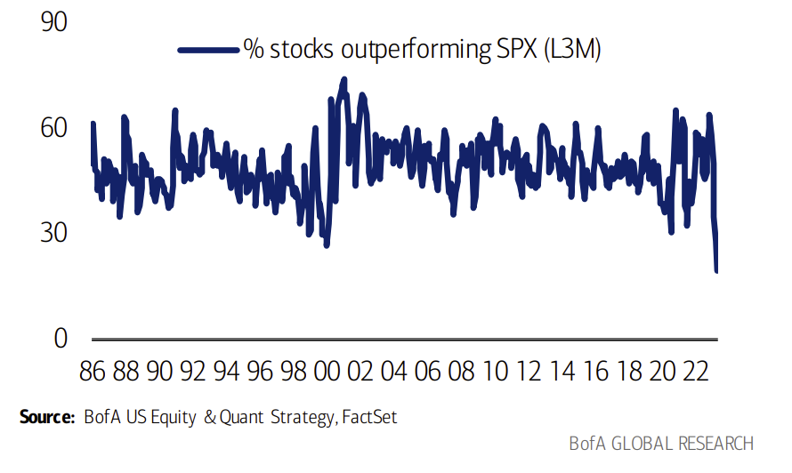

> **📊 图表 16**：*In years of mega-cap leadership since 1986, the market was up the subsequent year nearly 75% of the time*
> **自 1986 年以来，大盘 50 股票跑赢的年份，次年标普上涨概率接近 75%**
>
> | 年份 Year | 漂亮 50 表现 | 标普 500 表现 | 相对超额 | 次年标普 500 表现 |
> |---|---|---|---|---|
> | 1989 | 33.4 | 27.3 | 6.1 | **-6.6** |
> | 1990 | 0.3 | -6.6 | 6.9 | **26.3** |
> | 1995 | 37.8 | 34.1 | 3.7 | 20.3 |
> | 1996 | 24.0 | 20.3 | 3.8 | 31.0 |
> | 1997 | 34.4 | 31.0 | 3.4 | 26.7 |
> | 1998 | 35.2 | 26.7 | 8.6 | 19.5 |
> | 1999 | 20.1 | 19.5 | 0.6 | **-10.1** |
> | 2006 | 14.3 | 13.6 | 0.7 | 3.5 |
> | 2011 | 1.4 | 0.0 | 1.4 | 13.4 |
> | 2015 | 2.2 | -0.7 | 3.0 | 9.5 |
> | 2017 | 19.6 | 19.4 | 0.1 | **-6.2** |
> | 2018 | -3.6 | -6.2 | 2.6 | 28.9 |
> | 2019 | 30.1 | 28.9 | 1.2 | 16.3 |
> | 2020 | 23.2 | 16.3 | 6.9 | 26.9 |
> | 2021 | 28.1 | 26.9 | 1.2 | **-19.4** |
> | **均值 Avg** |  |  |  | **12.0** |
> | **中位 Median** |  |  |  | **16.3** |
> | **胜率 Hit Rate** |  |  |  | **73%** |

## False: flows into equities push multiples higher
## 流言⑦：股票资金流入会推高估值 —— **错**

One might intuitively expect multiples to expand with inflows, and compress with outflows. In actuality, the correlation between equity flows and valuations is effectively zero (Exhibit 17). Our work suggests other reasons keeping the S&P 500 at its current lofty snapshot multiples, including the tendency for P/E ratios to rise when earnings decline and years of Quantitative Easing driving multiple expansion (see Relative Value).

直觉上会以为"资金流入→估值扩张、资金流出→估值收缩"。但事实上，**股票资金流向与估值之间的相关性几乎为零**（图表 17）。我们认为支撑标普 500 当前高估值的原因另有其因，包括：**盈利下滑时 P/E 反而抬升**（分母坍塌效应）以及**多年量化宽松（QE）推高估值中枢**（详见《相对估值》）。

> **📊 图表 17**：*No relationship between equity inflows and valuations*
> **股票资金流入与估值之间没有相关性**（2000–2021 年，标普 500 远期 P/E 同比变化 vs. 过去 12 个月股票资金流/市值%，R² = 0.0009）
>
> 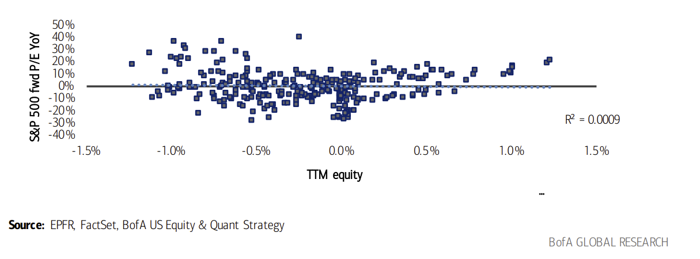

---

# 第 17 页 · 流言 ⑧—⑨ 戳破

## False: value underperforms during economic recessions
## 流言⑧：价值股在经济衰退中跑输 —— **错**

Investors tend to shun Value during periods of economic recession. Our work shows that during NBER recessions over the past almost 40 years, Value along with Quality were most consistently outperforming attributes with a 75% outperformance rate (Exhibit 6). Free cash flow based (High FCF/EV, Price/FCF), as well as Low EV/EBITDA were the best performing Value factors during those periods (Exhibit 19).

投资者在经济衰退期往往避开价值股。但我们的研究表明：在过去近 40 年里 **NBER 界定的经济衰退中，价值与质量是两类最稳定跑赢的特征**，**胜率 75%**（图表 6）。那些时期表现最好的价值类因子包括：基于自由现金流的 **高 FCF/EV**、**低 P/FCF**，以及 **低 EV/EBITDA**（图表 19）。

> **📊 图表 18**：*Value and Quality*
> **价值与质量：NBER 衰退期因子相对于等权标普 500 的表现（1986 至今）**
>
> | | 价值 | 现金回报 | 动量 | 成长 | 质量 | 风险 | 杂项 | 小盘 |
> |---|---|---|---|---|---|---|---|---|
> | Avg | 0.1% | -1.0% | -3.6% | -3.7% | 7.2% | 8.8% | 0.4% | 2.1% |
> | Median | 3.4% | 0.4% | -2.5% | -4.2% | 6.8% | 6.8% | 0.6% | 3.9% |
> | **胜率** | **75%** | 50% | 50% | 25% | **75%** | 50% | 50% | 50% |

> **📊 图表 19**：*Quality and Value tends to outperform during economic recessions*
> **质量与价值在经济衰退期倾向于跑赢**（NBER 衰退期单因子相对表现，1986 至今）
>
> | 因子 | Avg | Median | 胜率 |
> |---|---|---|---|
> | 5 年 ROE（负债调整） | 9.4% | 9.3% | **100%** |
> | 1 年 ROE（负债调整） | 6.8% | 7.8% | 75% |
> | ROA | 8.0% | 6.6% | **100%** |
> | 5 年 ROE | 8.1% | 6.3% | **100%** |
> | 1 年 ROE | 5.6% | 6.1% | 75% |
> | FCF/EV | 6.0% | 5.9% | 75% |
> | 低股价 | 3.4% | 5.8% | 75% |
> | EV/EBITDA | 2.3% | 5.8% | 75% |
> | ROC | 4.9% | 4.9% | 75% |
> | P/FCF | 3.5% | 4.3% | 75% |
> | 盈利收益率 | -0.8% | 3.6% | 75% |
> | P/CF | -1.2% | 2.1% | 75% |
> | 远期盈利收益率 | -1.5% | 1.7% | 75% |
> | 正向 EPS 超预期 | 0.5% | 1.0% | 75% |
> | 海外敞口 | 2.1% | 0.9% | 75% |

## False: during periods of wage disinflation labor intensive companies outperform
## 流言⑨：工资通胀下行时，劳动密集型公司会跑赢 —— **错**

Investors shouldn't own labor-intensive companies under almost any circumstances (Exhibit 20), based on our analysis. Despite the fact that the Fed is keenly focused on cooling wage inflation, which could be a boon to labor-intensive companies' margins, we find that companies with the highest ratio of number of employees per dollar of sales have been almost constant laggards relative to their labor-light counterparts.

按我们的分析，**几乎在任何时候，投资者都不应持有劳动密集型公司**（图表 20）。尽管美联储正全力压降工资通胀——理论上这会改善劳动密集型公司的利润率——但我们发现：**"每 1 美元营收对应员工数"最高**的那一组公司，相对于劳动力消耗较少的同行，**几乎长期跑输**。

> **📊 图表 20**：*Most labor intensive companies tend to underperform their least labor intensive peers on a sector neutral basis…*
> **在行业中性口径下，最劳动密集组（D1）相对最不劳动密集组（D10）长期跑输**（相对等权标普 500 的累计表现，1986–2022）
>
> 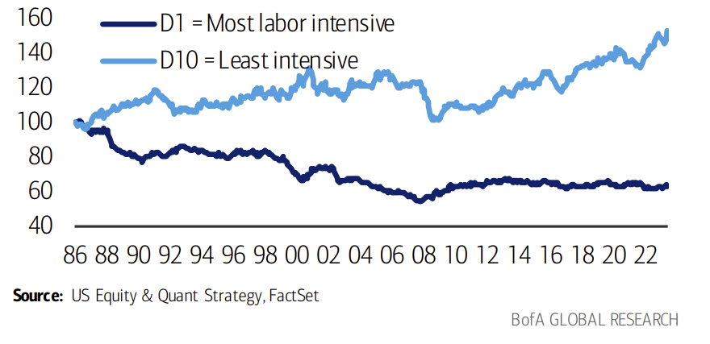

> **📊 图表 21**：*…as well as on an unconstrained basis*
> **在不加行业约束的口径下同样如此**（按员工/营收的十分位，D1 vs. D10）
>
> 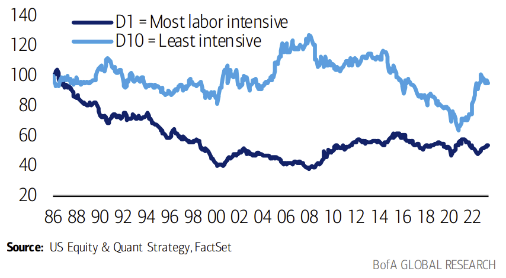

---

# 第 18 页 · 流言 ⑩—⑪ 戳破

## False: ERP needs to rise from here
## 流言⑩：股权风险溢价（ERP）还得往上走 —— **错**

While it is true that historical downturns have resulted in a much sharper increase in the equity risk premium (ERP) vs. now, we see reasons for the ERP to settle at lower levels. First, upside risk in real rates argues for a lower ERP (correlation between ERP and real rates = -84%). Moreover, ERP has trended lower during periods of strong efficiency gains (avg. of ~200bp from 1986-2006 vs. ~550bp post-GFC when efficiency gains stalled), and we believe Corporate America may be on the cusp of a new efficiency cycle (see Strategy in Pictures).

的确，历史上历次"下行期"中，**股权风险溢价（Equity Risk Premium, ERP）** 的跳升幅度都比当下更陡峭。但我们认为**这一次 ERP 可能会稳定在更低水平**，有如下几点理由：
（1）**实际利率仍有上行空间**意味着 ERP 应更低——**ERP 与实际利率的相关系数为 -84%**；
（2）**生产效率强劲改善的时期，ERP 往往趋势性走低**（1986–2006 年 ERP 均值约 200bp；2008 年全球金融危机后效率提升停滞，ERP 均值升至约 550bp）；
（3）我们判断**美国企业部门（Corporate America）正站在一个新效率周期的起点**（详见《图说策略》报告）。

> **📊 图表 22**：*Higher real rates = lower ERP*
> **实际利率上行 → ERP 下行**（归一化 ERP 与实际利率的历史关系，1945–2023/5，R² = 0.7042）
>
> 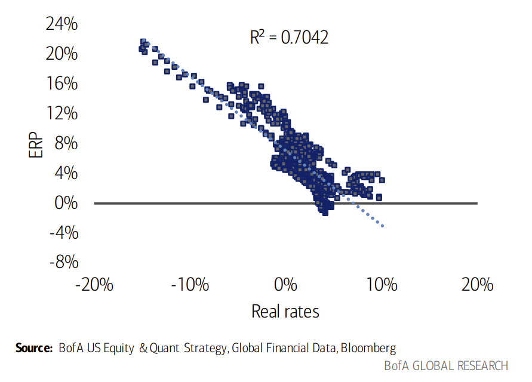

> **📊 图表 23**：*Higher ERP amid stalled productivity*
> **生产率停滞期间 ERP 抬升**（标普 500 每员工每年营收 vs. 归一化 ERP，经 CPI 调整，1986–2023/5）
>
> 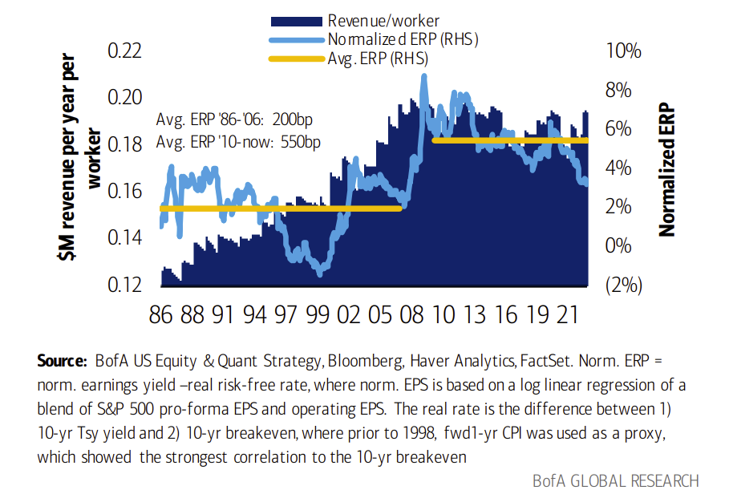
>
> 方法注：归一化 ERP = 归一化盈利收益率 − 实际无风险利率；归一化 EPS 基于标普 500 **Pro-forma EPS** 与 **Operating EPS** 的混合序列做对数线性回归；实际利率 = 10 年期国债收益率 − 10 年期盈亏平衡通胀；1998 年之前以"**未来 1 年 CPI**"替代盈亏平衡通胀（与 10 年期盈亏平衡通胀的相关性最强）。

## False: wait for the Fed pivot
## 流言⑪：先等美联储转向，再看多股市 —— **错**

Over the past year, investors have been waiting for signs of a Fed pivot to become bullish. But historically, the worst phase for equities has been when the Fed was easing and credit conditions were tightening, a regime that we typically see in a recession. Our economists continue to see resilience in the US economy, forecasting only a mild recession (or "growth recession") starting next year and no rate cuts until May 2024 (see Economic Viewpoint).

过去一年，投资者一直在等"**美联储转向（Fed pivot）**"的信号出现再转多。但翻开历史，**对股市最差的阶段恰恰是"美联储宽松 + 信用紧缩"并存的时期**——而这正是典型的**衰退情景**。我们的经济学家团队仍然看好美国经济的韧性，预计明年开始只会出现一次温和衰退（或"**增长型衰退**"，Growth recession），**首次降息要等到 2024 年 5 月**（详见《经济观点》报告）。

> **📊 图表 24**：*Fed easing/credit tightening sees weakest return*
> **"美联储宽松 + 信用紧缩"期间股市回报最弱**（1996–2023/5 标普 500 月度回报；*美联储周期由 2 年期利率判断；信用周期由投资级信用利差判断*）
>
> | 情景 | 平均 | 中位 | 上涨概率 |
> |---|---|---|---|
> | 美联储紧缩 + 信用宽松 | **+2.0%** | +2.2% | **73%** |
> | 美联储紧缩 + 信用紧缩 | +1.2% | +1.2% | 75% |
> | 美联储宽松 + 信用紧缩 | **-1.1%** | -0.7% | **44%**（最差） |
> | 美联储宽松 + 信用宽松 | 0.0% | -0.4% | 49% |

---