# 量化投研入门手册（Quantitative Primer）· 中英对照版 03

# 第 19 页 · 第一部分导读（Section I）

## Section I: Core Concepts and Methodology
## 第一部分：核心概念与方法论

| 页码 | 英文章节名 | 中文译名 |
|---:|---|---|
| 20 | What drives market performance? | 什么决定了市场表现？ |
| 38 | Liquidity risks for the S&P 500 | 标普 500 的流动性风险 |
| 39 | Earnings Expectation Life Cycle | 盈利预期生命周期 |
| 43 | Factor timing | 因子择时 |
| 56 | Measuring risk | 风险度量 |
| 61 | Roadmap to picking stocks | 选股路线图 |
| 67 | US Regime Indicator | 美国市场体制指标 |
| 72 | What are quants doing? | 量化从业者在做什么？ |
| 78 | Alternative Data | 另类数据 |
| 90 | The ABC's of ESG | ESG 入门 |

---

# 第 20 页 · 什么决定了市场表现？

## What drives market performance?
## 什么决定了市场表现？

Overall stock market performance is largely a function of valuation, sentiment and profits. When an investor buys stocks, he/she is buying a share of the future profits of the company and must decide whether the market is valuing this profits stream correctly. Valuation can be heavily influenced by investor sentiment, scarcity or abundance of other options, visibility, quality, governance, and a host of other factors that are difficult to quantify.

**股票市场的整体表现，主要由三件事决定：估值、情绪、盈利**。投资者买股票，本质上是在买这家公司未来盈利的一部分份额——所以必须判断：**市场对这条盈利河流的定价是否合理**。而估值本身会受到诸多因素的强烈影响：投资者情绪、其他可选资产的稀缺或充裕程度、可预见性、经营质量、公司治理，以及一大堆难以量化的因素。

### 1. Valuation
### 1. 估值

Our work suggests that valuation is generally a poor market timing indicator over short to medium time horizons. However, over longer time horizons valuation may be the most important determinant of market returns. The drawback of most single-period valuation ratios used by investors is that they implicitly assume that the single period being used – for example, EPS over the next 12 months in the case of forward PE ratios – is representative of the trajectory of future profit growth. Our preferred valuation measures adjust for this single-period bias.

我们的研究表明：**估值在短—中期并不是一个好的择时指标**；但**时间拉长之后，估值很可能是决定市场回报最关键的变量**。市面上多数单期估值比率（如**远期市盈率**，用未来 12 个月 EPS 作分母）都有一个隐含缺陷——**假定这"一个期间"的盈利水平能代表公司未来盈利的长期轨迹**，但这个假设往往不成立。我们**偏好的估值方法会修正这种"单期偏差"**。

#### Normalized P/E Framework
#### 归一化市盈率框架（Normalized P/E）

One way to adjust for the single-period bias is to estimate the underlying earnings power based on the historical trend, adjusting for inherent cyclicality. We estimate normalized earnings based on a linear log normal regression and our analysis shows that this measure of market valuation explains over 80% of the variability of equity market returns over the next 10 years (Exhibit 25). In the late-1990s, equity valuations were near peak levels, and we subsequently saw negative returns over the following decade. In contrast, valuations in the wake of the Global Financial Crisis reached extreme levels far below those seen during the 1980s and 1990s, and were similarly followed by strong equity market returns.

修正单期偏差的一种方法是：**基于历史趋势估算公司真实的盈利能力，并剔除其固有的周期波动**。我们用**线性对数正态回归**估算出"归一化盈利"，并以此构造归一化 P/E。分析显示，**这一估值指标对未来 10 年股票市场回报波动的解释力超过 80%**（图表 25）。具体来看：1990 年代末期估值接近历史峰值，随后 10 年市场回报为负；而 2008 年全球金融危机之后，估值跌至**远低于 1980s 与 1990s 的极端低位**，其后的十年股市回报也同样强劲。

> **📊 图表 25**：*Valuations explained ~80% of 10yr returns*
>
> 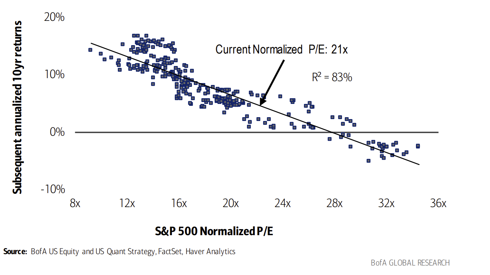
>
> **估值可解释约 80% 的未来 10 年回报**（标普 500 归一化 P/E vs. 其后 10 年年化回报，1987 至 2023/4；R² = 83%）
> **当前归一化 P/E：21 倍**

---

# 第 21 页 · 归一化 P/E 的长期解释力 & 股权风险溢价框架

> **📊 图表 26**：*Almost all that matters over the long term*
>
> 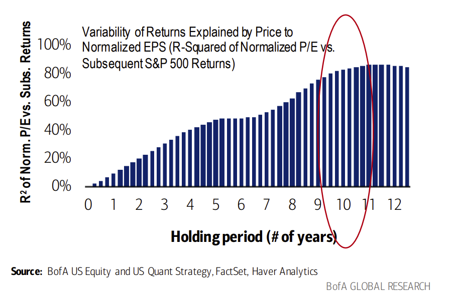
>
> **长期几乎就看这一件事** —— 归一化 P/E 对标普 500 后续各期回报的解释力（1987–2023/4）
> （横轴：持有期年数 0–12；纵轴：R² = 归一化 P/E 对后续区间回报的解释度——持有期越长，解释力越高，10 年达 ~80%+）

> **📊 图表 27**：*S&P's normalized PE is currently above average*
>
> 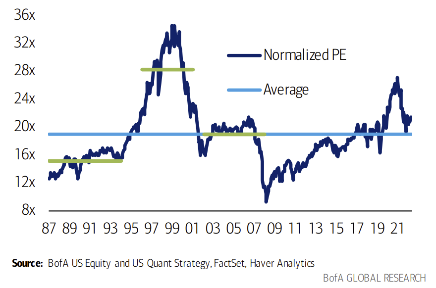
>
> **标普 500 当前归一化 P/E 高于均值**（1987–2023/4，归一化 P/E 8x–36x 历史走廊）

## Equity Risk Premium Frameworks
## 股权风险溢价（ERP）框架

Whereas normalized P/E ratios adjust for the single-period bias, two criticisms of this framework are that (1) it is backward looking; and (2) does not account for changes in the cost of capital. The equity risk premium (ERP) is the amount of additional return beyond the risk-free rate that investors require as compensation for accepting the investment risks and costs associated with owning stocks. When investor fear levels are high, and equities are perceived as being risky, the equity risk premium, or the required return of equities, increases to compensate for that risk. And vice versa.

归一化 P/E 虽然修正了"单期偏差"，但它也有两点常被诟病：（1）**向后看**（backward-looking）；（2）**未考虑资本成本的变化**。**股权风险溢价（Equity Risk Premium, ERP）** 则衡量投资者为承担持股风险与成本所要求的"无风险利率以上的额外回报"。当投资者恐慌情绪高涨、股票被视为高风险时，ERP（即对股票的要求回报）就会上升以补偿风险；反之亦然。

A rising equity risk premium typically coincides with higher quality investments outperforming, and a falling risk premium typically coincides with lower quality, riskier investments outperforming. An alternate interpretation is the idea that as the cost of equity capital (or the discount rate) increases, shorter duration (higher dividend yielding) equities generally outperform, and as the cost of capital falls, longer duration, higher growth and higher beta companies generally outperform.

**ERP 上行期通常高质量投资跑赢；ERP 下行期则低质量、高风险资产跑赢**。换一种说法：**股权资本成本（或贴现率）上行时，短久期（高股息）股票占优；资本成本下行时，长久期、高成长、高贝塔公司占优**。

The literature on equity risk premia is vast, but we have distilled it into two methods for evaluating the equity risk premium – a normalized approach and a market-derived approach.

关于 ERP 的研究文献浩如烟海，我们将其凝练为两种方法：**归一化法** 与 **市场隐含法**。

### Normalized Equity Risk Premium Framework
### 归一化 ERP 框架

We estimate the historical ERP as the normalized EPS yield (normalized EPS ÷ current price) less the real risk-free rate. The real risk-free rate is the difference between 1) the 10-yr Tsy yield; and (2) the 10-yr breakeven. Prior to 1998, fwd 1-yr CPI was used as a proxy for the breakeven (this showed the strongest correlation to the 10-yr breakeven).

历史 ERP 我们这样估算：**归一化盈利收益率**（归一化 EPS ÷ 当前价）**减去实际无风险利率**。实际无风险利率 = **10 年期国债收益率 − 10 年期盈亏平衡通胀**。1998 年以前，**用"未来 1 年 CPI"作为盈亏平衡通胀的代理**（与 10 年期盈亏平衡通胀相关性最强）。

---

# 第 22 页 · 归一化 ERP 的历史与实际利率关系

> **📊 图表 28**：*We expect ERP to normalize at levels lower than the post-Global Financial Crisis era's average of 550bp*
>
> 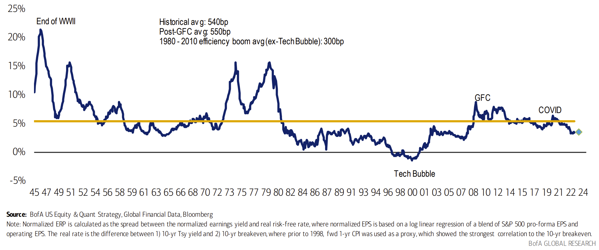
>
> **我们预计 ERP 将稳定在低于 GFC 后 550bp 均值的水平**（1945–2023/4，归一化 ERP；BofA 预测值 350bp）
> 关键标注：二战末、科网泡沫、GFC、新冠；历史均值 540bp；GFC 后均值 550bp；1980–2010 效率繁荣（剔除科网泡沫）均值 300bp。

> **📊 图表 29**：*Higher real rates = lower ERP*
>
> 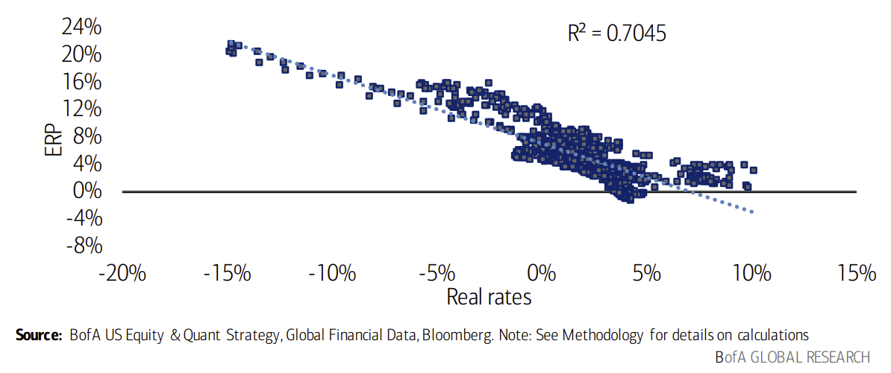
>
> **实际利率越高 → ERP 越低**（归一化 ERP vs. 实际利率，1945–2023/4，R² = 0.7045）

### Market-derived Equity Risk Premium Framework
### 市场隐含 ERP 框架

Our market-derived Equity Risk Premium framework is based on our proprietary Dividend Discount Model (DDM), making use of our analysts' forecasts for company earnings and dividends in order to estimate the expected, or required, rate of return of the equity market. For more details on our DDM, see the Appendix. Because our DDM mimics the yield-to-maturity calculation for a bond, we essentially compute the "yield-to-maturity" of equities. The spread between the expected return of the S&P 500 and corporate bond yields (as measured by AAA Long-Term Corporate Bond Rates) estimates the risk premium demanded by the market for taking on equity-specific risk over credit risk.

我们的市场隐含 ERP 框架基于自有的 **股息贴现模型（DDM）**，用分析师对公司盈利与股息的预测来估算市场的期望/要求回报率（DDM 细节见附录）。由于这个 DDM 在机制上**模拟债券的到期收益率（YTM）计算**，相当于给股票算出了一个"**到期收益率**"。**标普 500 的期望回报 − AAA 长期公司债利率**，就近似于**市场为承担"股权风险而非信用风险"所要求的风险补偿**。

---

# 第 23 页 · 市场隐含 ERP 与 通胀-P/E 框架

> **📊 图表 30**：*S&P 500 Risk Premium declined in recent months*
>
> 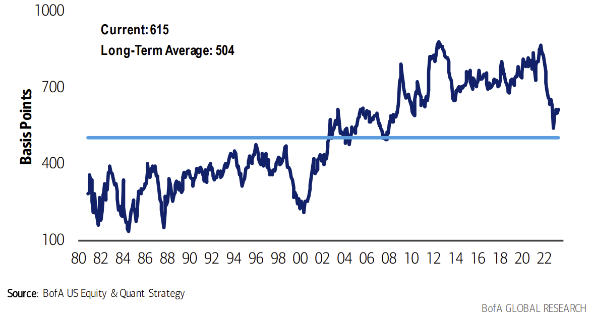
>
> **标普 500 风险溢价近几个月回落**（市场隐含 ERP = DDM 隐含期望回报 − AAA 公司债利率，1980/11–2023/4）
> **当前：615bp；长期均值：504bp**

### Inflation vs. P/E Framework
### 通胀 vs. P/E 框架

The inflation vs. P/E framework is based on the premise behind the "Rule of 21" valuation framework that has been used by traders in the past. The Rule of 21 states that the combination of the S&P 500 P/E and the year-to-year inflation rate (CPI) should be equal to 21. We found that the relationship is well-motivated, and there is a trade-off between inflation and multiples, but not at valuation and inflation extremes. Therefore, a non-linear curve better fits this thesis. Exhibit 31 below highlights the historical relationship between inflation and P/E over time. We quantify this relationship using a least-squares regression model fitted to an equation in the form y= cxb where b and c are constants.

通胀-P/E 框架源于历史上交易员惯用的"**21 法则（Rule of 21）**"：**标普 500 P/E + 同比 CPI ≈ 21**。我们研究发现这个关系逻辑上说得通——**通胀与估值之间确实存在权衡**——但在**估值与通胀极端值处这种线性关系不再成立**。因此用**非线性曲线拟合更合理**。图表 31 展示了通胀与 P/E 的历史关系，我们用**最小二乘回归**拟合成 **y = c·xᵇ**（b、c 为常数）的形式。

> **📊 图表 31**：*Inflation vs. P/E Framework*
>
> 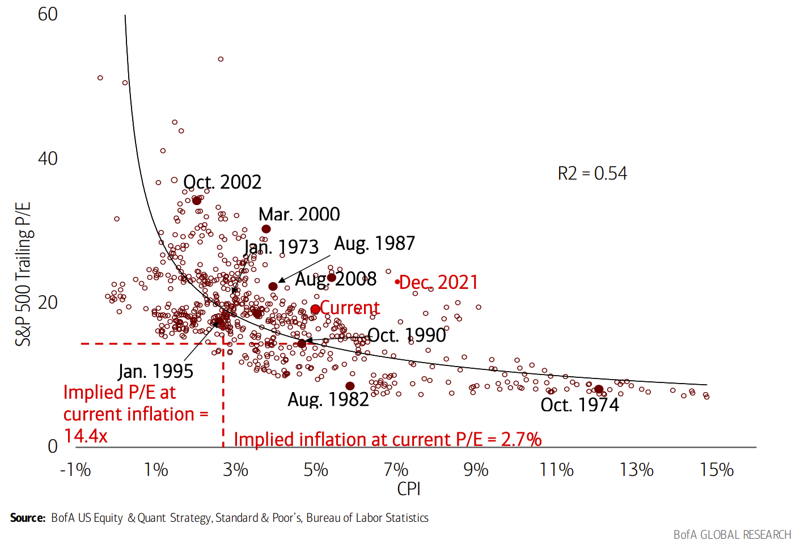
>
> **通胀与 P/E 框架**（1965 至今）
> 关键标注点：1974/10、1982/8、1987/8、1990/10、1995/1、2000/3、2002/10、2008/8、2021/12、当前。
> **当前 P/E 对应的隐含通胀 ≈ 2.7%；当前通胀对应的隐含 P/E ≈ 14.4 倍**。

---

# 第 24 页 · 情绪：卖方指标

## 2. Sentiment
## 2. 情绪

Returns tend to be greater where capital is scarce. As investors flock to invest in an asset, it pushes up the price and lowers the potential future returns of that asset. Thus, there should be an inverse correlation between investors' willingness to invest in stocks and future equity returns. And this is precisely what we have found.

**资金最稀缺的地方往往回报最高**。当投资者蜂拥买入某类资产时，价格被推高，未来的潜在回报就会下降。因此，**投资者对股票的热情与未来股票回报应呈反向关系**——我们的研究也正是这样印证的。

### Sell Side Indicator
### 卖方指标（Sell Side Indicator）

The Sell Side Indicator — our proprietary framework that measures Wall Street's bullishness on stocks — is based on the average recommended equity allocation of Wall Street strategists as of the last business day of each month. These equity weightings are from strategists who submit their asset allocation recommendations to us. We have found that Wall Street's consensus equity allocation has historically been a reliable contrary indicator. In other words, it has historically been a bullish signal when Wall Street was extremely bearish, and vice versa.

**卖方指标**是我们衡量华尔街对股票多空立场的自有框架——取每月最后一个交易日各家华尔街策略师推荐的**平均股票配置比例**。这些权重由向我们报送资产配置建议的策略师提供。历史数据表明：**华尔街共识股票配置一直是可靠的反向指标**——华尔街极度看空时反而是多头信号，极度看多时反而是空头信号。

> **提示**：为什么情绪通常是好的反向指标？**当所有数据、头条与噪音一面倒地偏向某一方向时，市场极大概率已充分消化甚至过度消化这种预期——于是实际走势更可能向反方向出其不意**。

> **📊 图表 32**：*Sell Side Indicator has high predictive power vs. frameworks like the Fed Model*
> **卖方指标的预测力远高于"美联储模型"一类框架**（各指标预测未来 12 个月标普 500 回报的 R²）
>
> | 指标 | R² |
> |---|---|
> | 卖方指标 | **24%** |
> | 卖方指标处于极值（买入/卖出阈值）| **34%** |
> | 标普 500 股息率 | 12% |
> | Pro-forma P/E | 10% |
> | 调整后美联储模型（EPS 收益率 − 10Y 实际利率）| 4% |
> | M1 增速 | 3% |
> | 美联储模型（EPS 收益率 − 10Y 国债）| 1% |

Given secular changes in equity allocation over time, we believe comparing the recommended equity allocation to a moving average may be most effective. Wall Street sentiment appears to go through long-lasting secular phases that can last more than a decade. From the '80s to the mid-90s, the average equity allocation was anchored at a lower level and then grew more aggressive beginning in the late '90s. Equity allocations have declined dramatically over the past year relative to bond allocations, putting us close to a "Buy" signal based on this indicator.

考虑到股票配置存在长期结构性变化，**将推荐配置与其滚动均值作对照**可能最有效。华尔街情绪似乎会经历持续超过十年的**长周期相位**：1980 年代到 1990 年代中期，平均股票配置锚定在较低水平；1990 年代末开始显著抬升。过去一年里，股票配置相对债券配置**大幅下降**，按此指标看，当前已**接近"买入"信号**。

---

# 第 25 页 · 卖方指标的信号与 R²；仓位开篇

> **📊 图表 33**：*Equity sentiment has declined by over 7ppt from peak levels of bullishness in 2021*
>
> 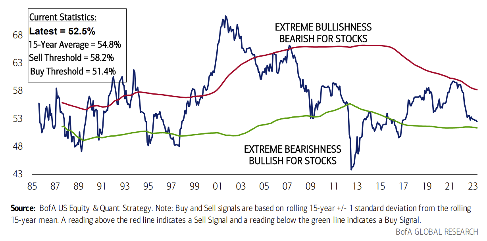
>
> **股票情绪相较 2021 年的极致看多已下降 7 个百分点以上**（卖方指标，1985/9–2023/5）
> **当前读数：52.5% · 15 年均值：54.8% · 卖出阈值：58.2% · 买入阈值：51.4%**
> （买/卖信号基于 15 年滚动均值 ±1 倍标准差）

The Sell Side Indicator does not catch every rally or decline in the stock market, but has had reasonably strong predictive capability with respect to subsequent 12-month S&P 500 total returns. Although the r-square of 24% may sound low, it is significantly higher than similar statistics for typical variables used in stock market timing models. In particular, note that such heralded indicators such as the "Fed Model" and money growth have relatively little predictive value. Moreover, at BUY and SELL extremes, the r-square improves to 34%.

卖方指标并非每一次涨跌都能抓到，但**对未来 12 个月标普 500 总回报的预测力相当强**。**24% 的 R² 听上去不高**，但已**显著高于市场择时模型中常见变量的同类统计**——注意，**像"美联储模型"、货币供应量增速这些听起来响亮的指标，其预测力几乎可忽略**。而且**在买入/卖出极值区间，R² 进一步升至 34%**。

> **📊 图表 34**：*R² of the Sell Side Indicator improves to 34% at BUY and SELL extremes*
>
> 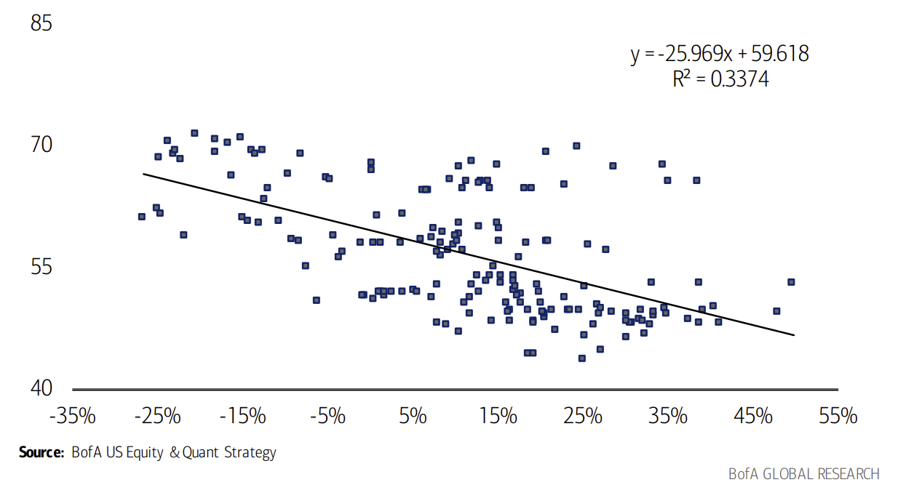
>
> **在买入/卖出极值区间，卖方指标的 R² 升至 34%**（卖方指标 vs. 后续 12 个月标普 500 总回报，1987/11 至今）
> 拟合方程：**y = −25.969·x + 59.618，R² = 0.3374**

## 3. Positioning
## 3. 仓位

### Who owns the S&P 500?
### 谁在持有标普 500？

We analyze the ownership of S&P 500 by institutions and individuals, collected by FactSet through various sources (see Exhibit 36). For the S&P 500 overall, investment advisers (asset managers) and mutual fund managers own the majority of the market cap of the index. However, this breakout can differ for individual stocks within the S&P 500, where ownership can provide insight on stock performance/volatility.

我们用 FactSet 多源汇总的数据分析标普 500 的机构与个人持股情况（数据来源见图表 36）。就整个指数而言，**投资顾问机构（资管公司）与共同基金经理合计持有大部分市值**。但**对个股来说持股结构差异很大**——而**持股结构对理解个股的表现与波动非常有价值**。

---

# 第 26 页 · 标普 500 持股结构与数据来源；主动管理人持仓

> **📊 图表 35**：*S&P 500 ownership breakout by institution type (4/30/2023)*
> **标普 500 持股按机构类型拆分（2023/4/30）** —— 投顾与共同基金是主要持有人
>
> | 类型 | 占比 |
> |---|---|
> | 投资顾问（Investment Adviser）| **37%** |
> | 未知 / Unknown | 20% |
> | 共同基金经理 | 19% |
> | 个人 | 15% |
> | 私行/财富管理 | 3% |
> | 养老基金经理 | 2% |
> | 对冲基金经理 | 2% |
> | 其他 | 2% |
>
> 注：**"未知"** 包括：（1）未达披露阈值的个人投资者；（2）依法不披露的共同基金；（3）美国境内管理规模低于 1 亿美元、无需报 13F 的机构；（4）境外不理 13F 要求或规模低于 1 亿美元的机构。**因卖空与报告时点差异，可能存在双重计数**。

> **📊 图表 36**：*S&P 500 aggregate ownership data sources*
> **标普 500 汇总持股数据来源**
>
> | 来源 | 说明 |
> |---|---|
> | **Form 13F** | 主要来源。在美国管理的美股规模 ≥ 1 亿美元的资管机构，须按季度申报 |
> | **Form 3/4/5** | 公司高管、董事及持有某类股票权益 10% 以上的受益所有人 |
> | **DEF 14A** | 股东大会委托书中披露的主要股东持股 |
> | **13D** | 持股 ≥ 5% 的个人须提交 |
> | **其他** | FactSet 直接联系基金/公司或从其报告/网站拉取数据，尤其是无须向 SEC 申报的境外基金 |

### Active managers' holdings
### 主动管理人持仓

At the sector and stock level, as well as for factors, we analyze large cap active managers' positioning on a quarterly basis. Positioning by sector for the latest quarter can be found below. Positioning data allows investors to assess, for example, what stocks are crowded vs. unloved by active managers or how managers' sector exposure has changed from quarter to quarter.

我们在**行业、个股、因子层面按季度分析大盘主动管理人持仓**。下方展示最新一季度的行业持仓。持仓数据能帮助投资者判断：**哪些股票被主动资金过度拥挤持有、哪些被冷落**；**各行业敞口环比如何变化**等。

---

# 第 27 页 · 多头基金 vs. 对冲基金行业持仓

> **📊 图表 37**：*Where do mutual funds and hedge funds agree (and disagree)?*
>
> 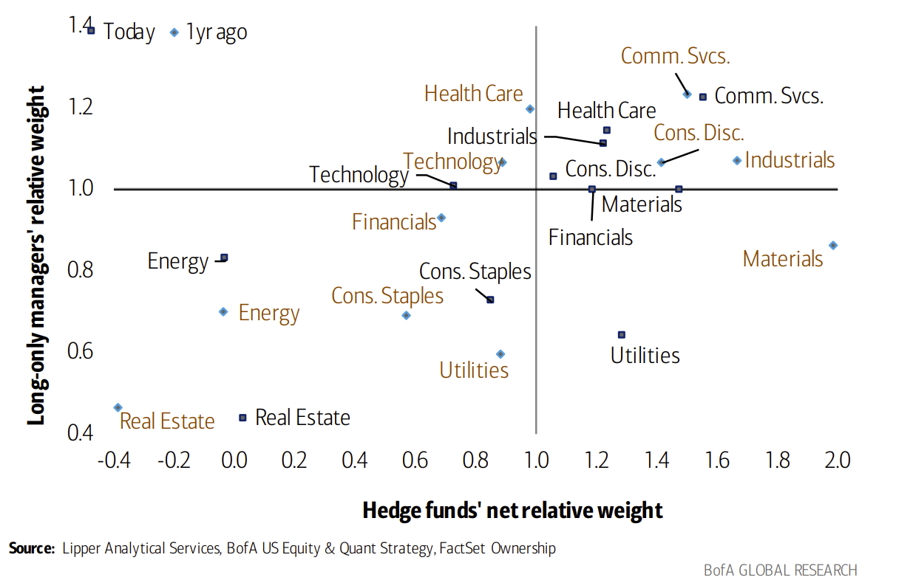
>
> **共同基金与对冲基金在哪些行业一致、哪些分歧？**（2023/4）
> —— 一年前 vs. 今天，各行业相对仓位对比。**目前双方分歧最大的行业**：通信服务（长仓超配、对冲低配）、医疗保健（双方都较超配）；**最一致**：能源、房地产。

> **📊 图表 38**：*Funds are slightly overweight cyclicals relative to defensives, but relative positioning is lowest since 2015*
>
> 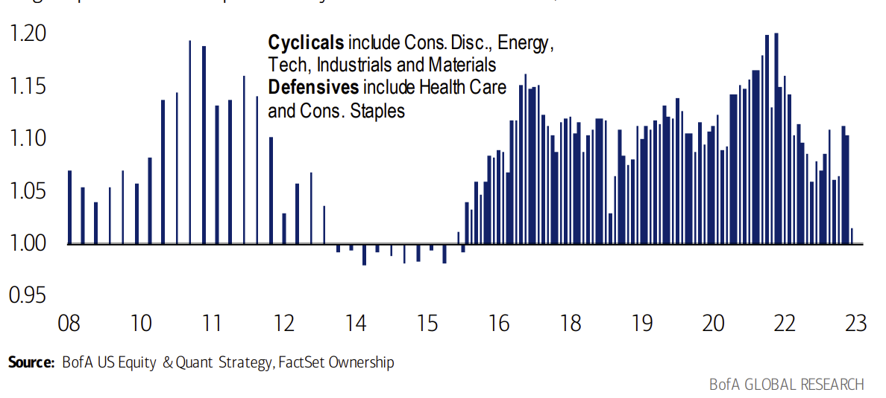
>
> **多头基金对周期股 vs. 防御股小幅超配，但相对仓位已降至 2015 年以来最低**
> （大盘共同基金对周期/防御行业的相对敞口，2008/9–2023/4）
> *周期 = 可选消费、能源、科技、工业、材料；防御 = 医疗保健、必需消费*

> **📊 图表 39**：*Hedge funds are underweight cyclicals relative to defensives (relative positioning near historic lows)*
>
> 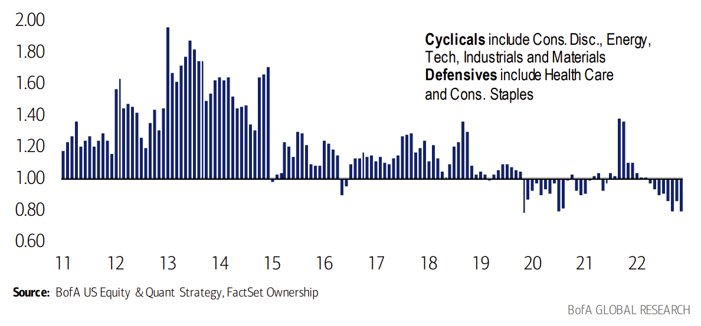
>
> **对冲基金对周期股低配（相对仓位接近历史低位）**
> （对冲基金对周期/防御行业的相对敞口，2011/6–2023/4）

---

# 第 28 页 · 从仓位中挖阿尔法；资产管理人对非流动资产的配置

### Extracting alpha from positioning
### 从仓位中挖阿尔法

Positioning can add alpha at a stock level. Our work suggests that over the last several years, during which active inflows were weak to negative but passive inflows were positive and strong, the strategy of buying the 10 most underweight stocks and selling the 10 most overweight stocks each year has generated an average of 5ppt to 18ppt of alpha per year, with the exception of 2017 and 2020 (Exhibit 41). We believe this should continue, as the main driver of the most crowded stocks' weakness – outflows from active fund into passive vehicles – may not be over (Exhibit 40).

**仓位信号在个股层面可以带来阿尔法**。近几年主动基金净流入疲弱甚至为负，被动基金则持续净流入——在这样的背景下，**每年买入主动管理人"最低配"的 10 只股票、卖空其"最高配"的 10 只股票**，除了 2017 年与 2020 年外，**平均每年贡献 5–18 个百分点的阿尔法**（图表 41）。我们认为这个信号还会继续有效，因为导致"最拥挤股票"走弱的核心驱动——**资金从主动基金流向被动工具**——远未结束（图表 40）。

> **📊 图表 40**：*Passive now accounts for 52% of all US domiciled fund assets*
>
> 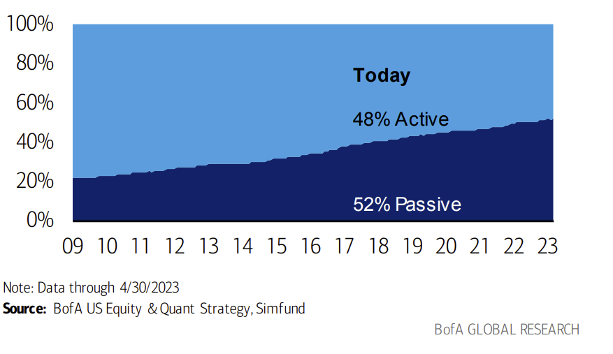
>
> **被动基金已占美国国内基金资产的 52%**（主动 48% vs. 被动 52%，2023/4/30）

> **📊 图表 41**：*Buying the 10 most underweight stocks and selling the 10 most overweight stocks by active funds has generated alpha in most years*
> **买"最低配 10 只"、卖"最高配 10 只"，在多数年份都能产生阿尔法**（相对标普 500，2014–2023 年初至今）
>
> | 年份 | 最高配 10 只（Top 10）| 最低配 10 只（Bottom 10）|
> |---|---|---|
> | 2014 | -5.5 | 8.4 |
> | 2015 | -8.7 | -5.8 |
> | 2016 | 5.9 | 12.3 |
> | 2017 | 1.1 | 3.9 |
> | 2018 | -4.6 | 13.4 |
> | 2019 | -8.7 | -9.5 |
> | 2020 | -16.2 | 0.4 |
> | 2021 | -2.6 | 4.7 |
> | 2022 | 8.4 | -41.6（注：2022 年低配组包含较多成长白马，被整体重创）|
> | 2023 年初至今 | 35.8 | -11.3 |

> **📊 图表 42**：*Pension funds' allocation to illiquid assets has more than quadrupled since 2006*
> **养老金对非流动资产的配置自 2006 年以来翻了 4 倍以上**（美国 Top 1000 养老金，2006–2022）
>
> | 年份 | 流动资产 | 非流动资产 |
> |---|---|---|
> | 2006 | 92% | 8% |
> | 2010 | 83% | 17% |
> | 2015 | 77% | 23% |
> | 2020 | 75% | 25% |
> | 2022 | **64%** | **36%** |
>
> 注：流动 = 本国股债、国际/全球股债（含按揭、信用、杠杆贷款）、现金；非流动 = 私募股权、地产、其他另类投资。

---

# 第 29 页 · FMS 现金水平；空头兴趣

### Global Fund Manager Survey cash balances
### 全球基金经理问卷调查（FMS）中的现金水平

The BofA Fund Manager Survey (FMS, see note) is a monthly survey of 300-400 primarily long-only investors. One of the key questions in this survey asks for cash balance as percentage of assets under management. A low cash balance leaves investors vulnerable to negative market shocks, while a high cash balance means investors are under-invested and vulnerable to positive market shocks.

美银基金经理问卷调查（**BofA Fund Manager Survey, FMS**）是每月对 300–400 位以多头为主的投资者进行的调查。其中一个关键问题是"**现金占 AUM 的比例**"。现金水平低意味着投资者对负面冲击**脆弱**；现金水平高则说明投资者"**仓位不足**"，对正面冲击反而**被动**。

- **当现金水平跌破 4%，触发反向"卖出"信号**
- **当现金水平升破 5%，触发反向"买入"信号**

> **📊 图表 43**：*Cash drifts up to 5.6% from 5.5% (May 2023)*
>
> 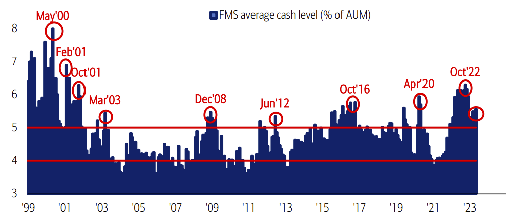
>
> **现金水平从 5.5% 小幅升至 5.6%（2023 年 5 月）**（FMS 平均现金占 AUM 比，1999–2023）
> 运作规则：< 4% 触发反向卖出；> 5% 触发反向买入。

The BofA Fund Manager Survey (FMS) also provides a context for global positioning of fund managers, and today highlights that global investors have reduced their US stocks allocations to underweight.

FMS 同时反映全球基金经理的仓位情况。**当前显示：全球投资者已将美股仓位下调至低配**。

> **📊 图表 44**：*Net % Asset Allocators Say they are overweight US Equities*
>
> 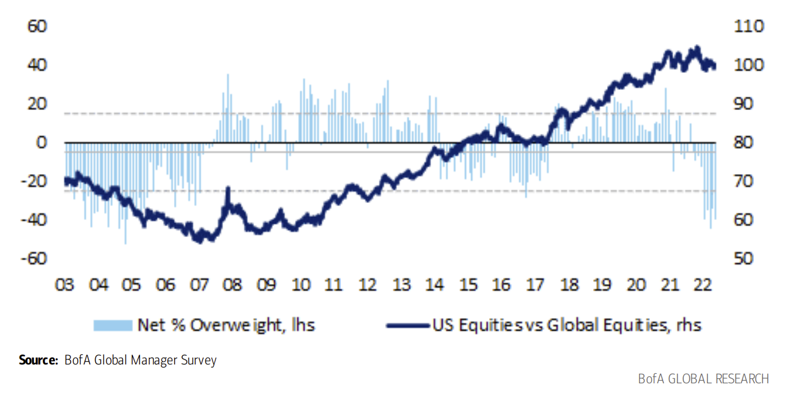
>
> **资产配置人中净超配美股的比例**（2023/5）

### Short Interest
### 空头兴趣

While short interest is not predictive of market performance in isolation, when used in conjunction with valuation, sentiment and fundamentals, it can be helpful in calling for upside or downside risk to the equity market.

**单独看空头兴趣并不能预测市场表现**，但**与估值、情绪、基本面结合使用时**，它对判断股市上行/下行风险很有帮助。

---

# 第 30 页 · 空头兴趣走势；客户资金流；企业盈利开篇

> **📊 图表 45**：*Short interest has generally risen in 2023 YTD*
>
> 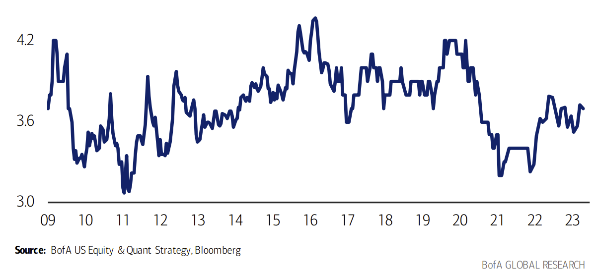
>
> **2023 年以来空头兴趣整体抬升**（全市场空头兴趣/流通盘比，2008–2023/4）

### Flow trends
### 资金流趋势

Flows trends are often assessed as another gauge of sentiment, as they can serve as confirmation of a rally or a signal of capitulation when buying or selling activity spikes to extremes or accelerates over a period. We track BofA Securities client trading flows into US single stocks and ETFs that are executed by the cash equities business of the firm, and provide a weekly update on flows by sector, client type, and size segment.

资金流趋势常作为另一重情绪指标——当买卖活动飙到极值或明显加速时，它要么**确认上涨趋势**，要么**释放投降式抛售的信号**。我们跟踪美银证券客户在美股个股与 ETF 上的交易流（由公司现金股票业务执行），每周按**行业、客户类型、市值段**发布更新。

📖 <b>术语解释：ETF / 投降式抛售（Capitulation）</b>

- **ETF（Exchange-Traded Fund，交易所交易基金）**：**像股票一样在交易所盘中买卖的基金**。一份 ETF 份额背后对应一篮子底层资产（股票、债券、商品等），其净值由篮子内资产的市值决定，**做市商通过\"申购/赎回\"机制让 ETF 价格紧密贴合净值**。
  - 按跟踪目标分：**指数 ETF**（如 SPY 跟踪 S&P 500、QQQ 跟踪 Nasdaq-100）、**行业 ETF**（XLK 科技、XLF 金融）、**风格 ETF**（价值/成长）、**主题 ETF**（AI、清洁能源）、**商品 ETF**（GLD 黄金）、**债券 ETF** 等。
  - **跟个股相比**：ETF 的资金流更能反映\"资产配置层面\"的情绪（例如机构从个股切换到行业 ETF 做快速方向押注），因此追踪 ETF 净流入/流出已成为**情绪分析**的标准工具。

- **投降式抛售（Capitulation）**：市场长期下跌后，最后一批\"还抱有希望\"的投资者**集体放弃**、不计价格割肉出局的时刻——表现为**成交量骤增 + 价格短时间暴跌 + VIX 飙升 + 资金流极端流出**。历史上这往往是**中期底部的信号**，因为\"该卖的都卖完了\"。

> **📊 图表 46**：*BofA client net buys of US equities ($mn) and S&P 500 since 2008*
>
> 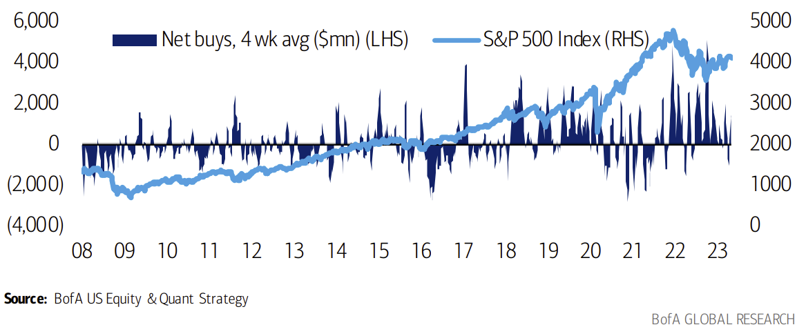
>
> **美银客户美股净买入（百万美元）与标普 500 走势**（2008/1–2023/4）——资金流时常是反弹的确认或投降抛售的信号

---