# 量化投研入门手册（Quantitative Primer）· 中英对照版 04

## 4. Corporate Profits
## 4. 企业盈利

### Normalized earnings
### 归一化盈利

Earnings are volatile over the course of a cycle, so we adjust earnings by this cyclicality to estimate the underlying earnings power of the S&P 500. Without the benefit of hindsight, it is difficult to assess what stage of the cycle we are in, but our best estimate is to normalize earnings based on a trend line of earnings growth using a cumulative linear log normal regression. This normalized earnings is compared to the current price of the S&P 500 to determine the current normalized PE ratio discussed earlier.

企业盈利在一个景气周期中起伏很大。为估算标普 500 的"**真实盈利能力**"，我们把这种周期性剔除。由于身在局中很难判断此时此刻处于周期哪一阶段，我们的**最佳估计方法**是：**用累计对数线性回归拟合出一条盈利增长趋势线，从而得到归一化盈利**。然后把它与标普 500 当前价格对照，即可得到前述的归一化 P/E。

---

# 第 31 页 · 归一化盈利走势 & 利润周期

> **📊 图表 47**：*Normalized earnings: suggests flat earnings growth over the next two years***归一化盈利：提示未来两年盈利增长几近持平**（TTM 实际 EPS vs. 归一化 EPS，1936–2022Q4；图中小圆点 = 2023 与 2024 年归一化 EPS）
>
> 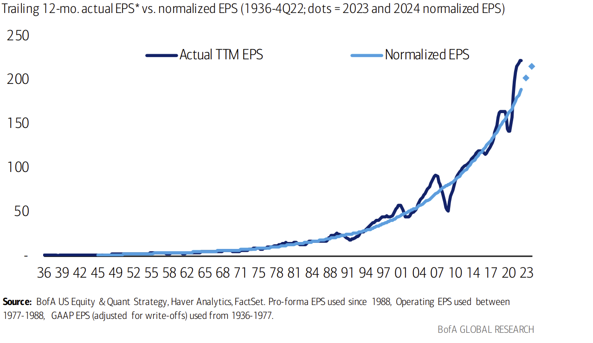
>
> 注：1988 年后使用 Pro-forma EPS；1977–1988 年使用 Operating EPS；1936–1977 年使用 GAAP EPS（剔除减值）。

### Profits cycle
### 利润周期

The profits cycle is a core focus of our research. We feel that profitability moves equity prices (as opposed to GDP or some other macroeconomic variable) and thus we concentrate on the profits cycle when formulating our equity strategies. We define the profits cycle as the year-to-year percentage change in S&P 500 reported earnings on a trailing four-quarter basis. See chart below.

**利润周期**是我们研究的核心。**我们认为"是企业盈利驱动股价，而不是 GDP 或其他宏观变量"**——因此在制定股票策略时，我们更聚焦于利润周期。**利润周期的定义**：标普 500 **过去 4 季滚动盈利的同比变化**。

> **📊 图表 48**：*Profits cycle: YoY EPS Growth for S&P 500, 1935 to present*
> **利润周期：标普 500 EPS 同比增速（1935 至今）**——我们认为是盈利能力、而非 GDP 等宏观变量，驱动股价

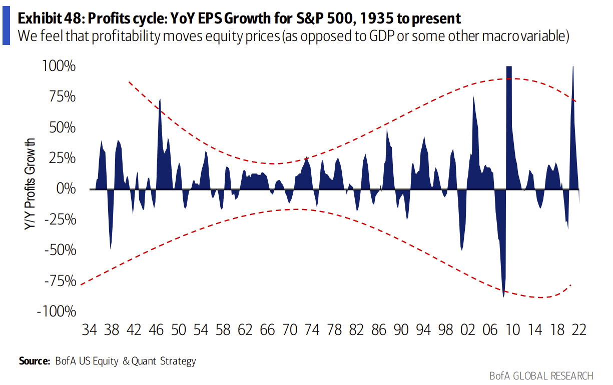

Whereas real earnings growth is possibly a better gauge of economic cycles, nominal earnings growth is a more important factor when examining the equity market. The equity market is a nominal concept because pricing and inflation, and not simply unit growth, influence profitability.

**实际盈利增长**或许更适合度量宏观经济周期；但**看股票市场时，名义盈利增长更重要**。这是因为**股票市场本质上是一个"名义"概念**——不仅销量/产量会影响利润，**价格与通胀**也在持续重塑盈利。

---

# 第 32 页 · 盈利惊喜（Earnings Surprise）

## 4: Earnings Surprise
## 4：盈利惊喜

### Stocks discount expected growth, but react to surprises
### 股价已消化预期增长，真正有反应的是"惊喜"

While the earnings revision ratio (discussed below) helps provide a gauge on sentiment and shows what happened in the recent past, we consider earnings surprise direction in our earnings and market outlook based on leading indicators including macroeconomic surprises, BofA analysts vs. consensus and corporate guidance.

**盈利预测修正比（后文会讲）** 能反映情绪、展示近期刚发生的事。但真正帮助我们前瞻性判断盈利与市场方向的，是**盈利惊喜（Earnings Surprise）的方向**——我们综合看几个**领先指标**：**宏观数据惊喜、美银分析师预测 vs. 市场共识、企业管理层指引**。

> **📊 图表 49**：*Returns are positively correlated with growth expectation…*
>
> **回报与增长预期正相关…**（标普 500 年度回报 vs. NTM 盈利增长预期，2001–2022，R² = 0.1343）
>
> 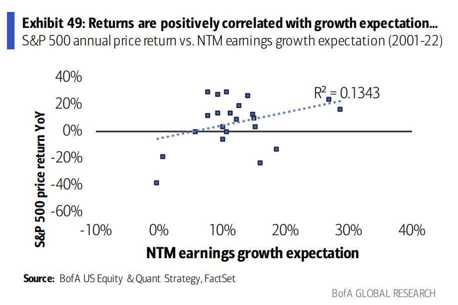

> **📊 图表 50**：*…but are more correlated to growth surprises*
> **…但与"增长惊喜"相关性更高**（年度回报 vs. 年度 EPS 增长超预期幅度，R² = 0.2057）
>
> 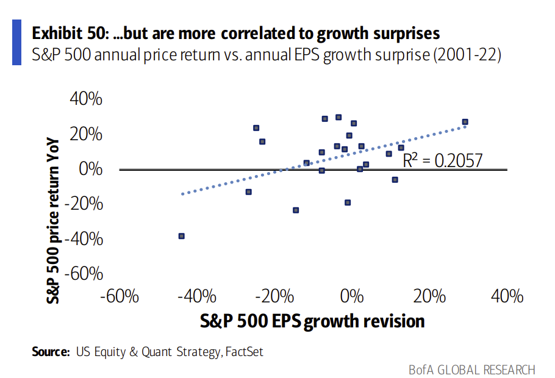

> **📊 图表 51**：*…as well as quarterly earnings surprises*
> **季度盈利惊喜也同样**（季度回报 vs. 季度 EPS 超预期幅度，R² = 0.2514）
>
> 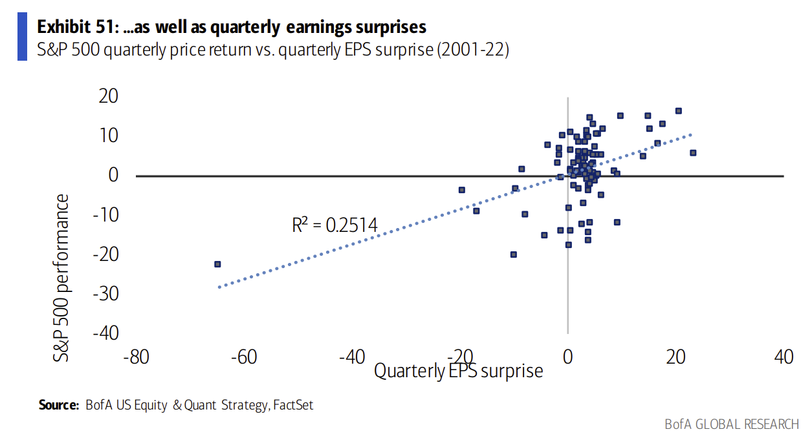

> **📊 图表 52**：*More positive surprises in economic data*
> **宏观数据惊喜整体偏正向**（Bloomberg ECO Surprise Index，2000 至今）
>
> 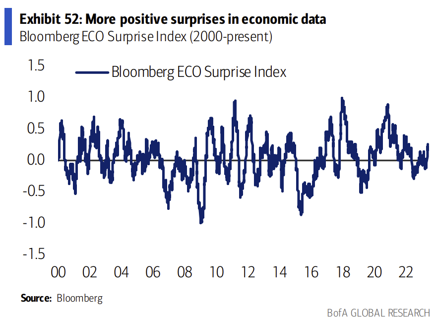

> **📊 图表 53**：*Consensus 2023 EPS plateauing after sharp decline*
> **2023 年共识 EPS 在大幅下调后趋于持平**（标普 500 历史 FY2 EPS 修正轨迹 vs. 2023 共识 EPS，截至 2023/5/18；历史均值基于 2001–2022 年，剔除新冠、GFC、千年虫年份）
>
> 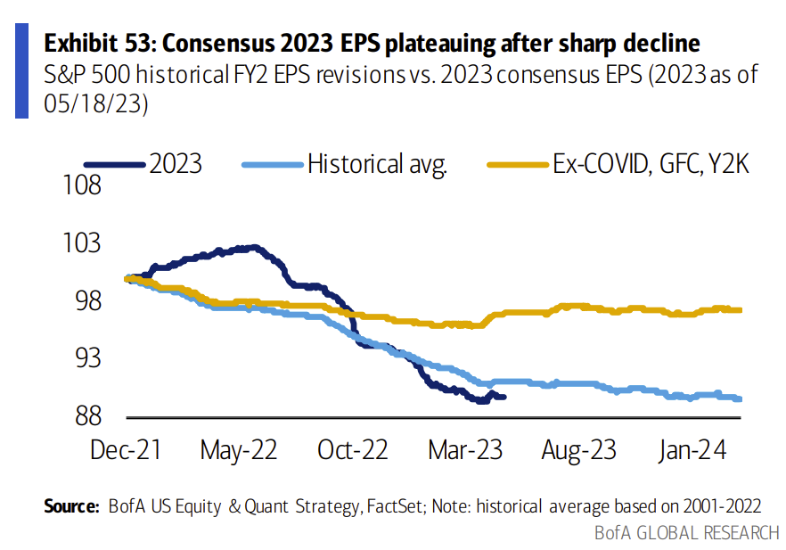

---

# 第 33 页 · 盈利预测修正比 & 销售预测修正比

### S&P 500 earnings estimate revision ratio
### 标普 500 盈利预测修正比

The following chart shows the earnings estimate revision ratio, calculated as the ratio between the number of companies in the S&P 500 for which consensus earnings estimates have been raised versus those that have been lowered over a three month period. As a breadth ratio, the earnings revision ratio is generally an earlier indicator of changes in the profits cycle, as it is more sensitive to changes in earnings expectations than is a market capitalization weighted estimate revision framework. For example, the revision ratio troughed at the end of January '09, about a month before the market recovered, whereas on a cap-weighted basis, earnings expectations troughed in the end of April '09, two months after the market's trough. The estimate revision ratio can be used as a short-term gauge of sentiment.

下图展示**盈利预测修正比**：过去 3 个月内共识盈利被**上调** vs. 被**下调**的标普 500 公司家数之比。作为**广度指标**，它通常领先于利润周期的拐点——因为它对盈利预期变化**比"市值加权"口径更敏感**。举例：2009/1 底该比值触底，**比市场反弹提前约 1 个月**；而"市值加权"口径下的盈利预期直到 2009/4 底才触底，**比市场底晚了 2 个月**。**该指标可作为短期情绪指标使用**。

> **📊 图表 54**：*S&P 500 Earnings Estimate Revision Ratio, 1/1986 - 04/2023*
> **标普 500 盈利预测修正比（1986/1–2023/4）** —— 通常是利润周期拐点的早期指标
>
> 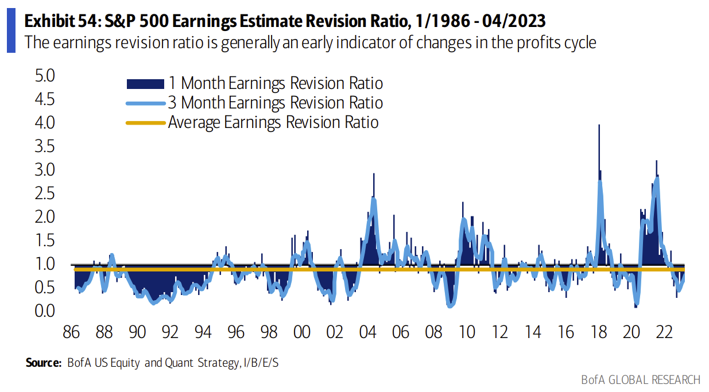

### S&P 500 sales revision ratio
### 标普 500 销售预测修正比

Sales forecast revision ratios are defined similarly to earnings estimate revision ratios, but instead of consensus earnings estimates, we use consensus sales forecasts for S&P 500 companies.

销售预测修正比的定义与盈利版类似，只是把"**共识盈利预测**"换成"**共识营收预测**"。

> **📊 图表 55**：*3m Sales Forecast Revisions Ratio has rebounded since Nov. 2022 lows*
> **3 个月销售预测修正比自 2022/11 低点回升**（标普 500 销售预测修正比，2000/1–2023/4）
>
> 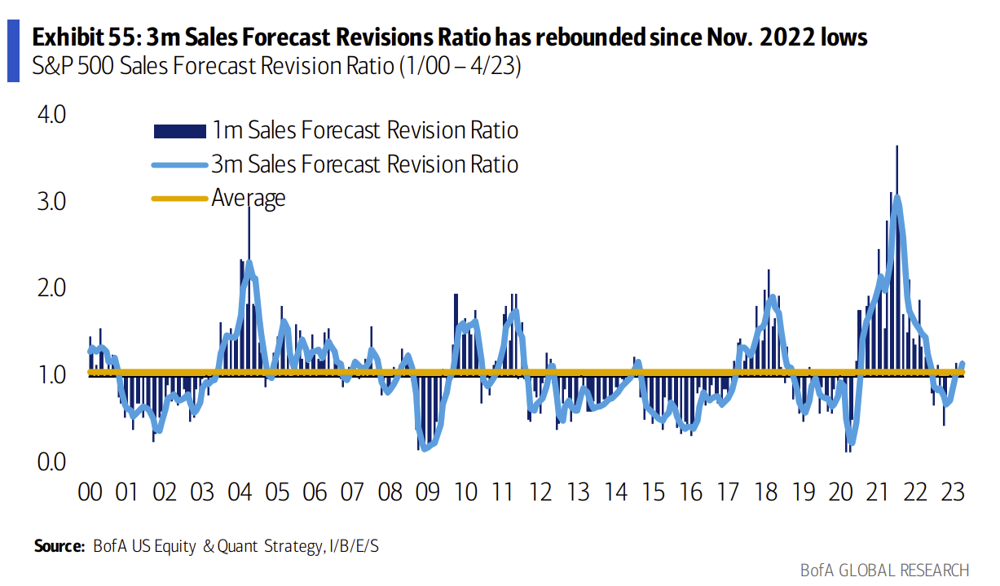

We also follow the gap between the top-line vs. bottom-line revision ratio. We have found that sales based measures may be more important when the sales revision ratio is not improving as rapidly as the earnings revision ratio, and vice versa. Generally, the scarce resource is the more rewarded and important metric.

我们也跟踪**收入端修正 vs. 盈利端修正**之间的**差值**。经验是：**谁改善得慢、谁就更重要**——收入修正改善慢于盈利修正时，收入类指标更关键；反之亦然。**简而言之：稀缺的东西更被市场奖赏**。

---

# 第 34 页 · 收入-盈利修正差值 & 管理层指引比

> **📊 图表 56**：*Spread: 3-month sales forecast revision ratio vs. 3-month earnings estimate revision ratio*
> **收入修正 − 盈利修正 价差**（1997/1–2023/4）
>
> 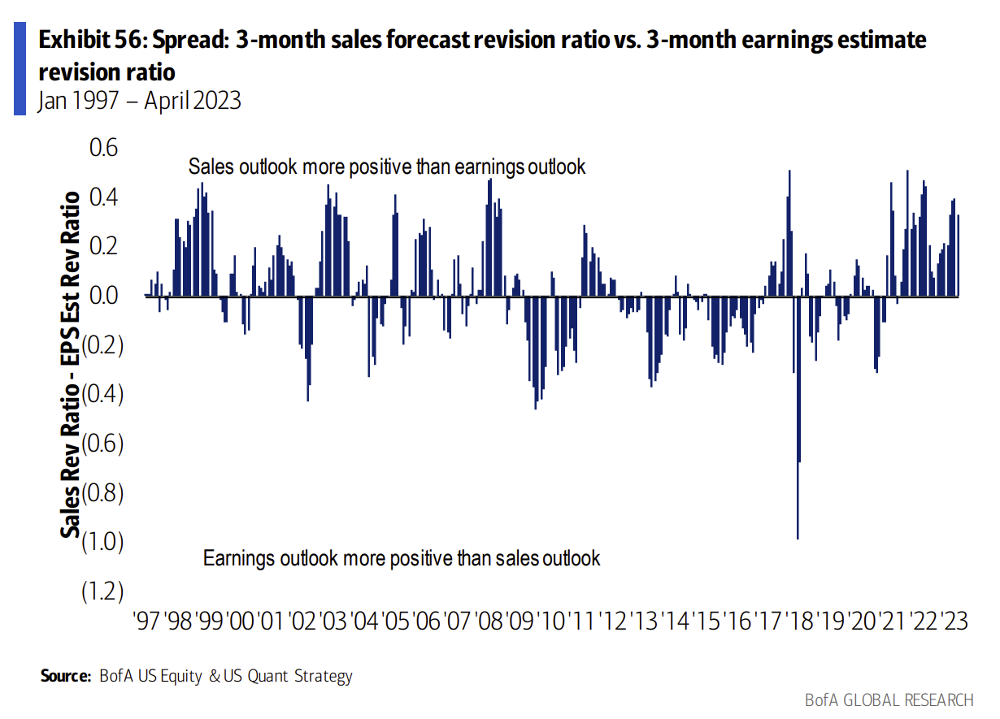
>
> 上方区：销售前景比盈利前景更乐观；下方区：盈利前景比销售前景更乐观。

### Management guidance ratio
### 管理层指引比

We track the ratio of total instances of above-consensus vs. below-consensus management guidance for S&P 500 companies over a one-month and three-month period, as we have found that guidance is generally a leading indicator of estimate revisions by about one month. Sustained divergences between the estimate revision ratio and management guidance ratio (for example, a rising estimate revision ratio but falling management guidance ratio) may suggest that analysts are being overly optimistic and a downward revision cycle is soon to follow, or conversely that management is being too negative in their outlook.

我们统计标普 500 公司在 1 个月和 3 个月窗口内"**高于共识**"与"**低于共识**"的管理层指引次数之比。**指引通常领先卖方预测修正约 1 个月**。如果**预测修正比与管理层指引比持续背离**（如预测修正比上行、但指引比下行），**要么说明卖方分析师过度乐观、后续将进入下调周期**；**要么说明管理层给的展望过度悲观**。

> **📊 图表 57**：*S&P 500 Management Guidance Ratio* — 指引比目前高于均值且持续上行（2000/1–2023/4）
>
> 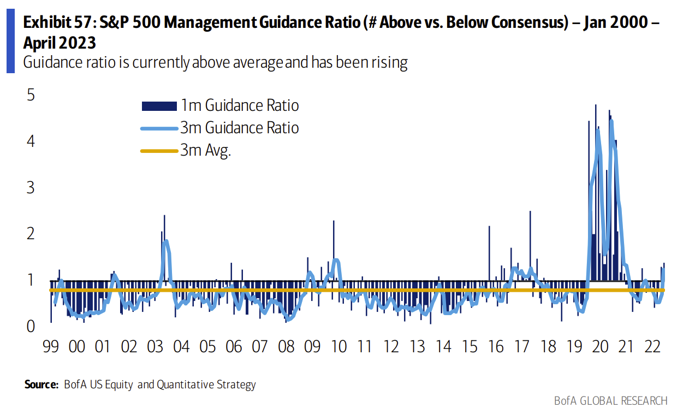

---

# 第 35 页 · 指引比与后续修正比的关系 & 指引溢价证据

> **📊 图表 58**：*Guidance ratio has historically led the subsequent month's estimate revision ratio…*
> **指引比在历史上领先下一月的预测修正比**（2000 至今，R² = 0.3299）
>
> 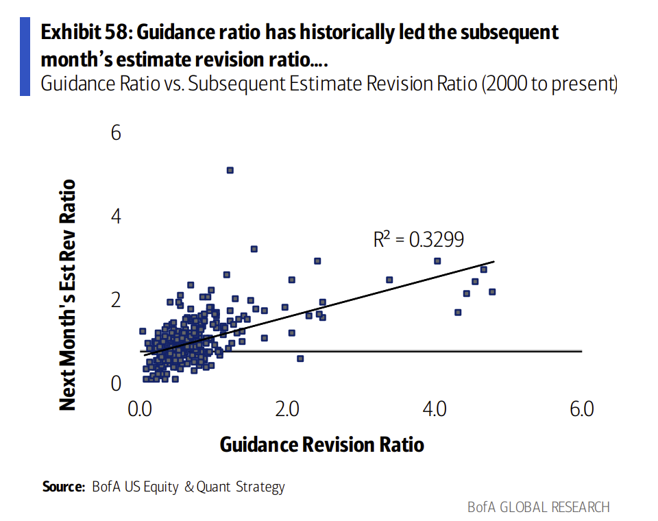

> **📊 图表 59**：*…with the relationship back to a high positive correlation after the two had diverged for much of the mid-2010s*
> **在 2010s 中期两者背离多年后，相关性已重回高位正相关**（3 年滚动相关系数，2002 至今）
>
> 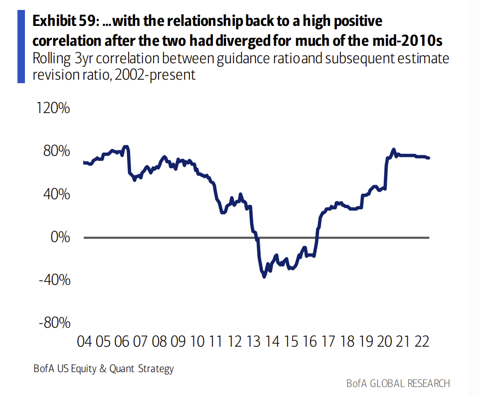

### Evidence of a guidance premium
### "指引溢价"的证据

We have also found some evidence that companies that regularly issue guidance may be rewarded for their apparent transparency. History suggests that beginning in mid-2000, companies that regularly issued profits guidance began to trade at a premium to book value relative to those that do not guide at all. This premium may be granted for transparency, and we have found that it is generally most pronounced in cyclical sectors.

我们还发现一些证据：**定期发布指引的公司因其透明度而被市场奖赏**。从 2000 年年中开始，**定期披露盈利指引的公司相对完全不发指引的公司，市净率（P/B）开始享有溢价**——**这一溢价可能就是对透明度的奖励，且在周期性行业中表现得最为明显**。

> **📊 图表 60**：*Premium (discount) to S&P 500 based on median P/B for companies that issue annual or qtrly guidance vs those that do not*
> **发布年度或季度指引的公司相对不发指引公司的 P/B 溢价**（2000–2022）——新冠后"指引方"的溢价有所收窄
>
> 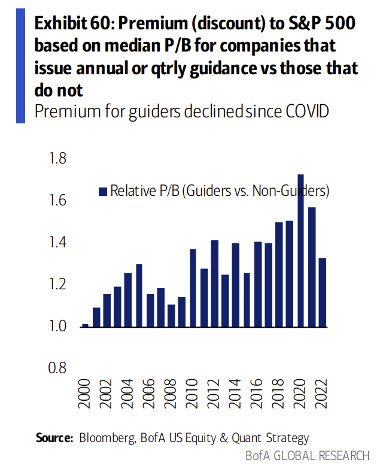

> **📊 图表 61**：*Premium (discount)… for companies that issue qtrly guidance vs those that do not*
> **季度指引 vs. 不发指引的 P/B 溢价**——历史上表现更分化，新冠后收窄
>
> 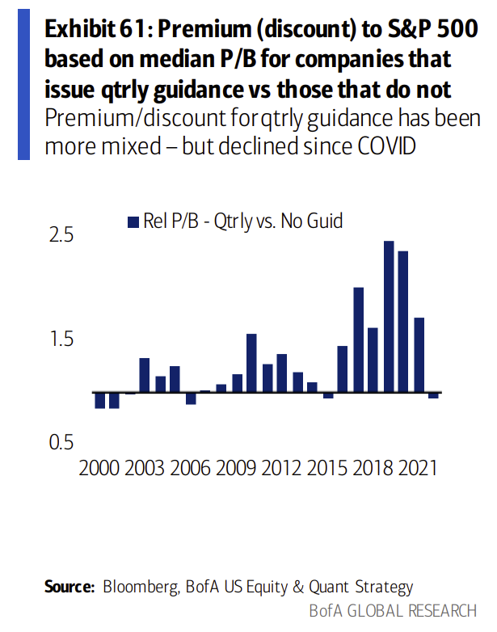

> **📊 图表 62**：*Premium (discount)… for companies that issue annual guidance vs those that do not*
> **年度指引 vs. 不发指引的 P/B 溢价**——2022 年有所下滑，但长期比"季度指引"更稳定
>
> 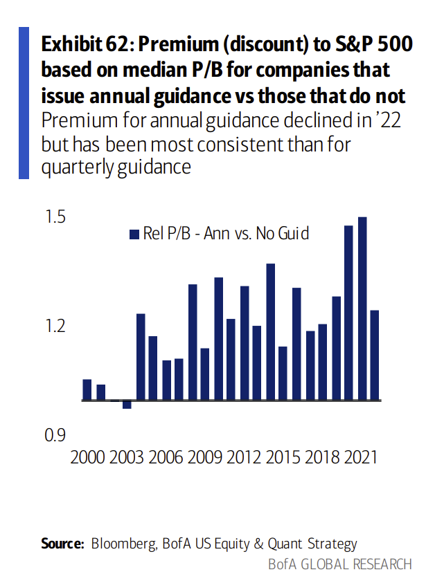

---

# 第 36 页 · 指引频次变化 & 盈利确定性（预测分歧度）

> **📊 图表 63**：*S&P 500 quarterly earnings guidance instances*
> **标普 500 季度盈利指引次数**（2001/1–2023/4，新冠低点后回升）
>
> 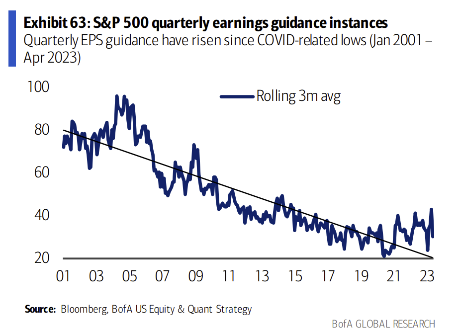

> **📊 图表 64**：*S&P 500 annual earnings guidance instances*
> **标普 500 年度盈利指引次数**（2001/1–2023/4，同样自新冠低点后回升）
>
> 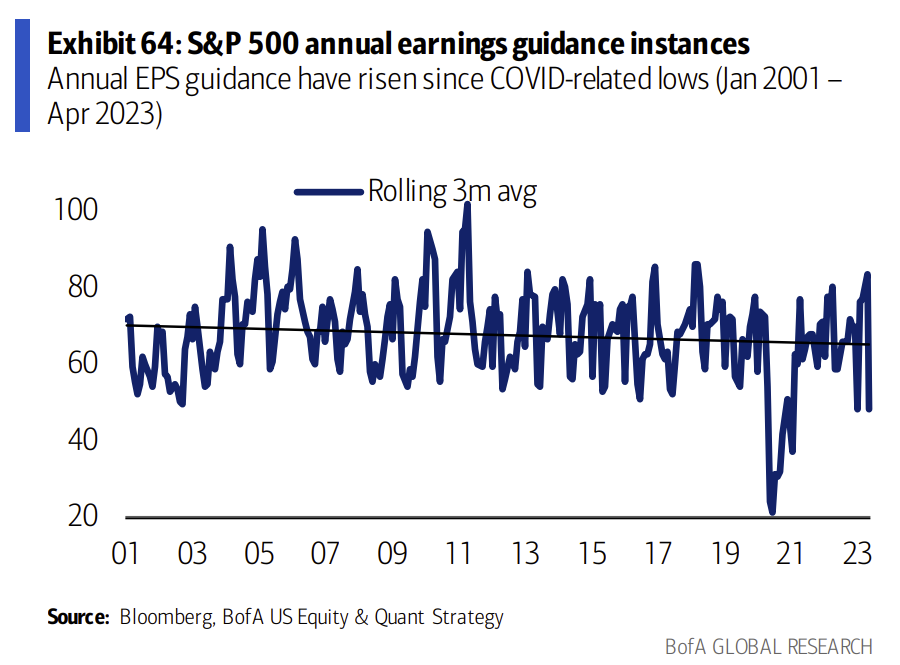

> **要点**：**在新冠期间指引普遍缺席的背景下，坚持发布年度展望的公司获得了创纪录的溢价**。

### Earnings certainty
### 盈利确定性（预测分歧度）

Earnings estimate dispersion can be used to gauge the certainty or uncertainty of earnings expectations. When the average dispersion of estimates for a company in the S&P 500 is high, this can suggest earnings are less certain, whereas when dispersion is low, analysts exhibit more agreement or certainty about future earnings. However, in uncertain macroeconomic environments, a low level of dispersion can also reflect an extreme lack of conviction and an unwillingness of analysts to diverge from the pack. We have found that companies with low dispersion tend to outperform when dispersion is rising, and companies with high dispersion tend to outperform when dispersion is falling.

**盈利预测分歧度（Estimate Dispersion）** 可用于衡量盈利预期的确定/不确定程度。**分歧度高 = 盈利不确定性高；分歧度低 = 分析师对未来盈利看法更一致**。**但要注意**：宏观不确定性很强时，**低分歧度也可能反映分析师毫无信念、不敢与共识偏离**。我们的实证规律是：**分歧度上行期，低分歧公司跑赢**；**分歧度下行期，高分歧公司跑赢**。

> **📊 图表 65**：*Average dispersion of FY2 S&P 500 Estimates (Feb 1986 to April 2023)*
> **标普 500 FY2 预测的平均分歧度**（1986/2–2023/4）——当前已降至历史均值以下
>
> 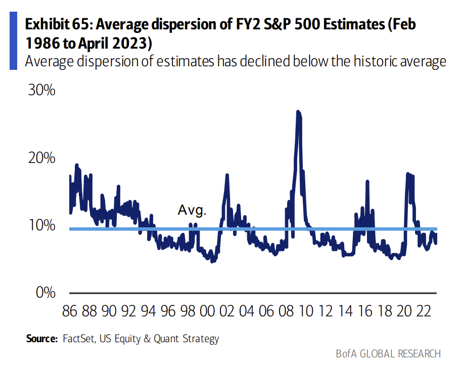

> **📊 图表 66**：*Relative factor performance: High - Low EPS Estimate dispersion (based on 1986 – 2023 performance)*
> **高分歧 vs. 低分歧公司的相对表现**（1986–2023）
>
> 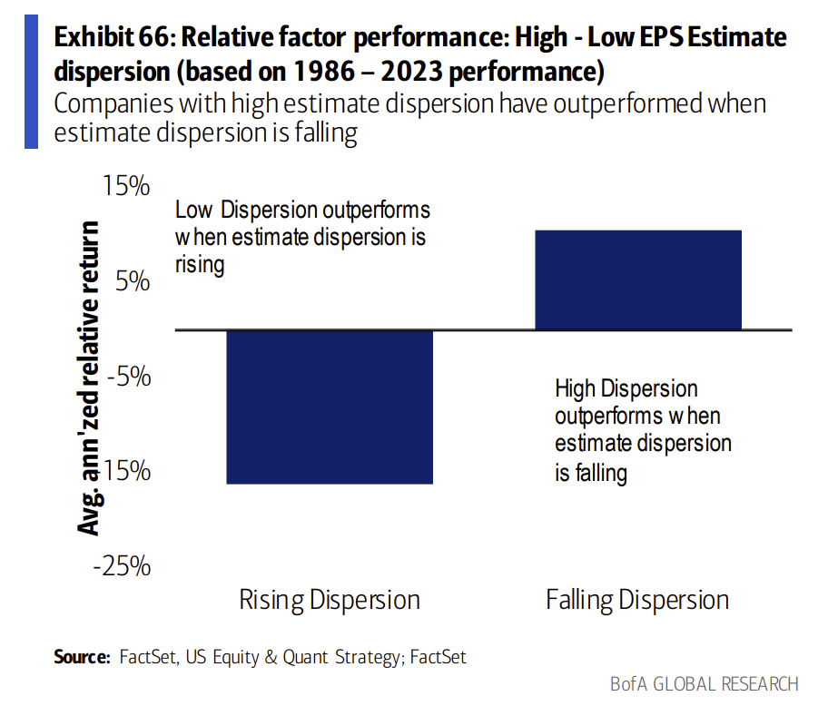
>
> - **分歧度上行期**：**低分歧跑赢**
> - **分歧度下行期**：**高分歧跑赢**

---

# 第 37 页 · 央行流动性：QE 与 QT 对股市的影响

## What else has mattered: Central Bank Liquidity
## 还有什么在起作用：央行流动性

### If QE mattered, QT should matter too
### 如果 QE 有效，那 QT 就也得有效

Pre-GFC, earnings explained ~50% of S&P 500 returns. Post-GFC, earnings mattered less (23% explanatory power), and Fed balance sheet changes mattered more. Fed liquidity was irrelevant pre-GFC, but drove more than half of non-earnings returns of the S&P 500 post-GFC. NB: the recent strong performance of growth / Tech stocks may be attributable to bank bailout-driven balance sheet expansion in 1Q23.

**2008 全球金融危机前（Pre-GFC）**，企业盈利可解释约 **50%** 的标普 500 回报。**GFC 之后**，盈利的解释力降至 **23%**，而**美联储资产负债表的变化取而代之成为主因**。**GFC 前美联储流动性对股市几乎无影响；GFC 后则驱动了标普 500 "非盈利"部分回报的一半以上**。**值得注意的是**：近期成长/科技股表现强劲，**部分可归因于 2023 年 Q1 银行救助驱动的美联储资产负债表再度扩张**。

> **📊 图表 67**：*Earnings explained nearly 50% of market returns pre-GFC, but only 23% of post-GFC returns*
> **GFC 前盈利解释近 50% 的回报，GFC 后只解释 23%**
> —— 1997–2009：48% / 2010–2021：23%
>
> 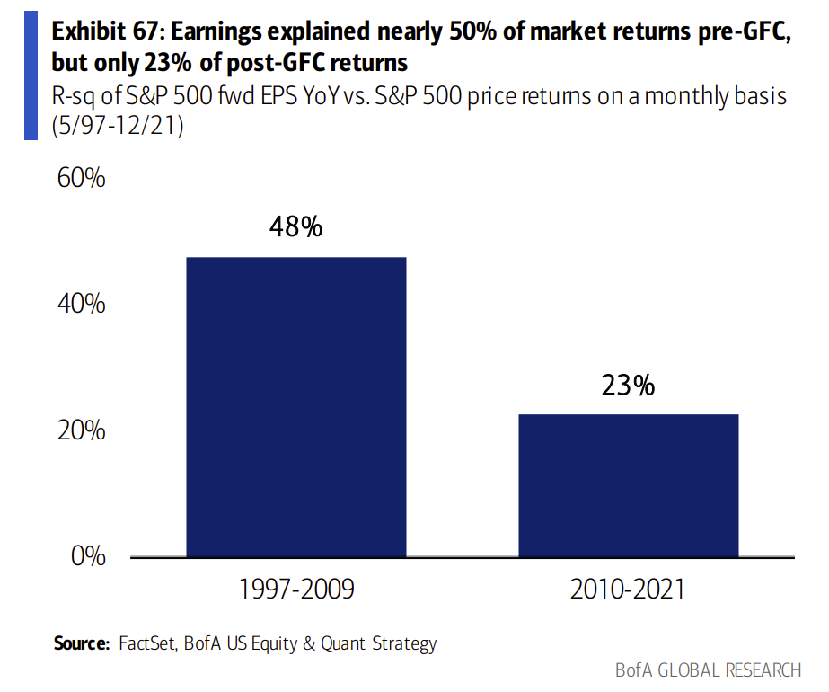

> **📊 图表 68**：*Over half of non-earnings driven market cap changes was explained by the Fed balance sheet expansion since GFC*
> **GFC 后，非盈利驱动的市值变化有超过一半可由美联储资产负债表扩张解释**
> —— 1997–2009：0% / 2010–2021：**51%**
>
> 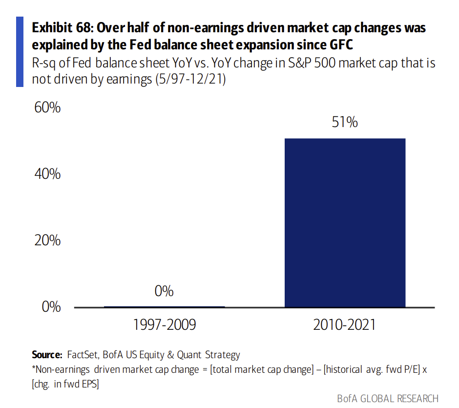注：
>
> 非盈利驱动的市值变化 = 总市值变化 − 历史均值远期 P/E × 远期 EPS 变化

> **📊 图表 69**：*$750bn reduction in the Fed balance sheet and trend earnings growth for 2024E EPS could result in the S&P 500 at 4100 in 2023*
> **假设美联储缩表 7500 亿美元 + 2024 年 EPS 按趋势增长，2023 年标普 500 约在 4100**
>
> 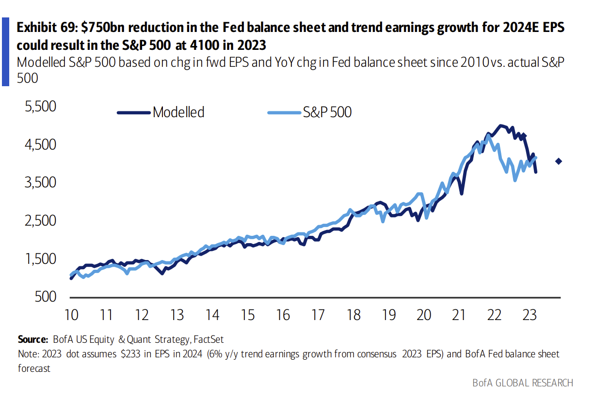
>
> （以 2010 年以来远期 EPS 变化与美联储资产负债表同比变化拟合的模型 vs. 实际标普 500；2023 点位假设 2024 EPS = \$233（2023 共识 EPS 同比趋势增长 6%），美联储资产负债表采用 BofA 预测）

---

# 第 38 页 · 标普 500 的流动性风险

## Liquidity risks for the S&P 500
## 标普 500 的流动性风险

In recent years, we have been highlighting rising liquidity risks for one of the most liquid areas of the market: large cap US equities (the S&P 500). S&P 500 trading volume has grown thinner and thinner, and as a casualty of the momentum- and growth-driven market of recent years, the index has grown increasingly tail-heavy with its market cap tilted toward a small number of mega cap companies.

近几年我们一直在强调：**连标普 500 这种传统上最具流动性的资产，也在累积流动性风险**。**标普 500 的成交量变得越来越稀薄**；而这些年"动量+成长"主导的行情也埋下一个后果——**指数权重越来越集中在少数几家超大市值公司身上**，**尾部越来越重**。

US stock ownership has eclipsed 50/50 for passive/active (52% of US domiciled funds are passive today), where passive represents non-fundamental buyers/sellers. And asset allocators have increasingly funneled assets into longer-term illiquid growth – the largest pension funds have growth their exposure in illiquid investments (including private equity) from 8% in 2006 to 25% today. Private equity AUM (assets under management) continues to rise.

美国股票持有结构**被动 vs. 主动**已突破 **52% vs. 48%**（被动基金代表"**非基本面**"的买卖方）。资产配置方同时不断把资金推向**长期、非流动的成长类投资**——最大一批养老金对非流动投资（含私募股权）的敞口，**从 2006 年的 8% 升至今天的 25%**。私募股权 AUM 持续走高。

Banks also provide substantially less liquidity today than in prior cycles, with the trading portfolio of large banks half of what it was a decade ago following regulatory constraints. Central banks, high frequency traders (HFTs), ETFs and other market participants have picked up some of the slack, but trading dynamics have undeniably changed, as large cap US stocks are increasingly traded by machines (HFT, quants, etc.) rather than humans.

由于监管收紧，**大银行如今提供的流动性远不如以往周期**——**大行自营交易账簿规模是十年前的一半**。这部分空缺由央行、**高频交易商（HFT）**、ETF 和其他参与者填补了一部分，但**交易生态已经不可逆地改变——大盘美股越来越多地由机器（HFT、量化等）而非人类在交易**。

> **📊 图表 70**：*S&P 500 increasingly tail-heavy*
> **标普 500 越来越尾部集中**（前 10 大公司占全指数市值的比例，1986–2023/4，15% → 33%）
>
> 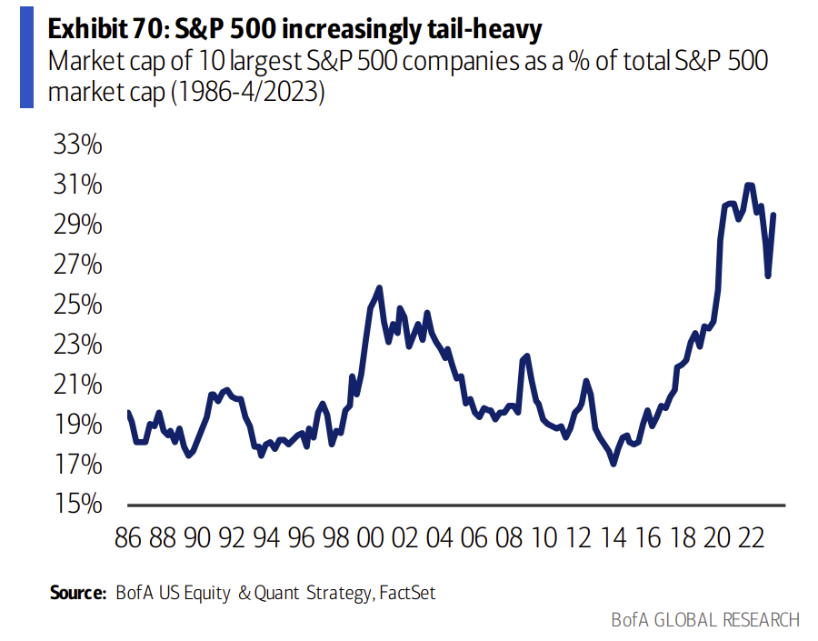

> **📊 图表 71**：*Prior to COVID, thinner and thinner trading – which has been generally declining again post-COVID*
> **新冠前成交越来越稀薄，新冠后整体再度下行**（日均成交量/市值比，2009/8–2023/4）
>
> 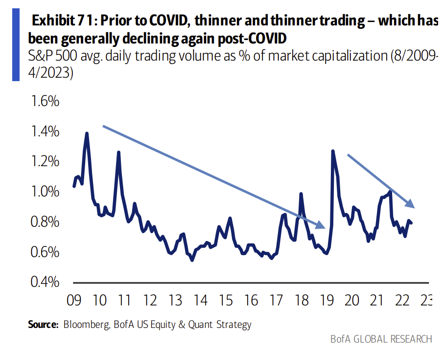

> **📊 图表 72**：*Passive now accounts for 52% of all US domiciled fund assets*
> **被动基金占比升至 52%**（美国国内基金，2009–2023/4）
>
> 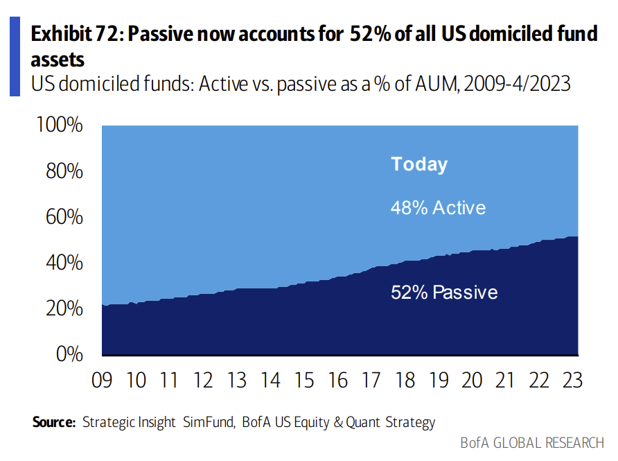

> **📊 图表 73**：*Big banks are not the providers of liquidity they once were*
> **大银行已非昔日的流动性提供者**（大行自营交易账簿规模，2009–2022，合计 **-52%**）
>
> 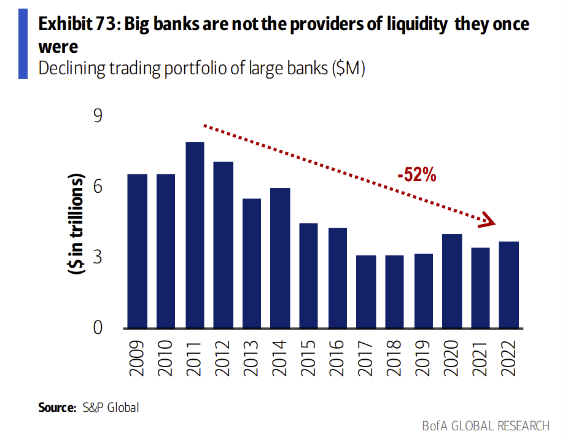

---

# 第 39 页 · 盈利预期生命周期（前半段）

## Earnings Expectation Life Cycle
## 盈利预期生命周期

Most stocks' earnings trajectories follow the pattern described by the cycle below, although not every stock will stop at each point, nor will stocks reside in each phase for any regulated amount of time. Stocks can also move backward and forward.

多数股票的盈利轨迹，都大致遵循下方这个**生命周期**——当然，并非每只股票都会停留每一阶段，也没有固定的停留时长；**股票可以前进也可以回退**。

The Earnings Expectation Life Cycle is our proprietary schematic, which portrays investors' changing attitudes towards a stock over time. We believe that a successful investment process should incorporate the notion of changing expectations, because "dogs" often become "stars" and "stars" often become "dogs".

**盈利预期生命周期**是我们的自有图谱，刻画投资者对某只股票态度随时间变化的全过程。**一个成功的投资体系必须把"预期会不断变化"这件事嵌入其中**——因为"**烂股**"常常会变成"**明星股**"，而"**明星股**"也常常会沦为"**烂股**"。

### Life Cycle Phases
### 生命周期的阶段

The Earnings Life Cycle, depicted below, contains eleven positions, with the left half of the cycle portraying the period of rising expectations, and the right half portraying the period of falling expectations.

整个生命周期共 **11 个位置**：**左半圆代表预期上行期，右半圆代表预期下行期**。

> **📊 图表 74**：*Earnings Expectation Life Cycle*
> **盈利预期生命周期图** —— 左半为预期上行期，右半为预期下行期
>
> 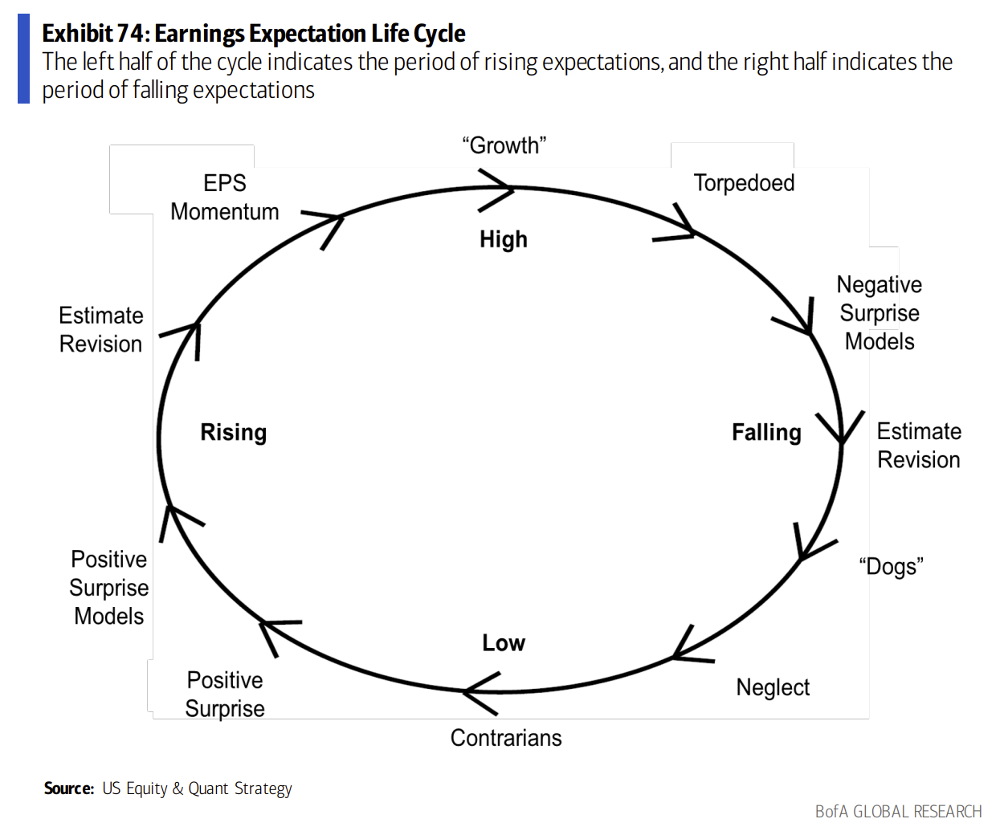

各阶段如下：

**Stage 1: Low Expectations / 阶段 1：低预期**

Investors commonly known as "Contrarians" typically invest in these stocks with lower earnings expectations. Most non-contrarian investors find these stocks unattractive or overly risky.

通常被称为"**逆向投资者（Contrarians）**"的人会买入这类"盈利预期极低"的股票。而大多数非逆向投资者觉得它们缺乏吸引力、或风险过高。

**Stage 2: Positive Surprise / 阶段 2：正向惊喜**

Eventually the low-expectations companies begin to report more optimistic information such as improved earnings significant enough so that the stocks recapture attention. Research coverage of such stocks may begin to increase although it is more likely that this will happen more towards stages 4 and 5.

这些低预期公司最终开始发布更乐观的信息（例如盈利出现明显改善），足够把关注度拉回来。**卖方覆盖**也可能开始增加——不过这个现象更常出现在阶段 4–5。

---

# 第 40 页 · 生命周期阶段 3–11

**Stage 3: Positive Surprise Screens / 阶段 3：正向惊喜筛选出现**

Stock picking screens that search for significant variations between analyst earnings expectations and actual reported earnings begin to highlight these stocks. We have found that these screens have gained a lot of popularity with investors; thus the screens themselves have grown less effective.

那些寻找"分析师预期 vs. 实际盈利"显著差异的筛选模型开始把这些股票筛出来。我们发现，**这类筛选模型已被大量投资者使用，因而其有效性正变得越来越弱**。

**Stage 4: Estimate Revisions / 阶段 4：卖方上调预测**

The consensus begins to raise their earnings estimates for these stocks in response to rising earnings expectations following the surprise of stage 3. Analysts' estimate revisions often lag a surprise because analysts are generally reluctant to believe that the superior earnings will last.

共识开始上调这些公司的盈利预测——**这通常滞后于惊喜**，因为分析师往往不太愿意相信"这种超预期能持续下去"。

**Stage 5: EPS Momentum / 阶段 5：EPS 动量**

Investors who follow earnings momentum themes begin to buy these stocks as estimates and reported earnings continue to rise and as year-to-year comparisons begin to improve.

**追逐盈利动量主题**的投资者开始买入——因为预测与实际盈利继续上行，同比比较也愈发亮眼。

**Stage 6: "Growth" / High Expectations / 阶段 6："成长股" / 高预期**

Strong earnings momentum continues for a long enough period that these stocks are termed "growth" stocks by the consensus. These stocks are not "new" growth stocks, for new growth stocks are probably found during stages 4 and 5, nor are they true growth companies that alter the business environment. Rather, this is the point at which most investors agree that the stock is a terrific growth stock. Earnings expectations are very high, which implies that there is a large risk of disappointment at this stage. Contrarian selling would optimally occur at this point in the cycle.

强劲的盈利动量持续足够久，共识就会给这类公司打上"**成长股**"标签——**但它们既不是"新"的成长股**（真正的新成长股往往在阶段 4–5 就已被发掘），**也不是"改变行业游戏规则"的真成长公司**。此时不过是**大多数投资者终于达成共识：这就是一只很棒的成长股**。但盈利预期已极高，**这意味着失望风险巨大**——**阶段 6 才是逆向投资者理想的卖出点**。

**Stage 7: Torpedoed / 阶段 7：被鱼雷击沉**

Earnings disappointment occurs, stocks are "torpedoed" – i.e., their earnings expectations and prices sink.

盈利不及预期，股价如同"**被鱼雷击沉**"——**盈利预期与股价同步下沉**。

**Stage 8: Negative Earnings Surprise Screens / 阶段 8：负向惊喜筛选出现**

The same screens from Stage 3 above begin to highlight stocks with lower-than expected earnings as potential sell candidates.

和阶段 3 同源的筛选模型，此时开始把这些"低于预期"的股票**标为潜在卖出候选**。

**Stage 9: Estimate Revisions / 阶段 9：卖方下调预测**

The consensus begins to lower their earnings estimates in response to the earnings disappointment. Again analysts tend to lag because they generally do not believe that the earnings shortfall is a sign of a fundamental problem with the company.

共识开始下调盈利预测——**同样滞后**，因为分析师一般不愿相信这次 miss 是公司基本面恶化的信号。

**Stage 10: "Dogs" / 阶段 10："烂股"**

These stocks, after continuing to report disappointing earnings for a long enough period of time, are shunned by investors. News regarding takeovers, restructuring or bankruptcy may affect the stock price temporarily; however, investors generally avoid or ignore these stocks.

业绩持续令人失望足够久后，投资者彻底抛弃这类股票。**虽然收购、重组、破产的新闻可能短暂拉动股价**，但投资者整体仍对其敬而远之。

**Stage 11: Neglect / 阶段 11：被忽视**

Investors have become so disinterested in the stocks or group that general research begins to dissipate. The lack of coverage may set the stage for a renewed cycle.

投资者对这些股票（或板块）兴趣彻底丧失，**卖方覆盖也逐渐消散**。**覆盖缺失反而为新一轮生命周期的轮回埋下伏笔**。

### Growth vs. Value and the Earnings Expectation Life Cycle
### 成长 vs. 价值 与 盈利预期生命周期

The Earnings Expectations Life Cycle can be adapted to help understand investment styles or management techniques. As is indicated by the diagram, value-oriented investment strategies are more likely to fall in the bottom half of the Life Cycle because they tend to be more Contrarian in nature. Value-oriented strategies spend more time attempting to distinguish the true "dogs" – those which might not take another turn around the Life Cycle – from those stocks that are simply out of favor but will rebound.

这个生命周期图谱也能帮助理解投资风格与管理手法。如图所示，**价值派策略更倾向于落在生命周期的"下半圆"**——因为价值派天然带有逆向思维的基因。**价值型投资者花大量时间分辨"真烂股"与"只是一时失宠但终将反弹的股票"**——前者可能再也无法重回生命周期轮回。

---

# 第 41 页 · 成长 vs. 价值（生命周期视角）

As the diagram below suggests, growth-oriented investment strategies tend to be in the top half of the Life Cycle. The success of these strategies depends on one's ability to realize that a company's earnings momentum is secular and not simply a result of cyclical influences. Thus, the equator of the earnings expectations life cycle schematically separates the worlds of growth and value investing.

如图所示，**成长派策略则多集中在生命周期的"上半圆"**。成长策略能否奏效，取决于一项关键能力：**判断某公司的盈利动量是长期结构性的，还是仅仅是周期性的**。**因此，生命周期的"赤道线"恰好把成长与价值这两个世界分开**。

The theory behind the Life Cycle suggests that the hardest thing for a growth manager to do is to time the sale of a stock, whereas the hardest thing for a value manager to do is to time the purchase of a stock. It seems that a good value-oriented manager is likely to be buying stocks later than his peers, whereas a good growth-oriented manager is likely to be selling stocks earlier than his peers.

生命周期理论还给出一个推论：**对成长经理来说，最难的是卖出时机；对价值经理来说，最难的是买入时机**。换句话说，**优秀的价值经理往往买得比同行晚，优秀的成长经理往往卖得比同行早**。

> **💡 结论一句话**：**好的价值经理晚同行一步买入；好的成长经理早同行一步卖出。**

> **📊 图表 75**：*Growth* —— 成长派策略集中于生命周期上半圆
>
> 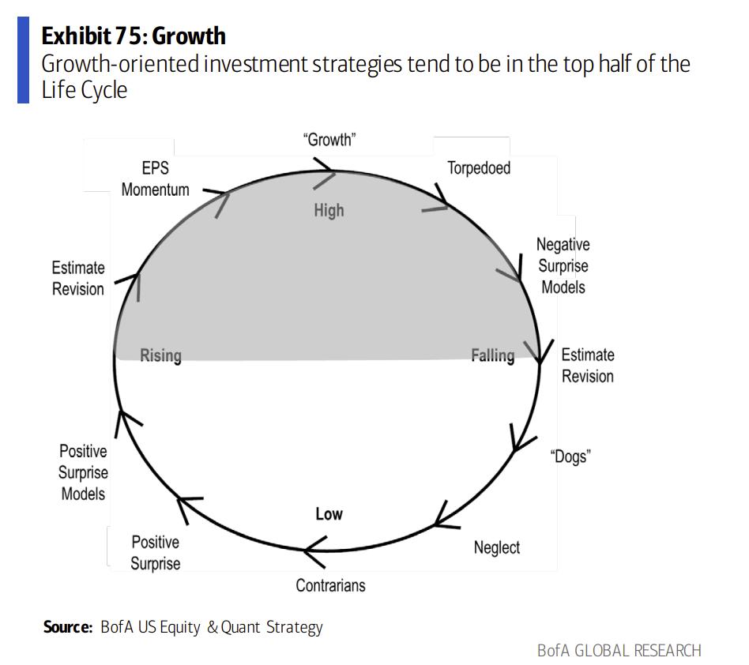
>
> **📊 图表 76**：*Value* —— 价值派策略集中于生命周期下半圆
>
> 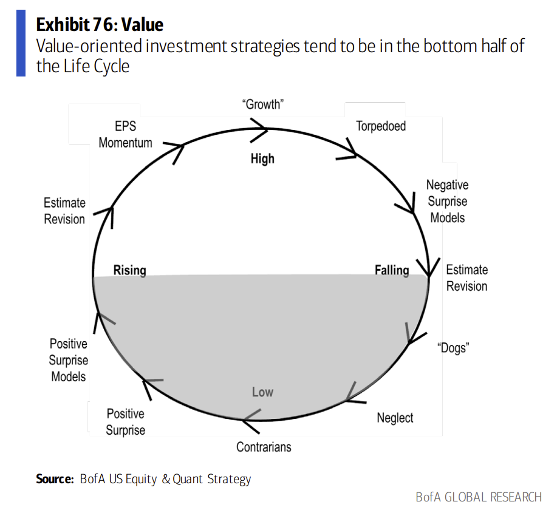

---

# 第 42 页 · 生命周期的"上行期"与"下行期"

> **📊 图表 77**：*Rising* —— 左半圆：预期上行期（阶段 1–6）
>
> 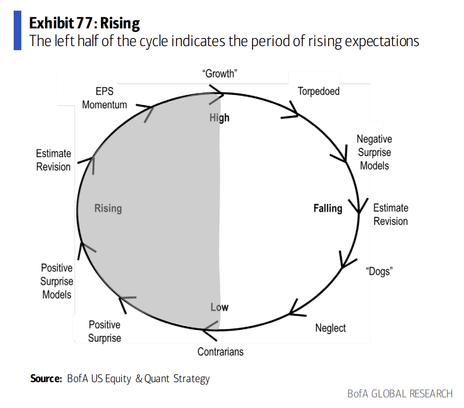
>
> **📊 图表 78**：*Falling* —— 右半圆：预期下行期（阶段 7–11）
>
> 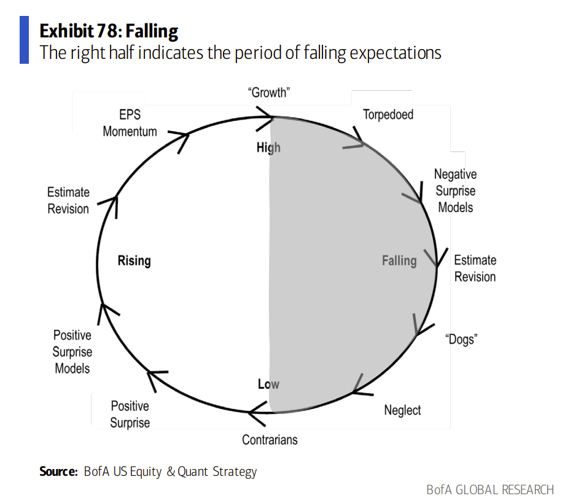

---