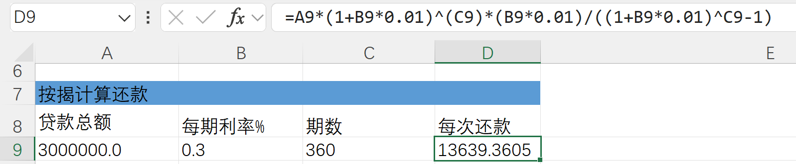

# 利率的含义

> 本文是《货币金融学》第十三版第4章的学习笔记

这章基于一个假设展开：一年后的100元比现在的100元**价值低**，原因是现在的100元通过投资赚取收益。那么如何计算一年后的100元现在的价值呢？书中给出了一个现值计算公式：

$$PV = \frac{CF}{(1+i)^n}$$

其中，$PV$（precent value）表示**现值**； $CF$（crash flows）表示**未来的现金流**；$n$表示**投资时长**；$i$表示**利率**，如果$n$以年为单位，$i$就是年利率，以月为单位就是月利率。这个公式换种形式可能更好理解一些:

$$CF = PV\cdot(1+i)^n$$

可理解为以现值$PV$做投资，年利率为$i$，$n$年后可得到现金流$CF$

## 房贷与车贷

房贷(等额本息)，可以反过来理解成银行对我们做了一次投资，我们每个月对银行做一次分红，直到到期。那么可得到现值计算公式：

$$PV = \frac{CF}{(1+i)} + \frac{CF}{(1+i)^2} + \cdot \cdot \cdot + \frac{CF}{(1+i)^n}$$

$PV$为贷款总额，$CF$为月供，$i$为月利率，即年利率除以12， $n$为还款期数，30年就是360个月。这是一个等比数列，求解后可以得到：

$$贷款总额 = 月供 \cdot \frac{(1+i)^n - 1}{(1+i)^n \cdot i}$$

即房贷月供计算公式，这里把它在Excel里实现出来：

已知贷款总额和月供，根据这个公式不好解算利率。好在Excel提供了内置函数：

说到车贷，我买车的时候，4S店一定要贷款才有优惠。他们贷款是这样算的，贷款总额为20万，利率为4%， 分48个月还清。月供的计算方式为：$$20\times(1+0.04\times4)\div48 = 4833.3$$

但使用上面的按揭利率计算器，可以得到实际利率大于6%。其根本原因是每期还款是提前还了本金的，但这部分本金的利息还在累加。不得不说是个奸商。

## 息票债券

息票债券（coupon bond）每年向债券持有人支付固定金额的利息，到期支付债券面值的金额。例如一张1000元面值的息票债券，假设10年有效期，约定的息票利率（coupon rate）为10%。那么它现在应该以多少价格发行？我们套用公式：

$$PV = \frac{100}{(1+0.1)} + \frac{100}{(1+0.1)^2} + \ldots + \frac{100}{(1+0.1)^{10}} + \frac{1000}{(1+0.1)^{10}} = 964.95$$

即发行价格需要是964.95时，投资者才能得到10%的收益。

美国发行的**长期国债**和**中期国债**，都属于息票债券。假设金融机构在商定债券的发行价格时，认为该息票利率的收益并不能覆盖自己的成本，那么就会压低购买价格以获得更大的收益。而金融机构的成本主要来自**存款利率**，所以就出现一种现象，**存款利率越高，债券的收益率就越高，债券的价格就越低**。长期债券的价格比短期债券更加异变。

## 名义利率实际利率

上述的利率忽略了**通货膨胀**对借款成本的影响，所以被称之为**名义利率**（nominal interest rate），而考虑通货膨胀的就是**实际利率**（real interest rate）。

举个例子，我向银行以10%（名义利率）的年利率贷款了1000元用于购买一批物资，一年以后因为通货膨胀，这些物资价格上涨了8%。那对于我来说，我实际支付的利率为2%（实际利率）。此时银行倾向于**提高利率**，**贷出资金意愿变小**；我**借入资金的动力也会变大**。对此，经济学家给出一个公式：

$$r = i - \pi^e$$

其中，$i$为名义利率，$r$为实际利率，$\pi^e$为通货膨率。