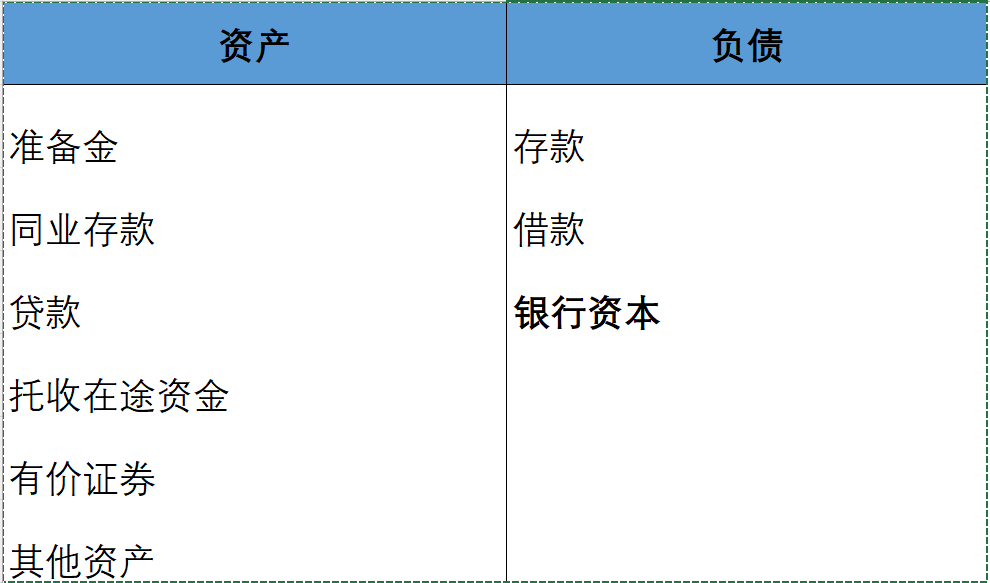

# 商业银行业务与管理

> 本文是《货币金融学》第十三版第9章的学习笔记

要理解一家公司如何运行，我们可以从资产负债表入手：

**总资产 = 总负债 + 资本(股东权益)**

一家商业银行的资产负债表可能如下：

通俗来讲，资产部分可以**盈利**，例如贷款利息，股息等；负债部分需要**支出成本**，例如付给存款人利息，股东股息等。书上结说：银行通过**资产转换**的方式盈利，它出售一组负债（向人们发放贷款，向股东筹集资本，此时银行欠别人钱），并使用出售资金购买另一组资产（购入债券，发放贷款，此时别人欠银行钱），赚取价差。通俗来讲，借短放长。

商业银行三性：**盈利性，安全性，流动性**。

## 流动性管理

### 存款准备金

存款准备金是银行为了应对存款人随时取款，准备的一笔资金。当前中国大型银行的准备金率为10%，意味着一家银行吸收了10元存款，需要将1元库存起来备用，只能使用其中的9元进行投资。

因为存款准备金机制有**货币乘数**的效应，央行也常常用调整存款准备金率的方式来**调整市场预期**。来看一个理想化模型：

1. 假设A有一笔100万的资金，他选择存入银行。
2. 银行将10万作为存款准备金，贷出90万给B。
3. B将90万存入银行，银行将9万作为存款准备金，贷出81万给C, 以此类推。

银行总贷出金额为：$$\lim_{n \to \infty}(100 * \frac{1-0.9^n}{1-0.9}) = 100 * 10 = 1000$$ , 即市场上存在1000万的资金(**广义M2**)。假如央行降低存款准备金率到9%， 货币乘数变成$$\frac{1}{1-0.91} = 11.11$$, 对于100万的基础货币，释放了111万的的流动性。

### 流动性管理

对于一家风险防范意识较强的银行持有了20%的存款准备金：

问，存款外流多少时，银行需要出售资产以保证有不低于10%的存款准备金？我们可设外流阈值为$$x$$, 有：

$$\frac{200-x}{1000-x} = 0.1$$

可得$$x=111.11$$

当超额准备金不够时，银行通常用以下做法筹集资金：

1. 同业拆借
2. 出售有价证券
3. 向中央银行借款
4. 收回贷款

存款外流导致的**筹集资金成本越高**，银行愿意持有的**超额准备金就越多**。

## 资本充足性管理

当银行的某次亏损大于银行资本，银行便**资不抵债**，需要破产。为什么银行不愿意持有较高的银行资本？

### 股东回报

主要有两个指标：

1. 资产回报率(ROA) = 税后净利润/资产, 代表银行经营效率。
2. 股本回报率(ROE) = 税后净利润/权益资本，代表股东收益

由此可知，如果两家银行盈利一样，**银行资本低的银行回报率高**，财报会更好看。银行调节银行资本通常有以下方式：

1. 回购或增发银行股票。
2. 增加或减少分红。

与一般企业类似，大环境不好时，会选择收缩业务规模，同时减少资本，保证回报率。

### 巴塞尔协议

《巴塞尔协议》要求银行持有至少占其风险**加权资产8%**的资本。如果银行持有以下资产：

- 100万风险加权为0的资产，例如准备金，政府债券等
- 100万风险加权为20%的资产，例如银行债券
- 100万风险加权为50%的资产，例如住房抵押贷款
- 100万风险加权为100%的资产，例如消费贷和企业贷

那么它需要具有的资本为：

$$(100\times0+100\times0.2+100\times0.5+100\times1)\times0.08 = 13.6万$$

这类似保证金，风险越大的资产需要的保证金就越多。

但同一类的资产的风险并不相同，这会引发所谓的**监管套利**，例如同样时企业贷，银行更愿意贷给风险大的企业，因为风险大的必然利率高。

## 利率风险管理

银行资产和负债的利率并不一致，有利率敏感型的资产和负债，利率经常变动；也有固定利率的资产和负债。利率的变动就会导致银行面临风险，**如果银行的利率敏感型负债多于资产，利率上升会导致利润下降，利率下降会导致利润增加**。

利润的变化可以用**缺口分析**来计算：

（利率敏感型资产-利率敏感性负债）x 利率变化

## 表外业务

表外业务是指不列入资产负债表内，却能影响利润的业务，例如财务顾问与咨询，衍生品交易等。在银行业务中占的比例越来越大，相应的风险也越来越高，例如2008年导致金融危机的CDS等衍生品。