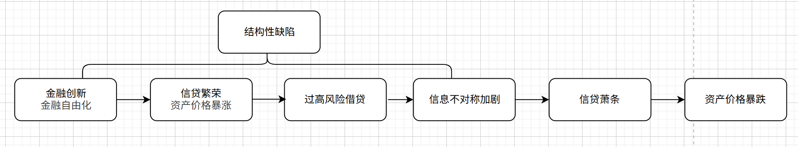
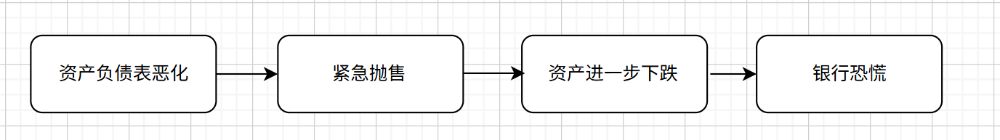
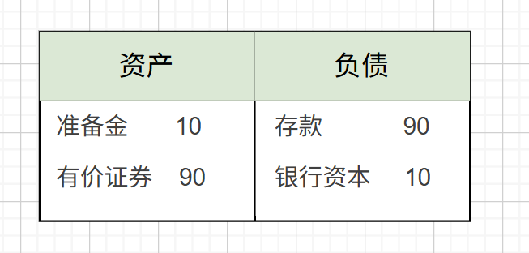
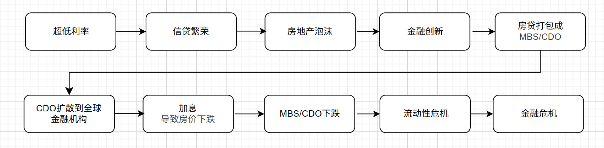

# 金融危机

> 本文是《货币金融学》第十三版第12章的学习笔记

## 金融危机的表现

一些概念：

- **金融摩擦(finacial frictions)**。信息不对称问题阻碍资本的有效配置。
- **去杠杆化(deleveraging)**。银行资本减少后，银行会削减向借款人-支出者的放款。

两个特征：资产的急剧下跌，企业破产

它有三个阶段：

### 初期

具体来说，就是**结构性缺陷**导致信贷萧条，戳破了**资产价格泡沫**，资产价值回归其基础经济价值。具体显现就是资产价格从高位暴跌。

### 银行危机

资产价格的暴跌传导到银行：

银行的杠杆特征加剧了资产的下跌，我们来看一个例子，假如某家银行的资产负债表如下：

假设该银行把所有的资金都买了某种有价证券。资产价格暴跌时，导致这些有价证券**价格下跌5%**，为了维持资产负债表平衡，需要从银行资本中**拿出45%来弥补损失**。此时该银行的**资本充足率**不满足要求，需要**紧急抛售**一部分有价证券来维持资本充足率。这进一步导致了资产的下跌。如果有银行资不抵债然后破产，**银行恐慌**就形成了。

### 债务紧缩

当资产价格持续下跌，而支撑资产价格的资金链以及断裂（银行恐慌了），借款人出现违约，银行出现坏账。之后借款人破产，抵押物被迫出售，进一步导致资产的下跌。形成了一个自我强化的**死亡螺旋**。

缺少了银行的协调，金融摩擦加大，资产配置更不合理，整个社会就进入了通缩，复苏变得异常困难。

## 次贷危机

一些概念：

- **次级贷款(Subprime Mortgage)**。是指向信用记录较差、还款能力较弱的借款人发放的住房抵押贷款。与之对应的是优**质贷款(Prime Mortgage)**。因为违约风险高，贷款机构会收取更高的利率。

- **抵押支持证券(Mortage-Backed Security, MBS)**。把一堆住房抵押贷款打包在一起，以这些贷款的未来现金流为基础，发行的债券。

- **债务担保凭证(Collateralized Debt Obligation)**。一种结构化的金融产品,它将一系列具有现金流的债务资产(**例如MBS**)打包成一个新的资产池，并以此发行新的，具有不同风险等级的证券。

- **信用违约互换(Credit Default Swap)**。本质上是一份针对特定债券或贷款违约风险的**保险**。

### 次贷危机的流程

  

简单来说，CDO放大了房地产泡沫的下跌，导致全球性的流动性危机，最终引发金融危机。

### 一些公司的表现

- 雷曼兄弟。雷曼兄弟是次贷证券化的领头羊，巅峰时期杠杆率达到了30:1。在破产前夕，其清算行要求其提供额外抵押品，美国政府也拒绝救助，导致它最终破产。
- 贝尔斯登。贝尔斯登不吸收存款，当需要资金时，它出售手中的证券，并约定回购日期，并支付利息。当装券价值缩水，债主拒绝续约，导致流动性枯竭濒临破产。好在美联储接收了部分资产，最终被J.P摩根收购。
- 房地美和房利美被美国政府接管。

#### CDS与AIG(美国国际集团)

CDS最危险的的地方在于它脱离了底层资产，变成了一个**纯投机工具**，而且杠杆极高。你完全不需要持有某个债券，也可以买该债券的CDS。当大量CDO违约，AIG需要赔付的金额远超保费收入，瞬间面临流动性枯竭。因为**AIG大而不能倒**，最终得到了救助

## 欧洲主权危机

次贷危机也导致了欧洲主权债务危机。通俗来讲，危机来临时，欧洲国家欠了太多外债，还不上了，导致国家违约。究其原因，不外乎花钱太多，竞争力不足，无法造血。

特别是希腊，注销了一半以上私人（就是银行）持有的债务价值，妥妥的国家层面赖账。

## 监管

《多德-弗兰克法案》

## 新冠疫情

2020年的新冠疫情确实有潜力触发金融危机，疫情带来的经济停摆让全球金融市场经历了剧烈的震荡。当时美股连续熔断，巴菲特都说活久见。但它与次贷危机的**结构性缺陷**不同，是由外部导致的流动性枯竭，之所以避免演化为金融危机，有以下几点：

- 央行“最后贷款人”的作用。美联储和全球主要央行向市场注入天量流动性，甚至直接购买企业债券，阻断了**企业违约**到**银行惜贷**的过程。
- 财政“直接发钱”修复资产负债表。就是直升机撒钱。
- 监管“逆周期“放松。不像雷曼时代那样强迫银行立即计提坏账，收缩贷款。

可以看到全球金融机构应对危机的能力是越来越强了。
