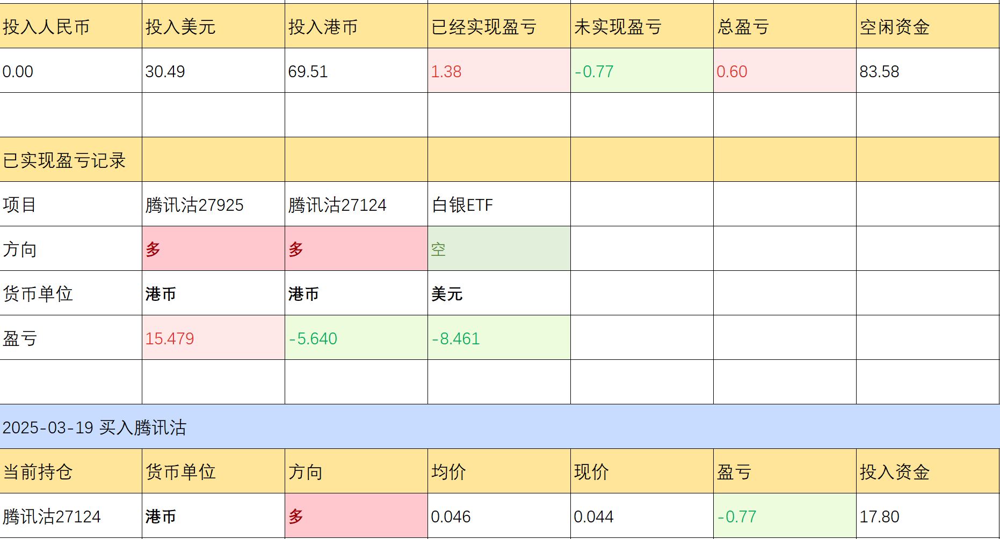

# 关税以及行情

## 目前持仓

想了一下，还是把持仓放上来，毕竟这个T大概率做失败了。真是个悲伤的故事。

目前金银比102，**如果短期内白银涨不回来，那意味着这次我又判断失败了，也意味着白银在我的认知范围以外。以后再也不做白银了！！**

## 关于关税

我们知道贸易是基于**相对优势**，即使一个国家生产任何物品都具有绝对优势，它也是需要自由贸易的。借用一个经济学中的例子：

- A国科技发达，生产一块芯片成本100元，生产100件衣服成本80元。
- C国科技落后，生产一块芯片成本200元，生产100件衣服成本100元。

基于自由贸易，A国向C国出口芯片，C国向A国出口衣服。

- A国人认为，本来一块芯片只能换125件衣服，现在能换200件，我赚了。

- C国人认为，本来200件衣服才能换1块芯片，现在125件衣服就可以了，我赚了。

接下来就是各国的产业转移，A国更多的从事芯片制造，C国跟多的人从事衣服制造。通过合理产业配比，AC**两国总产值都增加**了。当然前提是大家都是有道德的，不考虑政治因素。

### 关税是什么

关税是一种准入许可，用于限制某种行业的规模。任何税种，为政府带来税收收入的同时，也造成了无谓损失，原因就是市场规模的减少。关税导致的市场规模减少表现为**进口规模的减少**。这在一定程度上**保护了国内产业**。

对于出口国来讲，关税的增加，让生产商更偏重于内销。

还是考虑AC两国，两者互相提高关税，后续推演可能如下：

- A国芯片转内销，C国衣服转内销。
- A国芯片过剩，衣服紧缺，短期内服装生产商扩大生产，长期芯片产业向服装产业转移。C国相反。

长期来看，两国的生产总值都会减少，因为**资源配置没以前合理了**。

存在疑问：

1. A国真的想把芯片产业向服装产业转移么？
2. C国服装产业转芯片产业真的能转成功么？
3. 是不是在追求短期就业，管他以后洪水滔天？

## 猜测一下行情

还是感觉目前是一个对未来预期的发酵，真正的危机并没有落下来。清明节后或许有反弹，也只是反弹。