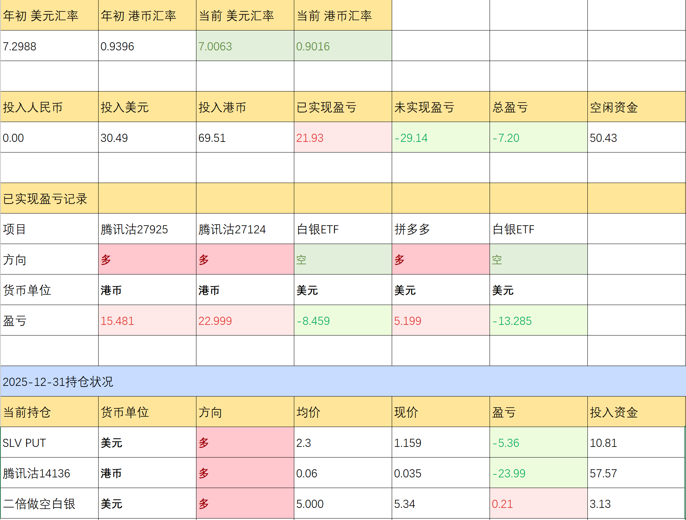

# 2025年总结

元旦加了两天班，现在才有时间写总结。先放持仓

今年分为两个阶段，前半年到5月，盈利了30%，到年底盈利全部回吐，且倒亏了7.2%。所以这次总结主要是要复盘下半年的亏损。

## 白银

白银操作及心理：

- 7月11日 34.53满仓做空白银，虽然后续有所波动，但很快开始浮盈
- 之后将近一个月的波动，8月22日开始拉升
- 9月16日保证金不足，平仓
- 持续拉升，10月16号开仓白银Put，一直持仓至现在

先回顾一下基本面，**我并不赞同市面上对贵金属上涨的一些分析**，他们主要持有以下几种观点：

1. 美元信用下降，大家购买贵金属避险。
2. 地缘政治。
3. 美联储加息。

其实可以归类于一个原因：**避险保值**。虽然能促进贵金属的上涨，但当前这种暴涨绝对不是这个原因。我们套用一个验证理论的方式，**看能不能找到这个理论不能解释的现象**。

1. 美元信用下降，对应的美元指数得跌。但就近10年的周期来看，**美指还是处于高位震荡状态**。
2. 又不是今天才开始打仗。
3. 白银的工业属性很重，黄金才是保值物品。如果真是为了避险保值，金银比会进一步拉大。然而并没有。

个人倾向的原因：**炒作**。借着避险的名义炒作，反正只要涨上去，自由大儒为我辩经。

但**操作上就值得商榷了**，做空没问题，但要有资本坚持到它跌下去的时刻，**保证金交易就不是个好东西**。然后一开是就满仓去做，这是很不理性的做法。对于这种本身炒作性强的品种，是不是应该**快进快出**？

投资综合评分：&#9733;&#9734;&#9734;&#9734;&#9734; 

## 腾讯空

上半年计划正股520的时候开始做空，之后两到三次加至满仓，实际也确实是这样操作的。操作上除了有些冲动，总体上是没问题的。

再来说以下为什么我要做空，先看看腾讯最近的财报数据。

近十年腾讯股价和营收同比基本一致，最近几次财报的营收增长率并不太高，对比而言股价有点太乐观了。

腾讯一直在降本增效，也优化了许多人，但代表员工薪酬的一般及行政开支增长率并没有很大改变，而推广开支近几年并没有增加。很让人怀疑是不是没有足够多的产品发行。

加上腾讯自19年后，现金头寸一直在增加，2025Q3达到了1024亿。虽然持有现金头寸对公司的稳定性有好处，但反面效果就是盈利性必然有所下降。不知道是不是考虑基本面不好，走现金为王的路子。

投资综合评分：&#9733;&#9733;&#9733;&#9734;&#9734; 

为什么亏损还能有三星？因为分析得有理有据，操作也符合预期，**是凭实力亏的钱！！**