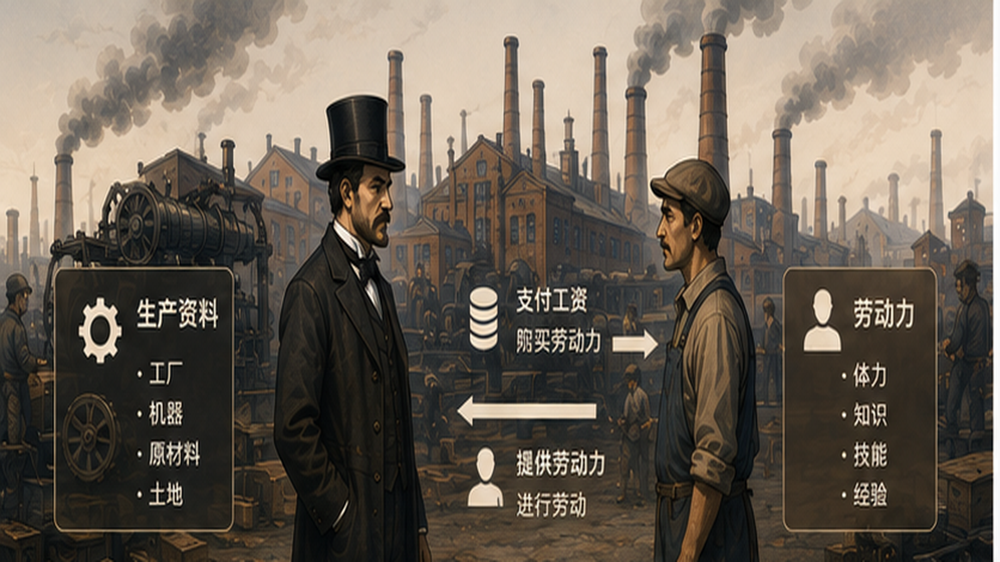
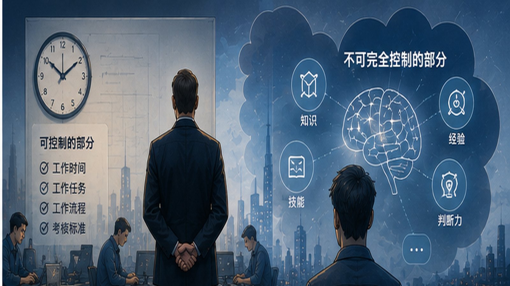
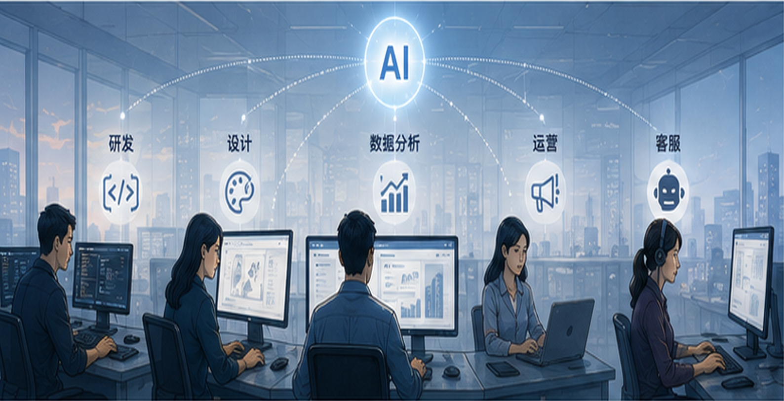
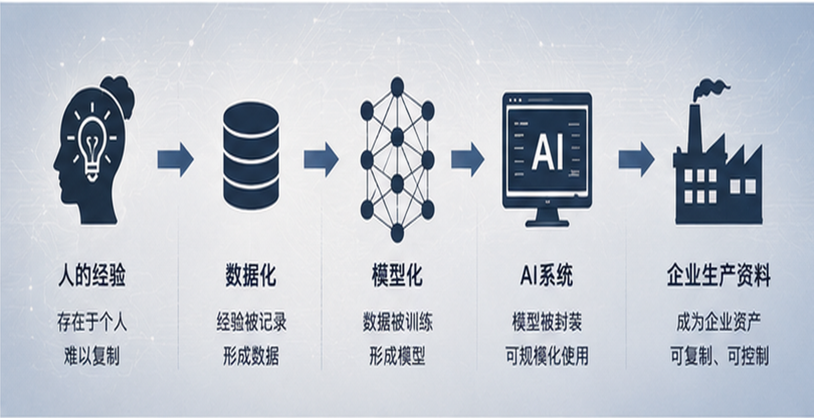
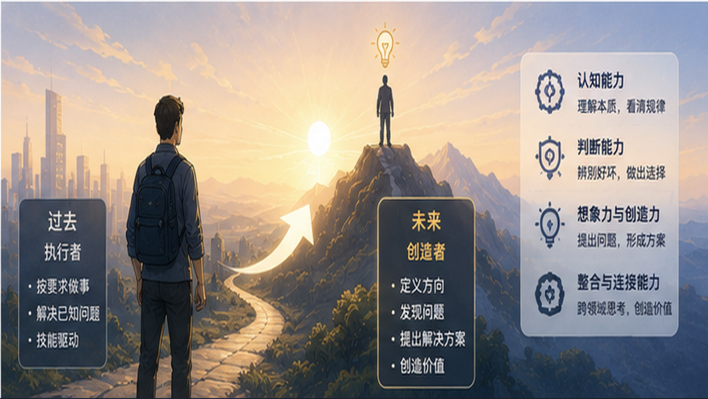

# AI时代下的生产关系转变

当前，人工智能正在成为新一轮技术革命的重要力量。与以往技术主要作用于人的体力、计算能力和信息传递能力不同，AI正在越来越深入地进入知识生产、内容创作、软件开发、数据分析、经营管理等领域。由此，一个值得认真讨论的问题逐渐浮现出来：

> **当机器开始大规模参与人的认知劳动时，生产资料与劳动力之间的关系是否正在发生新的变化？**

如果从马克思《资本论》关于生产资料、劳动力和资本主义生产关系的分析出发，我们或许能够看到AI革命背后更深层次的变化：**AI的意义并不只是提高劳动效率，更可能在于把原本依附于人的一部分劳动能力逐渐数字化、模型化，并转化为可以被资本直接组织和控制的生产资料。**

与此同时，对于普通人而言，AI带来的最大机会也未必只是“让我们工作得更快”，而是显著**扩大个人能力边界**。

---

## 工业时代的生产资料与劳动力

在《资本论》中，马克思对资本主义生产过程进行了系统分析。其中，一个重要的分析框架，就是生产资料与劳动力的区分：

- **生产资料**，是劳动者进行生产所需要的物质条件，包括机器、厂房、土地、原材料以及各种生产工具等。

- **劳动力**，则是人的劳动能力，即劳动者所拥有的体力、知识、技能、经验和创造能力。

工业革命之后，生产逐渐从分散的手工业生产转向以工厂为中心的大规模生产。资本家通过占有工厂、机器、原材料等生产资料，将大量劳动者组织到统一的生产过程中，由此形成了典型的资本主义生产关系：

> **资本家主要掌握生产资料，工人则以劳动力参与生产，并通过工资获得劳动报酬。**

这一关系，是理解传统工业生产关系的重要基础。

---

## 资本并不能完全控制人的劳动力

资本家可以购买一定时期内的劳动力使用权，却不能像拥有一台机器一样，对人的全部能力进行完全、直接的控制。例如，一家制造企业可以拥有厂房、生产线、机器人和原材料，**但工人的知识、经验、判断能力以及劳动能力本身，并不会因为进入工厂就自动成为企业的物质财产**。

表面上看，现代企业似乎可以通过制度、流程、绩效和管理体系，对员工的劳动进行高度组织，但生产资料与劳动力依然存在一个根本区别：

**生产资料可以在相当程度上被预先规定，而人的劳动能力始终包含主观性。**

例如，一个企业可以规定员工每天工作八小时，可以规定项目的目标和交付时间，也可以建立详细的工作流程。但是，企业很难完全规定一个人应该如何思考：

- 一个程序员十几年积累的经验，并不完全写在公司的制度里。
- 一个设计师形成的审美判断，也很难通过一套固定流程全部复制。
- 一个管理者对于复杂问题的判断能力，更不可能简单地通过绩效制度进行完全控制。

因此，在工业时代，即使资本已经高度组织化，企业依然面临一个长期存在的问题：

> **如何让属于个人的劳动能力持续、稳定地进入企业的生产过程？**

企业的招聘、培训、组织管理、绩效考核、企业文化等制度，在某种意义上都与这个问题有关。但企业可以直接拥有机器，却不能直接拥有人的全部知识、经验和创造能力。

**这也是传统生产关系中一个重要的边界。**

---

## AI正在进入企业生产过程

进入AI时代以后，这个边界正在发生变化。近年来，大型科技公司以及越来越多的传统企业，都在积极推动人工智能在生产经营中的应用。从企业角度来看，这首先意味着生产效率的提升，过去需要多人协作完成的部分工作，现在可能由一个人借助AI完成；过去需要员工花费数小时进行的信息整理，现在可能在几分钟内完成。

但是，如果仅仅把AI理解为一种“**效率工具**”，可能还没有看到它真正重要的地方。因为AI正在处理的，不再只是传统机器擅长的体力劳动，也不只是计算机擅长的机械式信息处理，而是越来越多地进入**人的知识劳动和认知劳动**。

这意味着，AI触及了传统生产关系中最难以被资本直接控制的一部分：**劳动力**。

---

## AI正在把一部分劳动力转化为新的生产资料

这是理解AI时代生产关系变化的一个关键视角。

过去，一个企业要获得某种专业能力，往往需要雇佣拥有这种能力的人。例如，一家公司需要软件开发能力，就需要招聘程序员；需要设计能力，就需要招聘设计师；需要数据分析能力，就需要招聘数据分析人员。这些**能力主要存在于具体的人身上**。

而AI正在改变这种状态：

- 一个程序员多年的经验，可以通过代码库、技术文档、开发规范、历史项目和数据逐渐被数字化；

- 一个客服团队长期积累的知识，可以整理为企业知识库，并进一步成为AI客服系统的一部分；

- 一个企业的运营经验，可以被沉淀为规则、数据和工作流程，并由AI Agent不断调用。

于是，一个值得注意的转化过程正在出现：

> **人的经验 → 数据化 → 模型化 → AI系统 → 企业生产资料**

更准确地说，是人的一部分知识、经验和认知能力开始从个体身上被提取出来，并固化到数字系统之中。

过去，一名优秀员工离开企业，企业可能同时失去大量经验。而在AI时代，如果这些经验已经被沉淀到模型、知识库、工作流和AI Agent中，那么企业就可以在一定程度上继续调用这些能力。这意味着：

> **原本高度依附于劳动者个人的一部分劳动能力，正在逐渐转化为企业可以重复使用、规模化调用和持续控制的生产资料。**

这可能是AI带来的生产关系变化中，比“效率提升”更加深刻的一层。这才是企业不遗余力应用AI的原因：**资本需要控制一切**。企业不再只能通过雇佣更多的人来扩大某些认知劳动的规模，而可以通过AI系统，对已经被数字化和模型化的能力进行复制和调用：

> **劳动力 = 大模型 + Token + 电力**
---

## 普通人如何破局

资本想让劳动力变得**可配置，可替换**。那么我们普通人该如何破局？

### 不是追逐每一种AI技术

今天可能是某个大模型最先进，明天可能出现新的模型；今天流行某种Agent框架，几个月之后又可能被新的技术替代。如果一个人把主要精力放在追逐具体工具上，很容易陷入一种循环：

> 学习新工具 → 工具更新 → 重新学习 → 工具再次更新。

这种方式很难形成真正长期的竞争力。

### 从“会做什么”转向“想做什么”

在过去的工业社会中，专业技能非常重要。一个人掌握什么技能，往往决定了他能够从事什么工作。因此，我们长期形成了一种非常稳定的教育逻辑：

> 学习知识 → 掌握技能 → 从事职业 → 提高专业能力。

AI出现以后，这套逻辑不会消失，但其中的权重正在发生变化。因为越来越多的具体执行工作可以由AI辅助完成。

真正稀缺的能力，可能越来越集中在另外一些地方：

- 发现问题的能力；
- 提出问题的能力；
- 判断方向的能力；
- 将不同领域知识连接起来的能力；
- 对结果进行评价和纠错的能力；
- 将模糊想法转化为具体目标的能力；
- 对未来进行想象和规划的能力。

换句话说：

> **当“怎么做”越来越容易获得，“做什么”就会变得更加重要。**

这也是为什么AI时代最重要的竞争力，未必是掌握多少个AI工具，而是拥有怎样的认知和想法。

## 结语：当能力被放大，想法本身会变得更加重要

从工业革命到今天，人类一直在制造能够扩大自身能力的工具。机器扩大人的体力，计算机扩大人的计算能力，互联网扩大人的连接能力，而AI正在开始扩大人的认知和创造能力。与此同时，AI也正在改变企业对劳动的组织方式。它可能正在推动**生产资料、劳动力以及资本之间的关系发生新的变化。**

AI越强大，越需要人重新思考自己的价值。

- 如果AI可以完成越来越多的“怎么做”，那么人就应该更加关注“做什么”。

- 如果AI可以不断降低专业能力的门槛，那么人的价值就会越来越多地体现在**发现问题、提出问题、判断方向和创造目标**上。

因此，AI时代真正值得投入的，不只是学习某一种模型、某一种工具或者某一种技术。因为当一个人的执行能力可以被AI大幅放大之后，真正决定这股力量最终流向哪里的，不再只是技术本身，而是：

> **这个人究竟想做什么。**

这或许才是AI时代留给普通人最大的机会，是让更多人第一次拥有成为**创造者**的可能。

