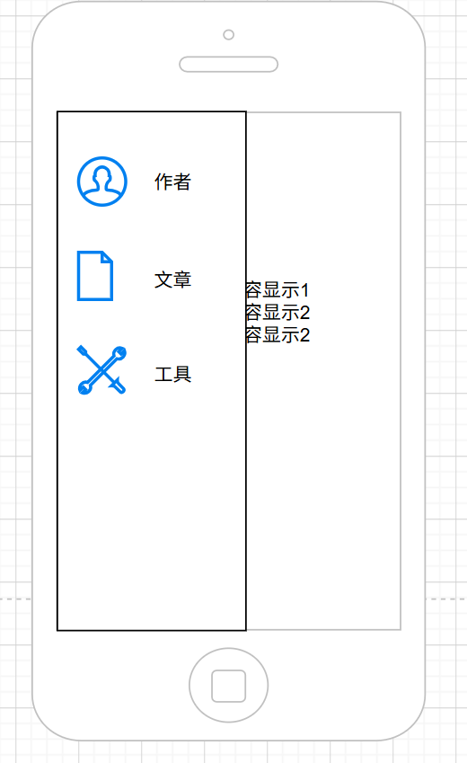

# OpenWorkSpace设计文档

> 本文保留产品界面需求；当前工程边界、配置和运行方式以 `docs/architecture/`、`docs/specs/` 与 ADR 为准。

OpenWorkSpace是一个个人网站的框架
1. 用户可以通过它快速部署个人网站
2. 用户可以快速添加功能模块
3. 该框架展示与数据分离
4. 展示内容基于markdown

## 主界面设计
### Web主界面

功能介绍：
- 左侧为工具栏，竖向展示网站的功能模块。
- 每个功能模块由图标和图标下方的标题组成。
- 功能模块有选中态，点击后选中该功能模块，取消其他模块的选中。
- 右侧为功能展示区，点击左侧的功能模块后，在右侧显示功能的具体内容。
- 进入网站时默认选中第一个功能模块，可配置。
- 可以有私有功能模块，默认不展示，可以根据设备白名单展示。

### 移动端主界面

功能介绍：
- 功能与Web主界面一致，交互方式有不同。
- 默认不展示左侧工具栏
- 当用户从屏幕左侧向右滑动屏幕时，工具栏从左侧浮动移动出来
- 功能模块的标题在图标的右侧


## 目录结构
本框架数据和展示分离。有利于创作者专心于内容创作。
**目录结构**：

```text
OpenWorkspace/
├── workspace/                 # 私有工作区
│   ├── config.json            # 全局配置
│   ├── modules/               # 页面模块
│   │   ├── introduction/
│   │   ├── articles/
│   │   └── tools/
│   ├── services/              # 跨模块服务
│   └── storage/               # 数据库、缓存、任务状态
├── src/                       # 可公开复用的框架
│   └── server/                # 通用 API 宿主
└── dist/                      # 构建产物
```


## 配置说明
**全局配置**

`workspace/config.json` 用来描述站点名称和默认模块。

**功能模块配置**：
每个功能模块下都有一个config.json，用于描述该功能模块的展示方式。如果没有，则不是功能模块，不做展示。配置内容：
```json
{
  "id": "articles",
  "title": "文章",
  "order": 2,
  "access": "public",
  "runtime": "static",
  "icon": "./icon.svg",
  "contentDir": "./content",
  "showDirectoryTree": true,
  "index": "index.md"
}
```

`runtime` 可为 `static`、`client` 或 `server`；服务端模块还需通过 `serverEntry` 指向模块内的服务入口。当前静态构建只发布 `access: "public"` 的模块。

`order` 为正数时从工具栏顶部向下排列；为负数时从底部向上排列，`-1` 最靠近底部；不允许使用 `0`。

## 功能说明
### 功能模块展示
- 所有markdown都展示其渲染后的形式
- 如果content_dir下是html文件，直接展示该html文件
- 构建时框架读取 `workspace/modules/` 下各模块的 `config.json`，生成模块导航和页面
- 根据 `workspace/config.json` 中的 `defaultModule` 展示默认功能
- 点击功能模块，根据 `showDirectoryTree` 在内容区左侧展示目录树，内容区右侧展示 `index` 配置的内容。目录树功能：
    - 根据show_directory_tree字段生成content_dir下的文件目录树，默认所有目录折叠
    - 点击某个目录，如果该目录已经展开，收起该目录。如果是收起状态，展开该目录。
    - 目录下文件名与content_dir下的文件名相同。
    - 点击目录下的文件名，内容区域显示渲染好的markdown文件内容
- 每个文件内容的展示都有单独url，方便直接定位到该文件
- 指定定位到该文件时，如果有目录树，展开目录树到该文件，并滚动到该文件位置
- `authenticated` 和 `allowlist` 模块在真正的服务端认证实现前不会进入公开 `dist/`
